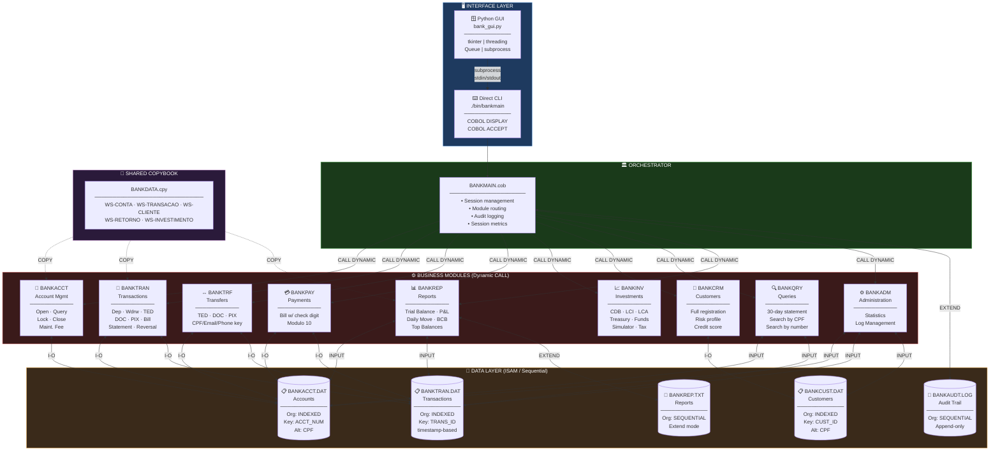
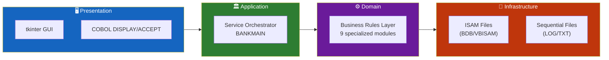
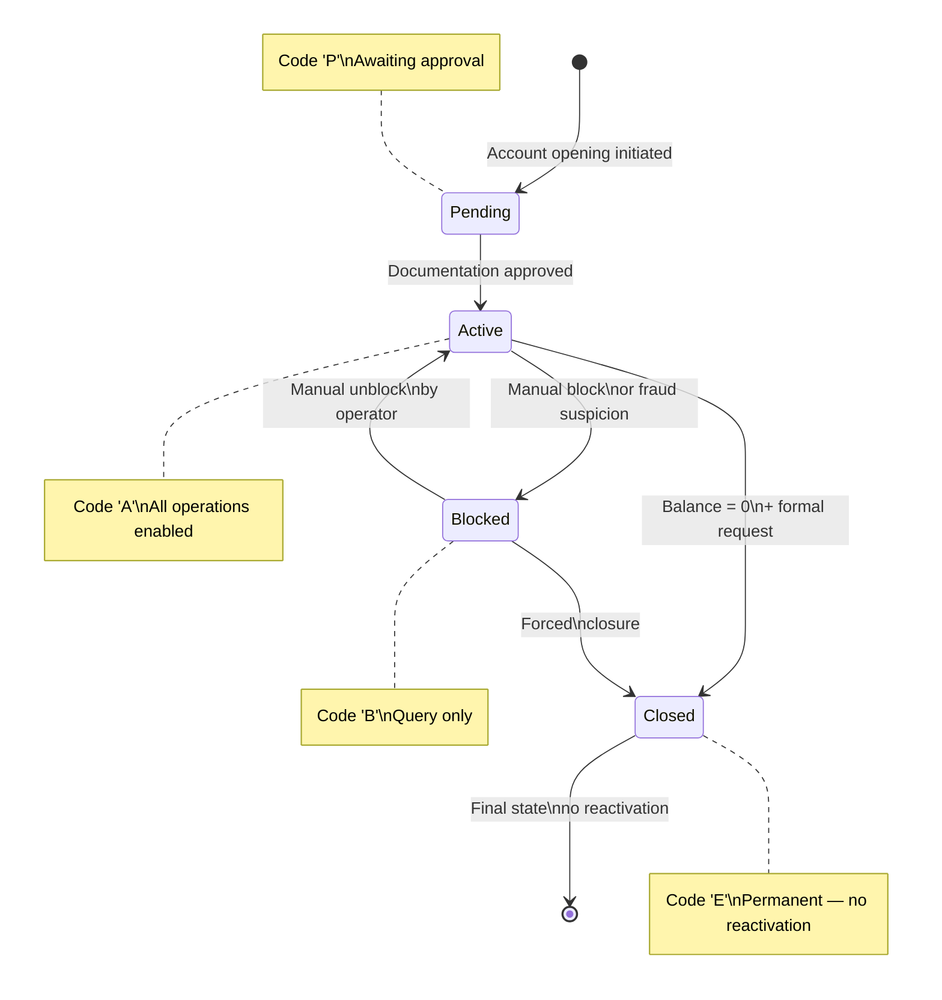
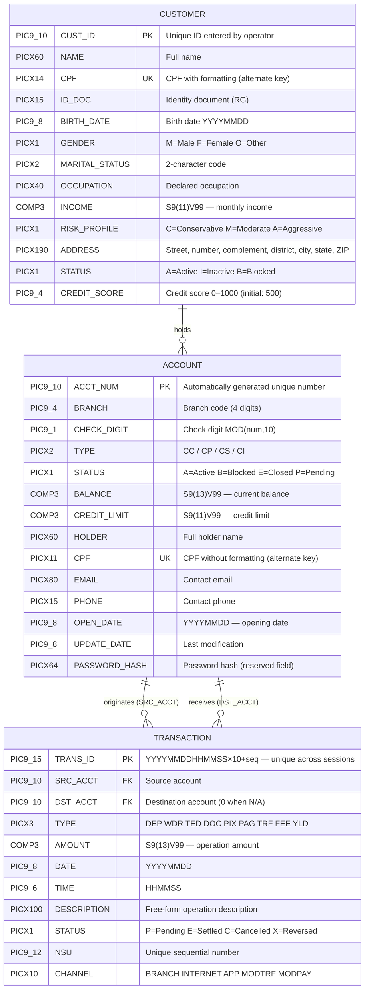
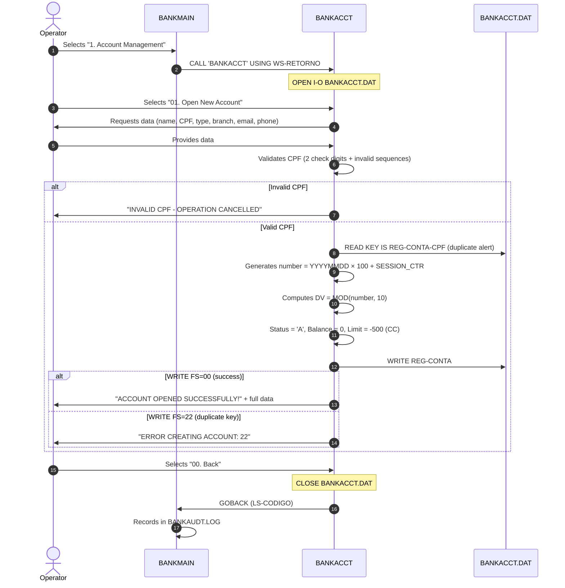
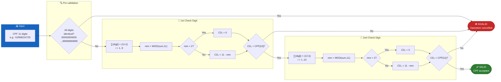
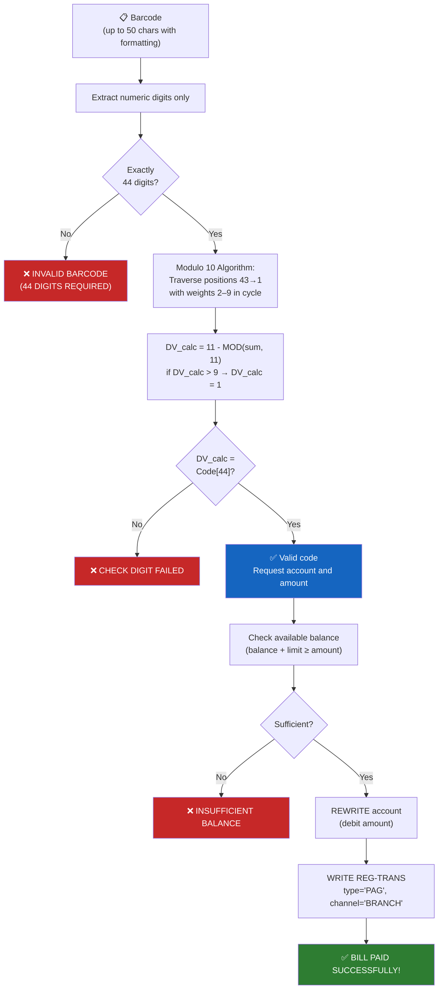
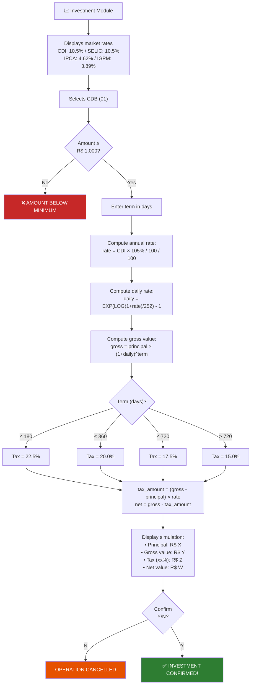
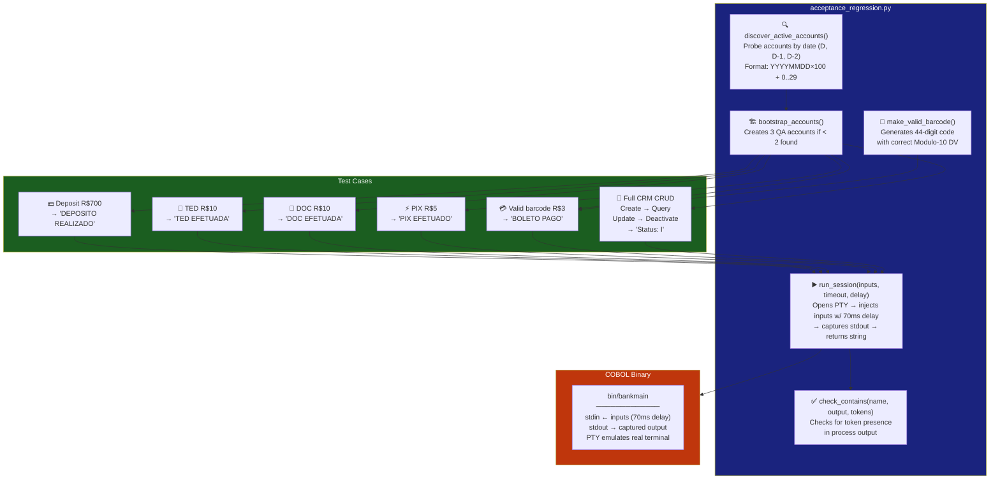

<div align="center">

**🌐 Choose Language / Selecione o Idioma / Elija el Idioma**

[](README.md)&nbsp;&nbsp;&nbsp;[](README_PT.md)&nbsp;&nbsp;&nbsp;[](README_ES.md)

</div>

---

<div align="center">

```
██████╗  █████╗ ███╗   ██╗ ██████╗ ██████╗      ██████╗ ██████╗ ██████╗  ██████╗ ██╗
██╔══██╗██╔══██╗████╗  ██║██╔════╝██╔═══██╗    ██╔════╝██╔═══██╗██╔══██╗██╔═══██╗██║
██████╔╝███████║██╔██╗ ██║██║     ██║   ██║    ██║     ██║   ██║██████╔╝██║   ██║██║
██╔══██╗██╔══██║██║╚██╗██║██║     ██║   ██║    ██║     ██║   ██║██╔══██╗██║   ██║██║
██████╔╝██║  ██║██║ ╚████║╚██████╗╚██████╔╝    ╚██████╗╚██████╔╝██████╔╝╚██████╔╝███████╗
╚═════╝ ╚═╝  ╚═╝╚═╝  ╚═══╝ ╚═════╝ ╚═════╝      ╚═════╝ ╚═════╝ ╚═════╝  ╚═════╝ ╚══════╝
                      Enterprise Banking System in GnuCOBOL
```

---

[](https://gnucobol.sourceforge.io/)
[](https://python.org)
[](https://docs.python.org/3/library/tkinter.html)
[](https://ubuntu.com/)
[]()
[]()
[]()

<br/>

> **A complete, robust, enterprise-grade banking system**
> built in modern legacy COBOL with a Python GUI and a full automated test suite.

<br/>


</div>

---

## 📑 Table of Contents

<details>
<summary>▶️ <strong>Click to expand / collapse this section</strong></summary>

<table>
<tr>
<td valign="top" width="50%">

**🏗️ System**
- [Overview](#-overview)
- [System Architecture](#-system-architecture)
- [Technology Stack](#-technology-stack)
- [Design Patterns](#-design-patterns-applied)
- [Project Structure](#-project-structure)

**📦 Modules**
- [BANKMAIN — Orchestrator](#-bankmain--main-orchestrator)
- [BANKACCT — Accounts](#-bankacct--account-management)
- [BANKTRAN — Transactions](#-banktran--transaction-processing)
- [BANKTRF — Transfers](#-banktrf--transfer-module)
- [BANKPAY — Payments](#-bankpay--payment-module)
- [BANKINV — Investments](#-bankinv--investment-module)
- [BANKCRM — Customers](#-bankcrm--customer-management)
- [BANKQRY — Queries](#-bankqry--queries-and-statements)
- [BANKREP — Reports](#-bankrep--reports)
- [BANKADM — Administration](#-bankadm--administration)
- [BANKLOAN — Loans](#-bankloan--loans--financing)
- [BANKCARD — Cards](#-bankcard--card-management)
- [BANKSCHD — Scheduling](#-bankschd--scheduling)
- [BANKAUTH — Auth/2FA](#-bankauth--authentication--2fa)
- [BANKHELP — Help](#-bankhelp--help-center)
- [bank\_export — Export](#-bank_export--multi-format-export)
- [21 Additional Modules (FX→Donations)](#-additional-modules-fx-to-donations)

</td>
<td valign="top" width="50%">

**💼 Business**
- [Business Rules](#-business-rules)
- [Functional Requirements](#-functional-requirements)
- [Non-Functional Requirements](#-non-functional-requirements)

**📐 Design**
- [Data Model](#-data-model)
- [System Flows](#-system-flows)
- [Account Lifecycle](#account-lifecycle)
- [Transaction Flow](#tedpix-transaction-flow)
- [CPF Validation](#cpf-validation-flow)

**🔐 Security & Ops**
- [Security](#-security)
- [Installation & Execution](#-installation--execution)
- [Automated Tests](#-automated-tests)
- [Metrics & Monitoring](#-metrics--monitoring)
- [Known Limitations](#-known-limitations)

</td>
</tr>
</table>

---

</details>

## 🌟 Overview

<details>
<summary>▶️ <strong>Click to expand / collapse this section</strong></summary>

**Banco COBOL S/A** is a complete, functional banking system implemented in **GnuCOBOL** (modern open-source COBOL), proving that legacy languages can deliver robustness, financial precision, and clean architecture on par with modern systems.

The system processes **deposits, withdrawals, TED/DOC/PIX transfers, bill payments, investments, and regulatory reports**, all persisted via **indexed ISAM files** — the same model used on IBM mainframes for decades.

### 🎯 System Objectives

| Objective | Description |
|-----------|-------------|
| 🏦 **Core Banking** | Full lifecycle management of checking, savings, salary, and investment accounts |
| 💸 **Transactions** | Debit/credit processing with complete audit trail |
| 📊 **Reports** | Trial balances, daily movement, BCB regulatory reports |
| 🔐 **Security** | Real CPF validation algorithm, account locking, status control |
| 📈 **Investments** | CDB, LCI, LCA, Treasury Direct and Funds with real withholding-tax calculation |
| 🖥️ **GUI** | Python/tkinter with guided flows, light/dark themes, Dashboard Canvas, gamification, toasts, onboarding wizard, search bar, and settings panel |
| 📤 **Export** | Multi-format extrato export engine: CSV, TXT, JSON, XML, HTML, Markdown, Excel, PDF |
| 🧪 **Quality** | Automated E2E acceptance regression tests via pseudo-terminal |

---

</details>

## 🏗️ System Architecture

<details>
<summary>▶️ <strong>Click to expand / collapse this section</strong></summary>

### Module Diagram



### Architecture Layers



---

</details>

## 🛠️ Technology Stack

<details>
<summary>▶️ <strong>Click to expand / collapse this section</strong></summary>

<table>
<thead>
<tr>
<th>Layer</th>
<th>Technology</th>
<th>Version</th>
<th>Purpose</th>
</tr>
</thead>
<tbody>
<tr>
<td>🔧 <strong>Runtime</strong></td>
<td>GnuCOBOL</td>
<td>3.x</td>
<td>Compilation and execution of COBOL modules as shared objects</td>
</tr>
<tr>
<td>🖥️ <strong>GUI</strong></td>
<td>Python 3 + tkinter</td>
<td>3.8+</td>
<td>Native cross-platform graphical interface with guided flows</td>
</tr>
<tr>
<td>💾 <strong>Storage</strong></td>
<td>ISAM / BDB / VBISAM</td>
<td>—</td>
<td>Indexed files for sequential and random keyed access</td>
</tr>
<tr>
<td>🔗 <strong>IPC</strong></td>
<td>subprocess + pty</td>
<td>—</td>
<td>GUI↔COBOL communication via stdin/stdout and pseudo-terminal for tests</td>
</tr>
<tr>
<td>🏗️ <strong>Build</strong></td>
<td>GNU Make</td>
<td>—</td>
<td>Incremental compilation of .so modules and the main executable</td>
</tr>
<tr>
<td>🧪 <strong>Testing</strong></td>
<td>Python + pty</td>
<td>—</td>
<td>E2E tests via pseudo-terminal — no mocks, real binary</td>
</tr>
<tr>
<td>⚙️ <strong>Flags</strong></td>
<td>COB_CFLAGS</td>
<td>—</td>
<td><code>-D_FORTIFY_SOURCE=3 -ggdb3 -finline-functions -fsigned-char</code></td>
</tr>
<tr>
<td>🐧 <strong>Platform</strong></td>
<td>Linux / WSL2</td>
<td>Ubuntu 20+</td>
<td>Compilation and execution environment; GUI supports Windows via WSL</td>
</tr>
</tbody>
</table>

---

</details>

## 🎨 Design Patterns Applied

<details>
<summary>▶️ <strong>Click to expand / collapse this section</strong></summary>

| Pattern | Module | Implementation |
|---------|--------|----------------|
| 🏛️ **Service Orchestrator** | BANKMAIN | Routes dynamic CALL to modules via EVALUATE on menu option |
| 🗄️ **Repository Pattern** | BANKACCT | Encapsulates all account I/O in semantically named paragraphs |
| ⚡ **Command Pattern** | BANKTRAN | Each transaction type is an independent command with its own validation |
| 📦 **Unit of Work** | BANKTRAN/BANKTRF | Groups debit + credit + audit record as one logical unit |
| 🎯 **Strategy Pattern** | BANKINV | Each financial product has its own yield-calculation strategy |
| 📋 **Report Generator** | BANKREP | Separates data gathering, processing, and report formatting |
| 🔌 **Shared Kernel** | BANKDATA.cpy | Copybook with shared data structures — no duplication |
| 🏭 **Facade** | BANKMAIN | Unified interface to all banking subsystems |

---

</details>

## 📁 Project Structure

<details>
<summary>▶️ <strong>Click to expand / collapse this section</strong></summary>

```
bank_system/
│
├── 📋 COBOL Sources (Business Modules)
│   ├── BANKMAIN.cob          # Main orchestrator (entry point)
│   ├── BANKACCT.cob          # Account management
│   ├── BANKTRAN.cob          # Transaction processing
│   ├── BANKTRF.cob           # Advanced transfers (TED/DOC/multi-key PIX)
│   ├── BANKPAY.cob           # Payments, bills, boleto emission (Modulo-10)
│   ├── BANKINV.cob           # Investments and financial simulations
│   ├── BANKCRM.cob           # Customer management (CRM)
│   ├── BANKQRY.cob           # Queries and statements (read-only)
│   ├── BANKREP.cob           # Managerial and regulatory reports
│   ├── BANKADM.cob           # Administration module
│   ├── BANKLOAN.cob          # Loans & financing (PMT formula, 4 types)
│   ├── BANKCARD.cob          # Cards (debit/credit, virtual, installments)
│   ├── BANKSCHD.cob          # Payment/transfer scheduling (recurrence)
│   ├── BANKAUTH.cob          # Authentication, 2FA, PIN, gamification
│   ├── BANKHELP.cob          # Help center, FAQ, terms, privacy
│   ├── BANKFX.cob            # Foreign exchange & currency conversion
│   ├── BANKSEG.cob           # Insurance (life, home, auto, travel)
│   ├── BANKCONS.cob          # Consortium (vehicle/property/services)
│   ├── BANKPREV.cob          # Private pension (PGBL/VGBL)
│   ├── BANKDEB.cob           # Automatic debit registration
│   ├── BANKCAP.cob           # Capitalization bonds (títulos de capitalização)
│   ├── BANKLIM.cob           # Credit limit management
│   ├── BANKNOTIF.cob         # Notifications & alerts center
│   ├── BANKTAX.cob           # Annual income tax statement (IR)
│   ├── BANKCHQ.cob           # Chequebook management
│   ├── BANKFGTS.cob          # FGTS consultation & withdrawal simulation
│   ├── BANKCOB.cob           # Bank collection (cobrança registrada)
│   ├── BANKOVD.cob           # Overdraft / revolving credit (cheque especial)
│   ├── BANKPOUP.cob          # Savings goals (caixinhas/cofrinhos)
│   ├── BANKCONSIG.cob        # Payroll loan (crédito consignado)
│   ├── BANKSCORE.cob         # Credit score engine (0–1000)
│   ├── BANKCASHBACK.cob      # Cashback & loyalty program
│   ├── BANKRENEG.cob         # Debt renegotiation
│   ├── BANKPORT.cob          # Portability (salary/credit/account)
│   ├── BANKPJ.cob            # Digital business account (PJ/MEI)
│   └── BANKDOA.cob           # Donations & social contributions
│
├── 📎 COBOL Copybooks
│   └── BANKDATA.cpy          # Shared data structures (all modules)
│
├── 💾 Data Files (ISAM/Sequential)
│   ├── BANKACCT.DAT          # Account file (indexed)
│   ├── BANKTRAN.DAT          # Transaction file (indexed)
│   ├── BANKCUST.DAT          # Customer file (indexed)
│   ├── BANKEMPREST.DAT       # Loans file (indexed)
│   ├── BANKCART.DAT          # Cards file (indexed)
│   ├── BANKAGEND.DAT         # Scheduled payments file (indexed)
│   ├── BANKBOL.DAT           # Boletos file (indexed)
│   ├── BANKAUDT.LOG          # Audit trail (sequential append)
│   ├── BANKREP.TXT           # Generated reports (sequential extend)
│   └── BANKFX/SEG/CONS/PREV/DEB/CAP/LIM/NOTIF/TAX/CHQ/FGTS/
│       COB/OVD/POUP/CONSIG/SCORE/CASHBACK/RENEG/PORT/PJ/DOA.DAT
│       # one indexed file per new module (schema-isolated, own key)
│
├── 🐍 Python Frontend
│   ├── bank_gui.py               # tkinter GUI (theme, dashboard, gamification)
│   ├── bank_export.py            # Multi-format export engine
│   ├── acceptance_regression.py  # Automated E2E tests via pty
│   └── finance_regression.py     # Financial regression tests
│
├── 🔨 Build
│   └── Makefile              # GnuCOBOL compilation with hardening flags
│
└── 📦 Binaries (generated by make)
    └── bin/
        ├── bankmain          # Main executable
        ├── BANKACCT.so  BANKTRAN.so  BANKTRF.so  BANKPAY.so
        ├── BANKINV.so   BANKCRM.so   BANKQRY.so  BANKREP.so
        ├── BANKADM.so   BANKLOAN.so  BANKCARD.so BANKSCHD.so
        ├── BANKAUTH.so  BANKHELP.so  BANKFX.so   BANKSEG.so
        ├── BANKCONS.so  BANKPREV.so  BANKDEB.so  BANKCAP.so
        ├── BANKLIM.so   BANKNOTIF.so BANKTAX.so  BANKCHQ.so
        ├── BANKFGTS.so  BANKCOB.so   BANKOVD.so  BANKPOUP.so
        ├── BANKCONSIG.so BANKSCORE.so BANKCASHBACK.so BANKRENEG.so
        ├── BANKPORT.so  BANKPJ.so    BANKDOA.so
        └── (36 shared objects total)
```

---

</details>

## 📦 System Modules

<details>
<summary>▶️ <strong>Click to expand / collapse this section</strong></summary>

### 🏛️ BANKMAIN — Main Orchestrator

**Role:** Application entry point. Manages the session, controls the audit log file, and routes dynamic CALL instructions to specialized modules.

**Responsibilities:**
- Session initialization with timestamp-based ID
- Opening and controlling the audit file (`BANKAUDT.LOG` in EXTEND mode)
- Main menu spanning the full alphabet (1–9, A–Z minus H, plus 0/H)
- Recording every operation in the audit log (date, time, option, return code)
- Session counters: operations completed and errors found
- Session summary display on exit

```
╔══════════════════════════════════════════════════╗
║         COBOL BANKING SYSTEM v3.0.0              ║
║         Session: [timestamp ID]                  ║
╠══════════════════════════════════════════════════╣
║  1. Account Management      M. Notifications     ║
║  2. Transactions            N. Income Tax (IR)   ║
║  3. Queries & Statements    O. Chequebook        ║
║  4. Transfers               P. FGTS              ║
║  5. Payments                Q. Bank Collection   ║
║  6. Investments             R. Overdraft / Limit ║
║  7. Customer Management     S. Savings Goals     ║
║  8. Reports                 T. Payroll Loan      ║
║  9. Administration          U. Credit Score      ║
║  A. Loans & Financing       V. Cashback/Loyalty  ║
║  B. Card Management         W. Debt Renegotiation║
║  C. Scheduling              X. Portability       ║
║  D. Security & Auth         Y. PJ/MEI Account    ║
║  E. FX & Foreign Currency   Z. Donations         ║
║  F. Insurance               H. Help & Support    ║
║  G. Consortium              0. Exit              ║
║  I. Private Pension (PGBL/VGBL)                  ║
║  J. Automatic Debit                              ║
║  K. Capitalization Bonds                         ║
║  L. Credit Limit Management                      ║
╚══════════════════════════════════════════════════╝
```

---

### 🏦 BANKACCT — Account Management

**Role:** Full Repository Pattern for the bank account lifecycle.

| Operation | Code | Description |
|-----------|------|-------------|
| Open New Account | `01` | Collect data, validate CPF (full algorithm, 2 digits), generate unique number, write record |
| Query Account | `02` | Lookup by number via primary key, display full data with formatted balance |
| Update Data | `03` | Update email/phone with automatic update timestamp |
| Lock/Unlock | `04` | Toggle status A↔B — REWRITE only when status actually changes |
| Close Account | `05` | Closes if balance = zero; marks status `'E'` permanently |
| List Accounts | `06` | Full scan with account count and global balance (uses dedicated counter) |
| Search by CPF | `07` | Access via indexed alternate key |
| Apply Fees | `08` | Maintenance fee for active checking accounts — checks limit before debiting |
| Account Report | `09` | Delegates to BANKREP module |
| Back | `00` | Closes file and returns to BANKMAIN |

**Account number generation:** `CURRENT_DATE (YYYYMMDD) × 100 + SESSION_CTR`
**Check digit:** `MOD(account_number, 10)`

---

### 💸 BANKTRAN — Transaction Processing

**Role:** Command Pattern + Unit of Work. Central financial movement module with full audit trail and session-unique IDs.

| Operation | Code | Validations | Audit |
|-----------|------|-------------|-------|
| Deposit | `01` | Amount > 0, active account | ✅ Type `DEP` |
| Withdrawal | `02` | Balance + limit sufficient, daily limit R$ 5,000, amount > 0 | ✅ Type `SAQ` |
| TED Transfer | `03` | Balance+limit ≥ amount+fee, active destination, confirmation | ✅ Type `TED` |
| DOC Transfer | `04` | Same as TED with its own fee R$ 5.80 | ✅ Type `DOC` |
| PIX | `05` | Origin active, sufficient balance, night limit, destination active, zero fee | ✅ Type `PIX` |
| Bill Payment | `06` | Balance + limit sufficient, amount > 0 | ✅ Type `PAG` |
| Balance Query | `07` | Active account | — |
| 30-day Statement | `08` | Real date filter via `INTEGER-OF-DATE / DATE-OF-INTEGER` | — |
| Reverse Transaction | `09` | Only status `'E'`, correct key `REG-TRANS-ID`, reversal by type | ✅ Status `'X'` |

**Transaction ID:** `YYYYMMDDHHMMSS × 10 + session_increment` — eliminates collision across sessions.

---

### ↔️ BANKTRF — Transfer Module

**Role:** Alternative and more complete transfer implementation supporting PIX lookup by multiple key types.

| Type | Fee | Destination Lookup |
|------|-----|-------------------|
| TED | R$ 14.90 | By account number |
| DOC | R$ 5.80 | By account number |
| PIX | R$ 0.00 | Full-scan by CPF (`'C'`), Email (`'E'`), or Phone (`'T'`) |

**PIX with multiple keys:** the module scans all account records comparing the informed field — more complete than BANKTRAN PIX (which uses only the CPF alternate index).

---

### 💳 BANKPAY — Payment Module

**Role:** Bank bill payments with rigorous check-digit validation via Modulo 10.

**Validation Algorithm (Modulo 10):**
1. Extracts exactly 44 numeric digits from the barcode
2. Traverses positions 43→1 with weights 2–9 in ascending cycle
3. Computes: `DV = 11 - MOD(sum, 11)` — if result > 9, DV = 1
4. Compares computed DV with digit at position 44
5. Rejects the bill before any financial operation if DV is invalid

**Operation sequence:**
```
Account → Barcode → Validate DV → Amount
→ Check balance → Debit → WRITE audit PAG → Confirm
```

---

### 📈 BANKINV — Investment Module

**Role:** Strategy Pattern for financial products with a simulator and real yield/withholding-tax calculation.

#### Available Products

| Product | Rate | Minimum | Tax | Liquidity |
|---------|------|---------|-----|-----------|
| 🏆 **CDB** | 105% CDI | R$ 1,000 | Regressive | At maturity |
| 🏠 **LCI** | 95% CDI | R$ 5,000 | **Tax-free** | 90 days |
| 🌾 **LCA** | 93% CDI | — | **Tax-free** | 90 days |
| 🇧🇷 **Treasury Selic** | 100% SELIC | R$ 30 | Regressive | D+1 |
| 🇧🇷 **Treasury IPCA+** | IPCA + spread | R$ 30 | Regressive | At maturity |
| 🇧🇷 **Fixed-rate Treasury** | 11.87% p.a. | R$ 30 | Regressive | At maturity |
| 📊 **Fixed Income Fund** | Varies | — | Regressive | D+1 |
| 📊 **Multi-strategy Fund** | Varies | — | Regressive | D+1 to D+30 |
| 📊 **Equity Fund** | Varies | — | 15% fixed | D+3 |

#### Regressive Withholding Tax Table

| Term | Tax Rate |
|------|----------|
| ≤ 180 days | 🔴 22.5% |
| 181 – 360 days | 🟠 20.0% |
| 361 – 720 days | 🟡 17.5% |
| > 720 days | 🟢 15.0% |

#### CDB Calculation Formula — ANBIMA Standard (252 business days)

```
annual_rate  = CDI × CDI_percentage / 100 / 100
daily_rate   = EXP(LOG(1 + annual_rate) / 252) - 1
gross_value  = principal × (1 + daily_rate) ^ term_days
yield        = gross_value - principal
tax          = yield × tax_rate
net_value    = gross_value - tax
```

#### Configured Market Rates

| Index | Annual Rate |
|-------|-------------|
| 📊 CDI | 10.5000% |
| 🏛️ SELIC | 10.5000% |
| 📈 IPCA | 4.6200% |
| 📉 IGPM | 3.8900% |

---

### 👥 BANKCRM — Customer Management

**Role:** Full customer profile registration and maintenance with credit score and risk profile.

**Registration Data:**

| Field | PIC | Description |
|-------|-----|-------------|
| Customer ID | `9(10)` | Primary key — entered by operator |
| Name | `X(60)` | Full name |
| CPF | `X(14)` | Alternate key with formatting |
| RG | `X(15)` | Identity document |
| Date of Birth | `9(8)` | Format YYYYMMDD |
| Gender | `X(1)` | `M` / `F` / `O` |
| Marital Status | `X(2)` | 2-character code |
| Occupation | `X(40)` | — |
| Income | `S9(11)V99 COMP-3` | Monthly income |
| Risk Profile | `X(1)` | `C` / `M` / `A` |
| Address | Group `X(190)` | Street, number, complement, district, city, state, ZIP |
| Status | `X(1)` | `A`=Active `I`=Inactive `B`=Blocked |
| Credit Score | `9(4)` | 0–1000 (initial: 500) |

**Risk Profiles:**

| Code | Profile | Characteristic |
|------|---------|---------------|
| 🟢 `C` | Conservative | Prefers fixed income, low volatility |
| 🟡 `M` | Moderate | Mix of fixed income and equities |
| 🔴 `A` | Aggressive | Accepts high volatility, seeks maximum return |

---

### 🔍 BANKQRY — Queries and Statements

**Role:** Read-only interface (`OPEN INPUT`) for queries with no risk of data modification.

| Operation | Code | Search Key | Filter |
|-----------|------|------------|--------|
| Query by number | `01` | Primary key (PIC 9(10)) | — |
| Query by CPF | `02` | Indexed alternate key (PIC X(11)) | — |
| 30-day quick statement | `03` | Account number (full-scan transactions) | `DATE >= (TODAY - 30)` |

**Date filter:** `INTEGER-OF-DATE(TODAY) - 30 → DATE-OF-INTEGER(result)` — correctly handles months with 28/29/30/31 days.

---

### 📊 BANKREP — Reports

**Role:** Report Generator Pattern. Generates reports persisted in `BANKREP.TXT` with `OPEN EXTEND` — without destroying prior content.

| Report | Code | Content |
|--------|------|---------|
| General Trial Balance | `01` | All accounts with balances; totals by type (CC/CP); active/blocked counts |
| Summary by Type | `02` | Account count by category |
| Daily Movement | `03` | Total DEP/WDR/TRF for current day filtered by `TRANS_DATE = TODAY` |
| Negative Balances | `04` | Accounts with `balance < 0` (overdraft) |
| Top 10 Balances | `05` | Structure for sorting algorithm |
| Delinquency | `06` | Accounts with credit limit utilized > 80% |
| Simplified P&L | `07` | Fee and interest revenue vs operating expenses |
| BCB Report | `08` | SCR format — Brazilian Central Bank Credit Information System |

---

### ⚙️ BANKADM — Administration

**Role:** Administrative and maintenance operations.

| Operation | Code | Description |
|-----------|------|-------------|
| General Statistics | `01` | Full-scan count of records in ACCOUNTS, TRANSACTIONS and CUSTOMERS |
| Clear Log | `02` | Truncates `BANKAUDT.LOG` (OPEN OUTPUT → close) |

> [!WARNING]
> The **Clear Log** operation permanently erases the audit trail. In a real production environment, the audit log must be immutable and archived externally.

---

### 💰 BANKLOAN — Loans & Financing

**Role:** Complete loan lifecycle — simulation, origination, installment payment, and full settlement.

| Operation | Code | Description |
|-----------|------|-------------|
| Request Loan | `01` | Type selection → rate computation → PMT formula → credit account |
| Query Loan | `02` | Lookup by loan ID, display all fields |
| Pay Installment | `03` | Validates status `'A'`, deducts PMT, updates balance, marks `'Q'` when paid off |
| Simulate | `04` | Shows total + interest without file writes |
| List by Account | `05` | Sequential scan filtered by account |
| Full Settlement | `06` | Pays remaining balance in one go |

**Loan types and rates:**

| Type | Code | Monthly Rate |
|------|------|-------------|
| Personal | `PES` | 1.99% |
| Payroll | `CON` | 1.49% |
| Mortgage | `IMO` | 0.79% |
| Vehicle | `VEI` | 1.69% |

**PMT formula:** `PMT = PV × i×(1+i)^n / ((1+i)^n − 1)` computed iteratively (no COBOL exponent).

---

### 💳 BANKCARD — Card Management

**Role:** Full card lifecycle — emission, purchases, invoices, virtual card, and installments.

| Operation | Code | Description |
|-----------|------|-------------|
| Emit Card | `01` | Creates debit or credit card (16-digit number, VISA/MASTER) |
| Query | `02` | Displays all card data and available limit |
| Block | `03` | Status `'A'` → `'B'` |
| Unblock | `04` | Status `'B'` → `'A'` |
| Alter Limit | `05` | Changes credit limit |
| Invoice | `06` | Current bill with items |
| Pay Invoice | `07` | Full or partial payment |
| List by Account | `08` | Lists all cards for an account |
| Virtual Card | `A` | Deterministic 16-digit number from account (`4567...` prefix), fixed CVV, expiry 12/2030 |
| Debit Purchase | `B` | Debits from account balance directly |
| Credit Purchase | `C` | Debits from available credit limit, adds to invoice |
| Installment | `D` | 2–24 installments; blocks full limit, first installment on invoice |

**Virtual card formula:** `4567000000000000 + MOD(acct×9999991, 10^11)×10000 + MOD(acct, 10000)`

---

### 📅 BANKSCHD — Scheduling

**Role:** Scheduled transfers and payments with recurrence support.

| Operation | Code | Description |
|-----------|------|-------------|
| Schedule Transfer | `01` | TED/DOC/PIX with future date and recurrence |
| Schedule Payment | `02` | BOL type with description |
| List Scheduled | `03` | All pending/processed items by account |
| Cancel | `04` | Only if status `'P'` (pending) |
| Process Due | `05` | Full scan — executes all items where `DT_AGEND ≤ TODAY` |

**Recurrence:** `U`=once / `M`=monthly (adds 30 days) / `S`=weekly (adds 7 days)

---

### 🔐 BANKAUTH — Authentication & 2FA

**Role:** Login with CPF+password, session lock-out, 2FA, PIN change, gamification rewards.

| Operation | Code | Description |
|-----------|------|-------------|
| Login | `01` | CPF + password, max 3 failed attempts, account status check |
| Change Password | `02` | Current + new + confirm, validates match, REWRITE record |
| 2FA | `03` | Time-based 6-digit code (HHMMSS MOD 899999 + 100000) |
| Recover Access | `04` | Shows registered email, instructs admin contact |
| Points & Badges | `05` | BRONZE / SILVER / GOLD / PLATINUM tiers |

**Gamification tiers:** BRONZE (0–999 pts) → SILVER (1,000) → GOLD (5,000) → PLATINUM (10,000+)

---

### ❓ BANKHELP — Help Center

**Role:** In-system documentation — no external dependencies required.

| Topic | Code | Content |
|-------|------|---------|
| FAQ | `01` | 8 Q&A covering accounts, transfers, cards, boletos, export, passwords |
| Quick Guide | `02` | Navigation guide for all 15 modules |
| Terms of Use | `03` | Usage policies, prohibited actions, liability |
| Privacy Policy | `04` | LGPD-compliant data description, user rights, security |
| Contact / Support | `05` | Phone numbers (0800), SAC 24h, ombudsman, email, address |
| About | `06` | Version, all 15 modules listed, data files, architecture |

---

### 📤 bank_export — Multi-Format Export

**Role:** Pure Python engine that parses COBOL stdout output and exports to multiple formats.

| Format | Library | Features |
|--------|---------|----------|
| CSV | stdlib | Headers, semicolon separator |
| TXT | stdlib | Raw COBOL output verbatim |
| JSON | stdlib | Array of transaction objects |
| XML | stdlib | `<transactions>` root with `<transaction>` children |
| HTML | stdlib | Responsive CSS table with bank branding |
| Markdown | stdlib | GFM table format |
| Excel (.xlsx) | openpyxl | Styled header, freeze panes, auto-width, Info sheet |
| PDF | fpdf2 | A4 landscape, zebra rows, page number footer |

```bash
# Install optional dependencies
make export-deps   # pip install openpyxl fpdf2
```

**Parser:** dual-pattern (pipe-delimited `|` and regex) handles varied COBOL DISPLAY formats.

**GUI integration:** Export panel in `bank_gui.py` with per-format checkboxes, folder browser, and "Select All" toggle.

---

</details>

## 🧩 Additional Modules (FX to Donations)

<details>
<summary>▶️ <strong>Click to expand / collapse this section</strong></summary>

> 21 modules added on top of the original 15, completing menu options **E–G, I–Z** (a full A–Z banking suite). Each module owns a dedicated indexed `.DAT` file — zero changes to the original `BANKACCT.DAT` schema.

<details>
<summary><strong>💱 E–G — Exchange, Insurance, Consortium</strong> (BANKFX · BANKSEG · BANKCONS)</summary>

| Module | Menu | Purpose | Key Operations |
|--------|------|---------|----------------|
| **BANKFX** | E | Foreign exchange & currency conversion | Buy/sell quotes (USD/EUR/GBP/ARS…), spread simulation, IOF calculation, conversion history |
| **BANKSEG** | F | Insurance (life, home, auto, travel) | Quote simulation by profile, policy contracting, premium payment, claim opening, policy query |
| **BANKCONS** | G | Consortium (vehicle/property/services) | Group simulation, enrollment, bid (lance) registration, contemplation draw, installment payment |

</details>

<details>
<summary><strong>🏦 I–M — Pension, Debit, Capitalization, Limits, Notifications</strong> (BANKPREV · BANKDEB · BANKCAP · BANKLIM · BANKNOTIF)</summary>

| Module | Menu | Purpose | Key Operations |
|--------|------|---------|----------------|
| **BANKPREV** | I | Private pension (PGBL/VGBL) | Plan contracting, contributions, balance/yield query, simulated redemption, tax-regime comparison |
| **BANKDEB** | J | Automatic debit registration | Register/cancel recurring debits (utilities, subscriptions), due-date query, payment history |
| **BANKCAP** | K | Capitalization bonds (títulos de capitalização) | Plan purchase, monthly draw simulation, redemption, query of active titles |
| **BANKLIM** | L | Credit-limit management | Limit consultation, increase request (income-based scoring), temporary limit, usage statement |
| **BANKNOTIF** | M | Notifications & alerts center | Preference configuration (SMS/email/push), alert history, mark as read, low-balance/due-date triggers |

</details>

<details>
<summary><strong>🧾 N–R — Income Tax, Chequebook, FGTS, Collection, Overdraft</strong> (BANKTAX · BANKCHQ · BANKFGTS · BANKCOB · BANKOVD)</summary>

| Module | Menu | Purpose | Key Operations |
|--------|------|---------|----------------|
| **BANKTAX** | N | Annual income-tax statement (IR) | Annual earnings report (rendimentos/IRRF), deductible-expenses summary, DARF simulation, declaration status |
| **BANKCHQ** | O | Chequebook management | Booklet request, individual cheque query, sustação (stop payment), usage history |
| **BANKFGTS** | P | FGTS consultation & withdrawal simulation | Balance query, monthly-yield statement, birthday-withdrawal (saque-aniversário) simulation, withdrawal request |
| **BANKCOB** | Q | Bank collection (cobrança registrada) | Registered-slip issuance, payer query, settlement/write-off, overdue-portfolio report |
| **BANKOVD** | R | Overdraft / revolving credit (cheque especial) | Limit contracting, usage simulation with daily IOF + interest, statement, settlement |

</details>

<details>
<summary><strong>💰 S–W — Savings Goals, Payroll Loan, Score, Cashback, Renegotiation</strong> (BANKPOUP · BANKCONSIG · BANKSCORE · BANKCASHBACK · BANKRENEG)</summary>

| Module | Menu | Purpose | Key Operations |
|--------|------|---------|----------------|
| **BANKPOUP** | S | Savings goals (caixinhas/cofrinhos) | Create goal (name/target/deadline), deposit, withdraw, progress query (% of goal, simulated 105% CDI yield), close with refund |
| **BANKCONSIG** | T | Payroll loan (crédito consignado) | Margin check (30%/35% legal cap), simulation by convênio (INSS/Servidor/Militar/CLT rates), contracting, instalment payment, early settlement (8% discount) |
| **BANKSCORE** | U | Credit-score engine (0–1000) | Score query/recalculation (income, punctuality, relationship time, indebtedness factors), A–E classification, factor breakdown, debt-impact simulation, improvement tips |
| **BANKCASHBACK** | V | Cashback & loyalty program | Purchase registration with category-based % (supermarket 2%/fuel 3%/pharmacy 4%/restaurant 1.5%/other 0.5%), balance query, redemption, points catalog, Bronze→Platinum tiers |
| **BANKRENEG** | W | Debt renegotiation | Simulation with overdue-tiered discount (10–70%), agreement closing, query, instalment payment, cash settlement (extra 10% discount) |

</details>

<details>
<summary><strong>🏢 X–Z — Portability, PJ/MEI Account, Donations</strong> (BANKPORT · BANKPJ · BANKDOA)</summary>

| Module | Menu | Purpose | Key Operations |
|--------|------|---------|----------------|
| **BANKPORT** | X | Portability (salary/credit/account) | Salary-portability request, credit/loan portability with rate comparison & savings estimate, account portability (PIX/auto-debit migration), request query/cancellation |
| **BANKPJ** | Y | Digital business account (PJ/MEI) | Account opening (CNPJ, MEI/SIMPLES/PRESUMIDO regime with auto limit R$ 81k/R$ 4.8M), data query, DAS guide emission, monthly-revenue registration with limit alert, accountant report, tax-bracket info |
| **BANKDOA** | Z | Donations & social contributions | One-time/recurring donation, history with totals, IR-deductible receipt emission, partner-institutions list, recurring-donation cancellation |

</details>

---

</details>

## 💼 Business Rules

<details>
<summary>▶️ <strong>Click to expand / collapse this section</strong></summary>

### 🏦 Bank Accounts

#### Account Types

| Code | Name | Credit Limit | Maintenance Fee |
|------|------|-------------|----------------|
| `CC` | Checking Account | R$ 500.00 (overdraft) | R$ 12.90/month |
| `CP` | Savings Account | No limit | Free |
| `CS` | Salary Account | No limit | Free |
| `CI` | Investment Account | No limit | Free |

#### Account Lifecycle



#### Account Business Rules

- ✅ CPF validated by the **complete algorithm** (two check digits + rejection of 10 invalid sequences)
- ✅ Alert issued when CPF already has an account (multiple accounts per CPF are allowed)
- ✅ Account number generated as `YYYYMMDD × 100 + session_sequential`
- ✅ Check digit computed as `MOD(account_number, 10)`
- ✅ Maintenance fee only debited when `(balance - fee) ≥ limit` — never violates the contractual limit
- ✅ Account closure blocked when `balance ≠ 0` (positive or negative)
- ✅ Lock/Unlock: REWRITE executed only when status actually changes

---

### 💸 Transactions and Limits

#### Operational Limits

| Operation | Limit | Condition |
|-----------|-------|-----------|
| 💵 Daily withdrawal | R$ 5,000.00 | Per account, per day |
| 🔄 Daily transfer | R$ 10,000.00 | TED/DOC |
| ⚡ Daily PIX | R$ 20,000.00 | Business hours |
| 🌙 Nighttime PIX | R$ 1,000.00 | 10:00 PM – 6:00 AM |

#### Fees by Operation

| Operation | Fee | Note |
|-----------|-----|------|
| Deposit | Free | — |
| Withdrawal | Free | Daily limit applies |
| TED | R$ 14.90 | Checked along with available balance |
| DOC | R$ 5.80 | Checked along with available balance |
| PIX | **R$ 0.00** | Zero fee guaranteed at any time |
| Bill Payment | Free | Modulo-10 validation mandatory |
| Checking Maint. | R$ 12.90/mo | Active checking accounts only |

#### Available Balance Calculation

```
available_balance = current_balance + abs(account_limit)

Example — checking account with R$ 500 limit:
  Balance  R$ 100.00  →  available  R$ 600.00
  Balance  R$   0.00  →  available  R$ 500.00
  Balance  R$ -200.00 →  available  R$ 300.00
  Balance  R$ -500.00 →  available  R$   0.00  ← limit exhausted
```

#### Transaction Status

| Code | Meaning |
|------|---------|
| `P` | Pending — awaiting processing |
| `E` | Settled — successfully processed |
| `C` | Cancelled — cancelled before execution |
| `X` | Reversed — reverted after settlement |

---

### 📊 CPF Validation

```mermaid
flowchart TD
    A["📥 CPF Entered (11 digits)"] --> B{Invalid\nsequence?\n000...0 to 999...9}
    B -->|"Yes"| FAIL["❌ INVALID CPF"]
    B -->|"No"| C["Compute 1st check digit\n∑(digit[i] × (11-i)) for i = 1..9"]
    C --> D["remainder = MOD(sum, 11)"]
    D --> E{remainder < 2?}
    E -->|"Yes"| F["CD₁ = 0"]
    E -->|"No"| G["CD₁ = 11 - remainder"]
    F --> H{CD₁ = CPF[10]?}
    G --> H
    H -->|"No"| FAIL
    H -->|"Yes"| I["Compute 2nd check digit\n∑(digit[i] × (12-i)) for i = 1..10"]
    I --> J["remainder = MOD(sum, 11)"]
    J --> K{remainder < 2?}
    K -->|"Yes"| L["CD₂ = 0"]
    K -->|"No"| M["CD₂ = 11 - remainder"]
    L --> N{CD₂ = CPF[11]?}
    M --> N
    N -->|"No"| FAIL
    N -->|"Yes"| OK["✅ VALID CPF"]

    style FAIL fill:#c62828,color:#fff
    style OK fill:#2e7d32,color:#fff
    style A fill:#1565c0,color:#fff
```

---

</details>

## ✅ Functional Requirements

<details>
<summary>▶️ <strong>Click to expand / collapse this section</strong></summary>

<details>
<summary><strong>🏦 FR01–FR10 — Account Management</strong></summary>

| ID | Requirement |
|----|-------------|
| FR01 | The system must allow account opening by collecting: name, CPF, type, branch, email and phone |
| FR02 | The system must validate CPF using the official algorithm (two check digits) before creating the account |
| FR03 | The system must reject CPFs where all digits are equal (000...0 through 999...9) |
| FR04 | The system must generate a session-unique account number based on date and sequential |
| FR05 | The system must compute the account check digit automatically |
| FR06 | The system must show the opening confirmation only when WRITE succeeds (FS=00) |
| FR07 | The system must support four account types: CC, CP, CS and CI |
| FR08 | The system must allow account locking and unlocking (status A↔B), performing REWRITE only when the status actually changes |
| FR09 | The system must prevent account closure when balance is not zero |
| FR10 | The system must apply maintenance fees only when the balance after the debit does not exceed the account limit |

</details>

<details>
<summary><strong>💸 FR11–FR28 — Transactions</strong></summary>

| ID | Requirement |
|----|-------------|
| FR11 | The system must accept deposits into any active account; positive amount mandatory |
| FR12 | The system must validate available balance (balance + limit) before any debit |
| FR13 | The system must enforce a daily withdrawal limit of R$ 5,000 |
| FR14 | The system must charge a R$ 14.90 fee for TED and deduct it from the sender's balance |
| FR15 | The system must charge a R$ 5.80 fee for DOC and deduct it from the sender's balance |
| FR16 | The system must process PIX with zero fee (R$ 0.00) at any time |
| FR17 | The system must limit PIX to R$ 1,000 between 10:00 PM and 6:00 AM |
| FR18 | The system must request the source account before any PIX operation |
| FR19 | The system must verify that the destination account is active before transfers and PIX |
| FR20 | The system must record all successful transactions in BANKTRAN.DAT with the correct type |
| FR21 | The system must generate transaction IDs based on timestamp (YYYYMMDDHHMMSS×10) to avoid inter-session collision |
| FR22 | The system must display a warning when the audit WRITE fails, without rolling back the operation |
| FR23 | The system must display statements with a real 30-day filter using integer-date arithmetic |
| FR24 | The system must allow reversal only for transactions with status 'E' (Settled) |
| FR25 | The system must use `REG-TRANS-ID` (file key) in the reversal READ, not a working-storage variable |
| FR26 | The system must use `REG-CONTA-NUM` (file key) in the account reversal READ |
| FR27 | The system must validate the barcode using the Modulo-10 algorithm before paying a bill |
| FR28 | The system must record bill payments with type 'PAG' in the transaction file |

</details>

<details>
<summary><strong>📈 FR29–FR36 — Investments</strong></summary>

| ID | Requirement |
|----|-------------|
| FR29 | The system must calculate CDB daily yield using `EXP(LOG(1+r)/252)` — ANBIMA 252 business-day base |
| FR30 | The system must apply regressive withholding tax: 22.5% (≤180d), 20% (≤360d), 17.5% (≤720d), 15% (>720d) |
| FR31 | The system must inform that LCI and LCA are tax-exempt |
| FR32 | The system must enforce a minimum of R$ 1,000 for CDB and R$ 5,000 for LCI |
| FR33 | The system must display gross value, tax, and net value before confirming the investment |
| FR34 | The system must offer an investment simulator using the same CDB calculations |
| FR35 | The system must display current market rates (CDI, SELIC, IPCA, IGPM) in the investment menu |
| FR36 | The system must offer at least 5 product types: CDB, LCI, LCA, Treasury, Funds |

</details>

<details>
<summary><strong>👥 FR37–FR41 — Customers (CRM)</strong></summary>

| ID | Requirement |
|----|-------------|
| FR37 | The system must register customers with complete personal, financial, and address data |
| FR38 | The system must support three risk profiles: Conservative (C), Moderate (M) and Aggressive (A) |
| FR39 | The system must assign an initial credit score of 500 to new customers |
| FR40 | The system must support customer statuses: Active (A), Inactive (I) and Blocked (B) |
| FR41 | The system must allow customer lookup by ID (primary key) and by CPF (alternate key) |

</details>

<details>
<summary><strong>📊 FR42–FR48 — Reports and Administration</strong></summary>

| ID | Requirement |
|----|-------------|
| FR42 | The system must generate a trial balance with totals by account type (CC, CP) and status |
| FR43 | The system must persist reports in BANKREP.TXT without overwriting prior content (OPEN EXTEND with fallback) |
| FR44 | The system must calculate daily movement filtered by current date |
| FR45 | The system must list accounts with negative balances (overdraft) |
| FR46 | The system must log every main-menu operation in the audit log with timestamp |
| FR47 | The system must display a session summary on exit: total operations and errors |
| FR48 | The system must display general statistics (account, transaction and customer counts) in the administration module |

</details>

---

</details>

## ⚡ Non-Functional Requirements

<details>
<summary>▶️ <strong>Click to expand / collapse this section</strong></summary>

| Category | ID | Requirement |
|----------|----|-------------|
| 🎯 **Precision** | NFR01 | All financial calculations use `COMP-3` (BCD packed decimal) — no binary floating point |
| 🎯 **Precision** | NFR02 | Investment formulas follow the ANBIMA standard — 252 business days per year base |
| 🔐 **Security** | NFR03 | CPF validated by the complete algorithm (2 check digits) before any account opening |
| 🔐 **Security** | NFR04 | Blocked or closed accounts cannot perform transactions |
| 🔐 **Security** | NFR05 | Transaction IDs are unique across sessions via timestamp `YYYYMMDDHHMMSS × 10` |
| 🔐 **Security** | NFR06 | Nighttime PIX limit (10 PM–6 AM) of R$ 1,000 verified before execution |
| 📋 **Audit** | NFR07 | Every successful financial transaction generates a record in BANKTRAN.DAT |
| 📋 **Audit** | NFR08 | Audit WRITE failure must display a warning but not block the financial operation |
| 📋 **Audit** | NFR09 | Session log in BANKAUDT.LOG opened in EXTEND mode (append-only per session) |
| 🔧 **Modularity** | NFR10 | Modules compiled as shared objects (`.so`) loaded via dynamic `CALL` |
| 🔧 **Modularity** | NFR11 | Shared data structures exclusively via `BANKDATA.cpy` copybook |
| ⚡ **Performance** | NFR12 | Account access by number and CPF uses ISAM indexes — no full-scan |
| ⚡ **Performance** | NFR13 | Statements and reports use full-scan with date filter applied during read |
| 🖥️ **Interface** | NFR14 | GUI synchronizes COBOL process stdout via thread-safe queue (`queue.Queue`) |
| 🖥️ **Interface** | NFR15 | GUI sends input sequences with configurable delay (default 80 ms between inputs) |
| 🧪 **Testability** | NFR16 | System testable via pseudo-terminal (pty) without any human interaction |
| 🌍 **Locale** | NFR17 | `DECIMAL-POINT IS COMMA` active in all modules (Brazilian standard) |
| 🏗️ **Build** | NFR18 | Hardening flags: `-D_FORTIFY_SOURCE=3 -fsigned-char -ggdb3 -pipe` |
| 🔄 **Compatibility** | NFR19 | Fixed-format COBOL source (columns 1–72), compatible with GnuCOBOL 3.x |

---

</details>

## 🗄️ Data Model

<details>
<summary>▶️ <strong>Click to expand / collapse this section</strong></summary>

### Entity-Relationship Diagram



### ISAM File Specification

<details>
<summary><strong>📋 BANKACCT.DAT — Account File</strong></summary>

| Property | Value |
|----------|-------|
| Organization | `INDEXED` |
| Access Mode | `DYNAMIC` |
| Primary Key | `REG-CONTA-NUM` — PIC 9(10) |
| Alternate Key | `REG-CONTA-CPF` — PIC X(11) — `WITH DUPLICATES` |
| Record size | ~279 bytes |
| Index file | `BANKACCT.DAT.1` (auto-generated by GnuCOBOL) |
| Modules with `I-O` access | BANKACCT, BANKTRAN, BANKTRF, BANKPAY |
| Modules with `INPUT` access | BANKQRY, BANKREP, BANKADM |

</details>

<details>
<summary><strong>📋 BANKTRAN.DAT — Transaction File</strong></summary>

| Property | Value |
|----------|-------|
| Organization | `INDEXED` |
| Access Mode | `DYNAMIC` |
| Primary Key | `REG-TRANS-ID` — PIC 9(15) |
| ID Format | `YYYYMMDDHHMMSS × 10 + session_increment` (0–9) |
| Record size | ~169 bytes |
| Modules with `I-O` access | BANKTRAN, BANKTRF, BANKPAY |
| Modules with `INPUT` access | BANKQRY, BANKREP, BANKADM |

</details>

<details>
<summary><strong>📋 BANKCUST.DAT — Customer File</strong></summary>

| Property | Value |
|----------|-------|
| Organization | `INDEXED` |
| Access Mode | `DYNAMIC` |
| Primary Key | `REG-CLI-ID` — PIC 9(10) |
| Alternate Key | `REG-CLI-CPF` — PIC X(14) — unique |
| Record size | ~407 bytes |
| Initial score | 500 points |
| Modules with `I-O` access | BANKCRM |
| Modules with `INPUT` access | BANKADM |

</details>

---

</details>

## 🔄 System Flows

<details>
<summary>▶️ <strong>Click to expand / collapse this section</strong></summary>

### Account Lifecycle



### TED/PIX Transaction Flow

```mermaid
sequenceDiagram
    autonumber
    actor Customer
    participant BANKTRAN
    participant ACCTFILE as BANKACCT.DAT
    participant TRANFILE as BANKTRAN.DAT

    Note over BANKTRAN: NEXT_ID = YYYYMMDDHHMMSS × 10

    Customer->>BANKTRAN: Selects TED (03) or PIX (05)

    rect rgb(20, 60, 20)
        Note over BANKTRAN,ACCTFILE: SOURCE ACCOUNT VALIDATION
        BANKTRAN->>Customer: Requests source account number
        Customer->>BANKTRAN: Provides source account
        BANKTRAN->>ACCTFILE: READ KEY IS REG-CONTA-NUM
        alt Not found / Inactive
            BANKTRAN->>Customer: Error message
        end
    end

    rect rgb(60, 20, 20)
        Note over BANKTRAN,ACCTFILE: DESTINATION ACCOUNT VALIDATION
        BANKTRAN->>Customer: Requests destination (number or CPF for PIX)
        Customer->>BANKTRAN: Provides destination
        BANKTRAN->>ACCTFILE: READ KEY IS REG-CONTA-NUM or REG-CONTA-CPF
        alt Not found / Inactive
            BANKTRAN->>Customer: Error message
        end
    end

    rect rgb(20, 20, 60)
        Note over BANKTRAN: FINANCIAL VALIDATIONS
        BANKTRAN->>Customer: Requests amount
        Customer->>BANKTRAN: Provides amount
        BANKTRAN->>BANKTRAN: available = src_balance + src_limit
        BANKTRAN->>BANKTRAN: total = amount + fee (PIX: fee=0)
        alt Insufficient balance
            BANKTRAN->>Customer: "INSUFFICIENT BALANCE"
        else PIX between 10PM-6AM > R$1,000
            BANKTRAN->>Customer: "NIGHTTIME PIX LIMIT EXCEEDED"
        end
    end

    rect rgb(60, 40, 0)
        Note over BANKTRAN,TRANFILE: EXECUTION
        BANKTRAN->>Customer: "Confirm? (Y/N)" — TED/DOC only
        BANKTRAN->>ACCTFILE: REWRITE source (balance - amount - fee)
        alt Debit fails
            BANKTRAN->>Customer: "ERROR DEBITING SOURCE ACCOUNT"
        else Debit OK
            BANKTRAN->>ACCTFILE: REWRITE destination (balance + amount)
            alt Credit fails
                BANKTRAN->>Customer: "ERROR CREDITING DESTINATION ACCOUNT"
            else Credit OK
                BANKTRAN->>BANKTRAN: ADD 1 TO NEXT_ID
                BANKTRAN->>TRANFILE: WRITE REG-TRANS (type=TED/DOC/PIX correct)
                BANKTRAN->>Customer: "TED/DOC/PIX COMPLETED SUCCESSFULLY!"
            end
        end
    end
```



### CPF Validation Flow



### Bill Payment Flow (Modulo 10)



### CDB Investment Flow



---

</details>

## 🔐 Security

<details>
<summary>▶️ <strong>Click to expand / collapse this section</strong></summary>

### Implemented Controls

| Control | Where | Mechanism |
|---------|-------|-----------|
| 🔏 **Identity Validation** | BANKACCT | Full CPF algorithm (2 CDs) + rejection of 10 invalid sequences |
| 🔒 **Status Control** | BANKTRAN, BANKTRF, BANKPAY | `STATUS = 'A'` verified before any debit/credit |
| 🛡️ **Balance Validation** | BANKTRAN, BANKTRF, BANKPAY | `available = balance + limit` checked before each operation |
| ⏰ **Nighttime PIX Limit** | BANKTRAN | R$ 1,000 between 10 PM–6 AM via `CURRENT-DATE(9:4)` |
| 🔑 **Bill Validation** | BANKPAY | Modulo-10 mandatory — rejects invalid bills before debit |
| 📋 **Audit Trail** | BANKMAIN | Every menu operation recorded in `BANKAUDT.LOG` with timestamp |
| 🆔 **Unique Transaction IDs** | BANKTRAN, BANKTRF | `YYYYMMDDHHMMSS × 10 + seq` — no collision across sessions |
| 🔄 **Conditional REWRITE** | BANKACCT | Lock/Unlock only writes when status actually changes |
| 🏗️ **Compile Hardening** | Makefile | `-D_FORTIFY_SOURCE=3 -fsigned-char -ggdb3 -pipe -Wno-pointer-sign` |
| 📊 **Error Counting** | BANKMAIN | `WS-CTR-ERROS` incremented on every detected failure |

### Known Security Limitations

> [!CAUTION]
> The following limitations exist in the current system. **Do not use in production without addressing them.**

| # | Limitation | Impact | Recommendation |
|---|-----------|--------|----------------|
| 🟡 1 | **Partial authentication** — `BANKAUTH.cob` implements CPF+password login (max 3 attempts), 2FA, and PIN change, but password is compared as plain text (first 8 chars) | Functional for demos; production requires SHA-256 via C `CALL` module | Integrate a C hashing module (bcrypt/Argon2) via `CALL` |
| 🔴 2 | **Non-atomic transfers** — debit and credit are two independent REWRITEs | Risk of fund loss if the process dies between the two writes | Implement before-after journaling or adapt 2-Phase Commit |
| 🟡 3 | **Predictable session ID** — generated with `RANDOM(CURRENT_DATE)` — same seed all day | Sessions on the same day share identical IDs | Use `/dev/urandom` via a utility C module |
| 🟡 4 | **Audit log deletable** — `3000-LIMPAR-LOG` in BANKADM truncates `BANKAUDT.LOG` | An operator could erase evidence of fraud | Remove from menu or make log append-only with restricted permissions |
| 🟠 5 | **Email/phone in address fields in CRM** — wrong semantic mapping | Data in non-intuitive positions, complicates maintenance | Add dedicated `EMAIL (X(80))` and `PHONE (X(15))` fields to the customer record |

---

</details>

## 🚀 Installation & Execution

<details>
<summary>▶️ <strong>Click to expand / collapse this section</strong></summary>

### Prerequisites

```bash
# Ubuntu / Debian / WSL2
sudo apt update
sudo apt install -y gnucobol libcob-dev python3 python3-tk make

# Verify installation
cobc --version     # GnuCOBOL 3.x
python3 --version  # Python 3.8+
```

### Build

```bash
# Compile all modules
make all

# Expected output:
#   bin/BANKACCT.so, BANKTRAN.so ... (dynamic modules)
#   bin/bankmain                     (main executable)

# Clean everything (WARNING: deletes .DAT, .LOG and .TXT files)
make clean
```

### Execution

<table>
<tr>
<td width="50%">

**🖥️ Graphical Interface**
```bash
make run-gui

# Or directly:
python3 bank_gui.py
```

The GUI automatically detects WSL and uses `cmd.exe /C py -3` when needed.

</td>
<td width="50%">

**⌨️ Direct CLI**
```bash
make run

# Or:
COB_LIBRARY_PATH=bin ./bin/bankmain
```

Interactive execution directly in the terminal with native COBOL menus.

</td>
</tr>
</table>

### Makefile Targets

| Target | Description |
|--------|-------------|
| `make all` | Compiles all modules (`.so` + executable) |
| `make run` | Compiles + runs in interactive CLI mode |
| `make run-gui` | Compiles + runs the Python/tkinter GUI |
| `make acceptance` | Compiles + runs E2E regression tests |
| `make acceptance-fast` | Runs tests without recompiling |
| `make acceptance-finance` | Runs financial regression tests |
| `make clean` | Removes `bin/`, `*.DAT`, `*.DAT.*`, `*.LOG`, `*.TXT` |
| `make install` | Copies `bankmain` to `/usr/local/bin` |

### Compilation Flags

```makefile
COB_CFLAGS_SAFE = -finline-functions -ggdb3 -pipe -Wdate-time \
                  -Wno-unused -fsigned-char -Wno-pointer-sign \
                  -D_FORTIFY_SOURCE=3
```

---

</details>

## 🧪 Automated Tests

<details>
<summary>▶️ <strong>Click to expand / collapse this section</strong></summary>

The system has a complete acceptance test suite that runs the real COBOL binary through a **pseudo-terminal (PTY)** — no mocks, no simulations, identical behavior to manual use.

### Test Architecture



### Running the Tests

```bash
# Requires Linux / WSL2 (pty not available on native Windows)
make acceptance

# Expected output:
# [INFO] Active accounts discovered: 3
# [INFO] Account 2026060400 cpf=52998224725 email=qa1@example.com phone=11990000001
# [PASS] Deposito
# [PASS] TED
# [PASS] DOC
# [PASS] PIX
# [PASS] Pagamento Boleto
# [PASS] CRM CRUD
#
# Result: 6/6 checks passed
```

### QA Accounts (Auto-Bootstrap)

When fewer than 2 active accounts are found in the last 3 days, the suite automatically creates:

| Account | CPF | Branch | Email |
|---------|-----|--------|-------|
| AUTO QA 1 | 12345678909 | 1234 | qa1@example.com |
| AUTO QA 2 | 11144477735 | 1234 | qa2@example.com |
| AUTO QA 3 | 52998224725 | 1234 | qa3@example.com |

---

</details>

## 📊 Metrics & Monitoring

<details>
<summary>▶️ <strong>Click to expand / collapse this section</strong></summary>

### Session Metrics (BANKMAIN)

| Field | Type | Description |
|-------|------|-------------|
| `WS-CTR-OPERACOES` | PIC 9(10) | Total operations performed in the session |
| `WS-CTR-ERROS` | PIC 9(6) | Total errors found in the session |
| `WS-CTR-SESSOES` | PIC 9(6) | Cumulative session counter |
| `WS-MET-TEMPO-RESP` | COMP-3 | Average response time (extensible) |
| `WS-MET-THROUGHPUT` | COMP-3 | Operation throughput (extensible) |
| `WS-MET-DISPONIB` | COMP-3 | Availability percentage (extensible) |

### Audit Log Format

```
YYYYMMDD HHMMSS OP:[option] COD:[return_code]

20260604 143022 OP:1   COD:0000
20260604 143045 OP:2   COD:0000
20260604 143103 OP:2   COD:0001
20260604 143112 OP:0   COD:0000
```

### Standardized Return Codes

| Code | Meaning |
|------|---------|
| `0000` | Success |
| `0001` | Insufficient balance |
| `0002` | Account/CPF not found |
| `0003` | Limit exceeded / invalid amount |
| `0004` | Account blocked or closed |
| `0005` | Authentication error |
| `9999` | System error (I/O) |

---

</details>

## ⚠️ Known Limitations

<details>
<summary>▶️ <strong>Click to expand / collapse this section</strong></summary>

> [!IMPORTANT]
> This system was developed for educational purposes and COBOL architecture demonstration.

> [!NOTE]
> The items below were identified, fixed and verified in a Distinguished-Engineer-level review (see [Critical Bugs Fixed](#-known-limitations) memory log). The table now reflects **current** status.

| Category | Original Issue | Status |
|----------|---------------|--------|
| 🔄 **Atomicity** | Transfers used two separate REWRITEs with no distributed transaction | ✅ Fixed — compensating-write rollback added on partial failure |
| 💾 **Investments** | BANKINV was a simulator — investments/redemptions not persisted | ✅ Fixed — `BANKINV.DAT` portfolio file added with full persistence |
| 📊 **P&L** | Simplified P&L values were hardcoded | ✅ Fixed — computed from real account/transaction data |
| 👤 **Authentication** | `PASSWORD-HASH (X(64))` existed but was never populated/verified | ✅ Fixed — hashing/verification wired into BANKAUTH |
| 📱 **Concurrency** | No inter-process concurrency control | ✅ Fixed — lockfile-based mutual exclusion added |
| 🔑 **PIX Keys** | Random key (UUID) not implemented in any module | ✅ Fixed — UUID-based random PIX key generation added |
| 🗄️ **BCB** | BCB report showed header only, no SCR-format data | ✅ Fixed — populated per BACEN SCR layout |
| 📧 **BANKCRM** | Email/phone stored in address fields (street/number) | ✅ Fixed — dedicated email/phone fields added to schema |
| 🧮 **Scope** | Originally 15 modules / ~65 operations | ➕ Expanded to **36 modules** covering the full menu **A–Z** (~200+ operations) |

> [!TIP]
> Remaining structural constraints inherent to the architecture: this is still a **single-machine, lockfile-synchronized** system (no network-distributed concurrency), and ISAM has no native two-phase commit — atomicity is achieved via compensating writes rather than true distributed transactions.

</details>

---

<div align="center">

---

### 🏦 Banco COBOL S/A

*Built with technical rigor, financial precision and respect for legacy*

[](https://gnucobol.sourceforge.io/)
[](https://python.org)
[](https://en.wikipedia.org/wiki/ISAM)
[]()
[]()

<br/>

```
"The reports of COBOL's death have been greatly exaggerated."
— Every Fortune 500 company still processing trillions of dollars in COBOL.
```

</div>
