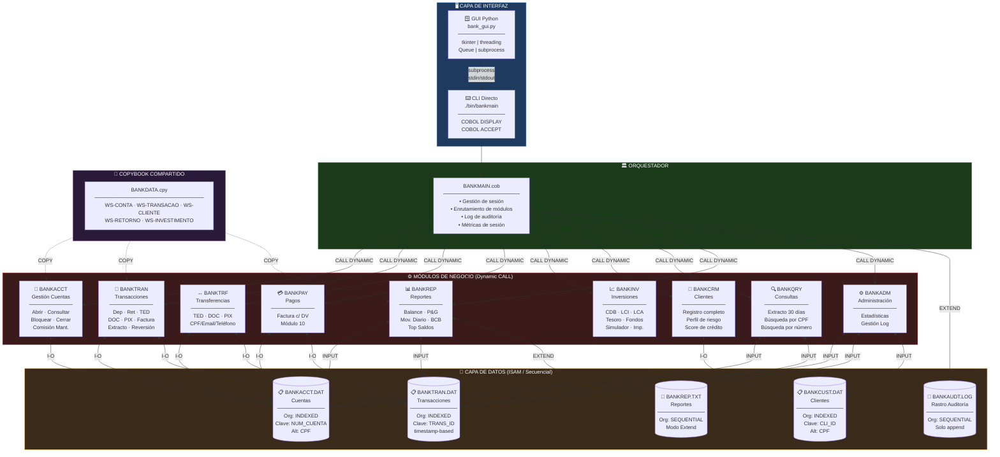
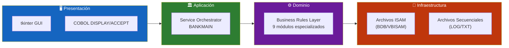
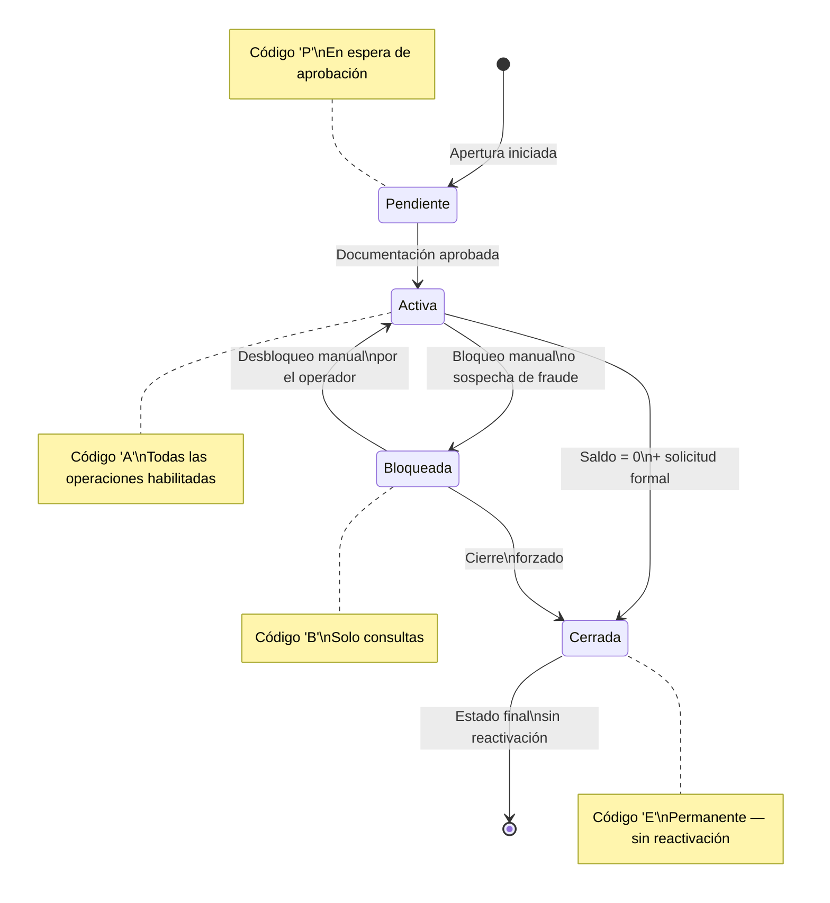
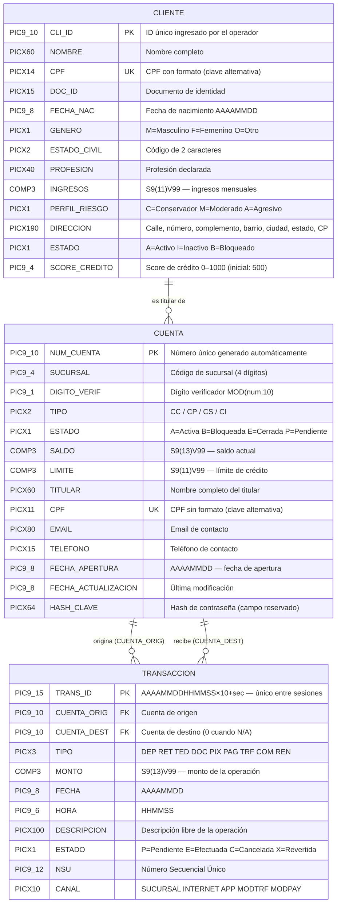
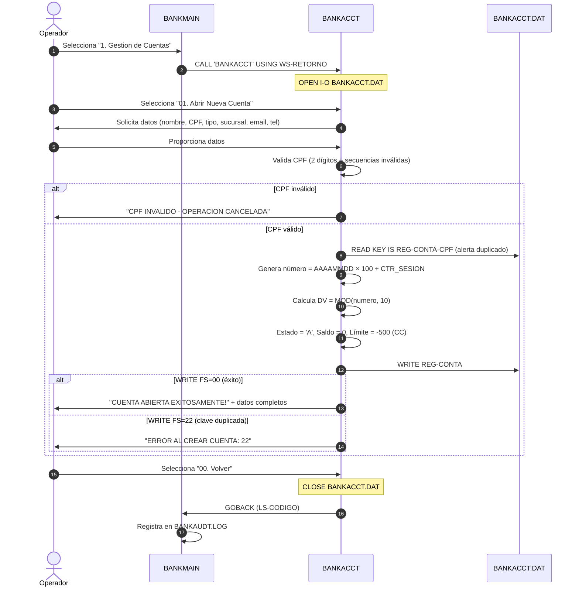
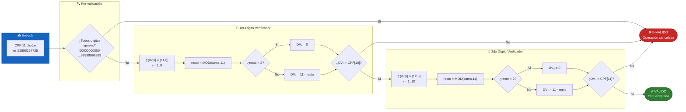
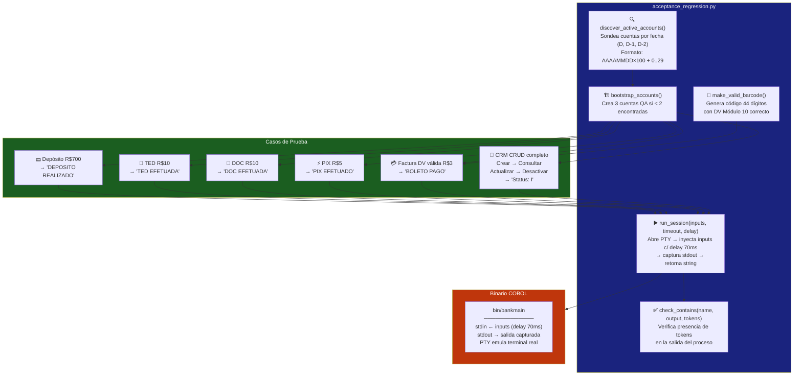

<div align="center">

**🌐 Elija el Idioma / Choose Language / Selecione o Idioma**

[](README.md)&nbsp;&nbsp;&nbsp;[](README_PT.md)&nbsp;&nbsp;&nbsp;[](README_ES.md)

</div>

---

<div align="center">

```
██████╗  █████╗ ███╗   ██╗ ██████╗ ██████╗      ██████╗ ██████╗ ██████╗  ██████╗ ██╗
██╔══██╗██╔══██╗████╗  ██║██╔════╝██╔═══██╗    ██╔════╝██╔═══██╗██╔══██╗██╔═══██╗██║
██████╔╝███████║██╔██╗ ██║██║     ██║   ██║    ██║     ██║   ██║██████╔╝██║   ██║██║
██╔══██╗██╔══██║██║╚██╗██║██║     ██║   ██║    ██║     ██║   ██║██╔══██╗██║   ██║██║
██████╔╝██║  ██║██║ ╚████║╚██████╗╚██████╔╝    ╚██████╗╚██████╔╝██████╔╝╚██████╔╝███████╗
╚═════╝ ╚═╝  ╚═╝╚═╝  ╚═══╝ ╚═════╝ ╚═════╝      ╚═════╝ ╚═════╝ ╚═════╝  ╚═════╝ ╚══════╝
                    Sistema Bancario Enterprise en GnuCOBOL
```

---

[](https://gnucobol.sourceforge.io/)
[](https://python.org)
[](https://docs.python.org/3/library/tkinter.html)
[](https://ubuntu.com/)
[]()
[]()
[]()

<br/>

> **Un sistema bancario completo, robusto y de nivel enterprise**
> desarrollado en COBOL legado moderno con interfaz gráfica Python y una suite completa de pruebas automatizadas.

<br/>


</div>

---

## 📑 Tabla de Contenidos

<details>
<summary>▶️ <strong>Haga clic para expandir / contraer esta sección</strong></summary>

<table>
<tr>
<td valign="top" width="50%">

**🏗️ Sistema**
- [Visión General](#-visión-general)
- [Arquitectura del Sistema](#-arquitectura-del-sistema)
- [Stack Tecnológico](#-stack-tecnológico)
- [Patrones de Diseño](#-patrones-de-diseño-aplicados)
- [Estructura del Proyecto](#-estructura-del-proyecto)

**📦 Módulos**
- [BANKMAIN — Orquestador](#-bankmain--orquestador-principal)
- [BANKACCT — Cuentas](#-bankacct--gestión-de-cuentas)
- [BANKTRAN — Transacciones](#-banktran--procesamiento-de-transacciones)
- [BANKTRF — Transferencias](#-banktrf--módulo-de-transferencias)
- [BANKPAY — Pagos](#-bankpay--módulo-de-pagos)
- [BANKINV — Inversiones](#-bankinv--módulo-de-inversiones)
- [BANKCRM — Clientes](#-bankcrm--gestión-de-clientes)
- [BANKQRY — Consultas](#-bankqry--consultas-y-extractos)
- [BANKREP — Reportes](#-bankrep--reportes)
- [BANKADM — Administración](#-bankadm--administración)
- [BANKLOAN — Préstamos](#-bankloan--préstamos-y-financiación)
- [BANKCARD — Tarjetas](#-bankcard--gestión-de-tarjetas)
- [BANKSCHD — Programación](#-bankschd--programación-de-pagos)
- [BANKAUTH — Autenticación](#-bankauth--autenticación-y-2fa)
- [BANKHELP — Ayuda](#-bankhelp--centro-de-ayuda)
- [bank\_export — Exportación](#-bank_export--exportación-multi-formato)
- [21 Módulos Adicionales (FX→Donaciones)](#-módulos-adicionales-fx-a-donaciones)

</td>
<td valign="top" width="50%">

**💼 Negocio**
- [Reglas de Negocio](#-reglas-de-negocio)
- [Requisitos Funcionales](#-requisitos-funcionales)
- [Requisitos No Funcionales](#-requisitos-no-funcionales)

**📐 Diseño**
- [Modelo de Datos](#-modelo-de-datos)
- [Flujos del Sistema](#-flujos-del-sistema)
- [Ciclo de Vida de la Cuenta](#ciclo-de-vida-de-la-cuenta)
- [Flujo de Transacciones](#flujo-de-transacciones-tedpix)
- [Validación de CPF](#flujo-de-validación-de-cpf)

**🔐 Seguridad y Ops**
- [Seguridad](#-seguridad)
- [Instalación y Ejecución](#-instalación-y-ejecución)
- [Pruebas Automatizadas](#-pruebas-automatizadas)
- [Métricas y Monitoreo](#-métricas-y-monitoreo)
- [Limitaciones Conocidas](#-limitaciones-conocidas)

</td>
</tr>
</table>

---

</details>

## 🌟 Visión General

<details>
<summary>▶️ <strong>Haga clic para expandir / contraer esta sección</strong></summary>

**Banco COBOL S/A** es un sistema bancario completo y funcional implementado en **GnuCOBOL** (COBOL moderno de código abierto), demostrando que los lenguajes legados pueden ofrecer robustez, precisión financiera y arquitectura limpia comparable a los sistemas modernos.

El sistema procesa **depósitos, retiros, transferencias TED/DOC/PIX, pagos de facturas, inversiones e informes regulatorios**, todo con persistencia mediante **archivos ISAM indexados** — el mismo modelo utilizado en mainframes IBM durante décadas.

### 🎯 Objetivos del Sistema

| Objetivo | Descripción |
|----------|-------------|
| 🏦 **Core Banking** | Ciclo de vida completo de cuentas corrientes, ahorros, nómina e inversión |
| 💸 **Transacciones** | Procesamiento de débitos y créditos con rastro de auditoría completo |
| 📊 **Reportes** | Balances, movimiento diario, reportes regulatorios BCB |
| 🔐 **Seguridad** | Validación CPF con algoritmo real, bloqueo de cuentas, control de estado |
| 📈 **Inversiones** | CDB, LCI, LCA, Tesoro Directo y Fondos con cálculo real de impuesto |
| 🖥️ **GUI** | Python/tkinter con flujos guiados, temas claro/oscuro, Dashboard Canvas, gamificación, toasts, onboarding, barra de búsqueda y panel de configuración |
| 📤 **Exportación** | Motor de exportación multi-formato: CSV, TXT, JSON, XML, HTML, Markdown, Excel, PDF |
| 🧪 **Calidad** | Pruebas de regresión de aceptación E2E automatizadas via pseudo-terminal |

---

</details>

## 🏗️ Arquitectura del Sistema

<details>
<summary>▶️ <strong>Haga clic para expandir / contraer esta sección</strong></summary>

### Diagrama de Módulos



### Capas de la Arquitectura



---

</details>

## 🛠️ Stack Tecnológico

<details>
<summary>▶️ <strong>Haga clic para expandir / contraer esta sección</strong></summary>

<table>
<thead>
<tr>
<th>Capa</th>
<th>Tecnología</th>
<th>Versión</th>
<th>Propósito</th>
</tr>
</thead>
<tbody>
<tr>
<td>🔧 <strong>Runtime</strong></td>
<td>GnuCOBOL</td>
<td>3.x</td>
<td>Compilación y ejecución de módulos COBOL como shared objects</td>
</tr>
<tr>
<td>🖥️ <strong>GUI</strong></td>
<td>Python 3 + tkinter</td>
<td>3.8+</td>
<td>Interfaz gráfica nativa multiplataforma con flujos guiados</td>
</tr>
<tr>
<td>💾 <strong>Almacenamiento</strong></td>
<td>ISAM / BDB / VBISAM</td>
<td>—</td>
<td>Archivos indexados para acceso secuencial y aleatorio por clave</td>
</tr>
<tr>
<td>🔗 <strong>IPC</strong></td>
<td>subprocess + pty</td>
<td>—</td>
<td>Comunicación GUI↔COBOL via stdin/stdout y pseudo-terminal para pruebas</td>
</tr>
<tr>
<td>🏗️ <strong>Build</strong></td>
<td>GNU Make</td>
<td>—</td>
<td>Compilación incremental de módulos .so y ejecutable principal</td>
</tr>
<tr>
<td>🧪 <strong>Testing</strong></td>
<td>Python + pty</td>
<td>—</td>
<td>Pruebas E2E via pseudo-terminal — sin mocks, binario real</td>
</tr>
<tr>
<td>⚙️ <strong>Flags</strong></td>
<td>COB_CFLAGS</td>
<td>—</td>
<td><code>-D_FORTIFY_SOURCE=3 -ggdb3 -finline-functions -fsigned-char</code></td>
</tr>
<tr>
<td>🐧 <strong>Plataforma</strong></td>
<td>Linux / WSL2</td>
<td>Ubuntu 20+</td>
<td>Entorno de compilación y ejecución; GUI soporta Windows via WSL</td>
</tr>
</tbody>
</table>

---

</details>

## 🎨 Patrones de Diseño Aplicados

<details>
<summary>▶️ <strong>Haga clic para expandir / contraer esta sección</strong></summary>

| Patrón | Módulo | Implementación |
|--------|--------|----------------|
| 🏛️ **Service Orchestrator** | BANKMAIN | Enruta CALL dinámico a módulos via EVALUATE sobre opción del menú |
| 🗄️ **Repository Pattern** | BANKACCT | Encapsula toda la E/S de cuentas en párrafos con nombres semánticos |
| ⚡ **Command Pattern** | BANKTRAN | Cada tipo de transacción es un comando independiente con su propia validación |
| 📦 **Unit of Work** | BANKTRAN/BANKTRF | Agrupa débito + crédito + registro de auditoría como unidad lógica |
| 🎯 **Strategy Pattern** | BANKINV | Cada producto financiero tiene su propia estrategia de cálculo de rentabilidad |
| 📋 **Report Generator** | BANKREP | Separa la recopilación de datos, el procesamiento y el formato de reportes |
| 🔌 **Shared Kernel** | BANKDATA.cpy | Copybook con estructuras de datos compartidas sin duplicación |
| 🏭 **Facade** | BANKMAIN | Interfaz unificada para todos los subsistemas bancarios |

---

</details>

## 📁 Estructura del Proyecto

<details>
<summary>▶️ <strong>Haga clic para expandir / contraer esta sección</strong></summary>

```
bank_system/
│
├── 📋 Fuentes COBOL (Módulos de Negocio)
│   ├── BANKMAIN.cob          # Orquestador principal (entry point)
│   ├── BANKACCT.cob          # Gestión de cuentas bancarias
│   ├── BANKTRAN.cob          # Procesamiento de transacciones
│   ├── BANKTRF.cob           # Transferencias avanzadas (TED/DOC/PIX multi-clave)
│   ├── BANKPAY.cob           # Pagos, facturas y emisión de boletos (Módulo 10)
│   ├── BANKINV.cob           # Inversiones y simulaciones financieras
│   ├── BANKCRM.cob           # Gestión de clientes (CRM)
│   ├── BANKQRY.cob           # Consultas y extractos (solo lectura)
│   ├── BANKREP.cob           # Reportes gerenciales y regulatorios
│   ├── BANKADM.cob           # Módulo administrativo
│   ├── BANKLOAN.cob          # Préstamos y financiación (fórmula PMT, 4 tipos)
│   ├── BANKCARD.cob          # Tarjetas (débito/crédito, virtual, cuotas)
│   ├── BANKSCHD.cob          # Programación de pagos/transferencias (recurrencia)
│   ├── BANKAUTH.cob          # Autenticación, 2FA, PIN, gamificación
│   ├── BANKHELP.cob          # Centro de ayuda, FAQ, términos, privacidad
│   ├── BANKFX.cob            # Cambio y conversión de divisas
│   ├── BANKSEG.cob           # Seguros (vida, hogar, auto, viaje)
│   ├── BANKCONS.cob          # Consorcio (vehículos/inmuebles/servicios)
│   ├── BANKPREV.cob          # Previsión privada (PGBL/VGBL)
│   ├── BANKDEB.cob           # Registro de débito automático
│   ├── BANKCAP.cob           # Títulos de capitalización
│   ├── BANKLIM.cob           # Gestión de límites de crédito
│   ├── BANKNOTIF.cob         # Centro de notificaciones y alertas
│   ├── BANKTAX.cob           # Declaración anual de la renta (IR)
│   ├── BANKCHQ.cob           # Gestión de talonario de cheques
│   ├── BANKFGTS.cob          # Consulta FGTS y simulación de retiro
│   ├── BANKCOB.cob           # Cobranza bancaria registrada
│   ├── BANKOVD.cob           # Sobregiro / crédito rotativo
│   ├── BANKPOUP.cob          # Metas de ahorro (alcancías digitales)
│   ├── BANKCONSIG.cob        # Crédito con descuento de nómina
│   ├── BANKSCORE.cob         # Motor de score crediticio (0–1000)
│   ├── BANKCASHBACK.cob      # Cashback y programa de fidelidad
│   ├── BANKRENEG.cob         # Renegociación de deudas
│   ├── BANKPORT.cob          # Portabilidad (salario/crédito/cuenta)
│   ├── BANKPJ.cob            # Cuenta digital PJ/MEI
│   └── BANKDOA.cob           # Donaciones y contribuciones sociales
│
├── 📎 Copybooks COBOL
│   └── BANKDATA.cpy          # Estructuras de datos compartidas (todos los módulos)
│
├── 💾 Archivos de Datos (ISAM/Secuencial)
│   ├── BANKACCT.DAT          # Archivo de cuentas (indexado)
│   ├── BANKTRAN.DAT          # Archivo de transacciones (indexado)
│   ├── BANKCUST.DAT          # Archivo de clientes (indexado)
│   ├── BANKEMPREST.DAT       # Archivo de préstamos (indexado)
│   ├── BANKCART.DAT          # Archivo de tarjetas (indexado)
│   ├── BANKAGEND.DAT         # Archivo de pagos programados (indexado)
│   ├── BANKBOL.DAT           # Archivo de boletos emitidos (indexado)
│   ├── BANKAUDT.LOG          # Rastro de auditoría (append secuencial)
│   ├── BANKREP.TXT           # Reportes generados (extend secuencial)
│   └── BANKFX/SEG/CONS/PREV/DEB/CAP/LIM/NOTIF/TAX/CHQ/FGTS/
│       COB/OVD/POUP/CONSIG/SCORE/CASHBACK/RENEG/PORT/PJ/DOA.DAT
│       # un archivo indexado por módulo nuevo (schema aislado, clave propia)
│
├── 🐍 Frontend Python
│   ├── bank_gui.py               # Interfaz gráfica tkinter (temas, dashboard, gamificación)
│   ├── bank_export.py            # Motor de exportación multi-formato
│   ├── acceptance_regression.py  # Pruebas E2E automatizadas via pty
│   └── finance_regression.py     # Pruebas de regresión financiera
│
├── 🔨 Build
│   └── Makefile              # Compilación GnuCOBOL con flags de hardening
│
└── 📦 Binarios (generados por make)
    └── bin/
        ├── bankmain          # Ejecutable principal
        ├── BANKACCT.so  BANKTRAN.so  BANKTRF.so  BANKPAY.so
        ├── BANKINV.so   BANKCRM.so   BANKQRY.so  BANKREP.so
        ├── BANKADM.so   BANKLOAN.so  BANKCARD.so BANKSCHD.so
        ├── BANKAUTH.so  BANKHELP.so  BANKFX.so   BANKSEG.so
        ├── BANKCONS.so  BANKPREV.so  BANKDEB.so  BANKCAP.so
        ├── BANKLIM.so   BANKNOTIF.so BANKTAX.so  BANKCHQ.so
        ├── BANKFGTS.so  BANKCOB.so   BANKOVD.so  BANKPOUP.so
        ├── BANKCONSIG.so BANKSCORE.so BANKCASHBACK.so BANKRENEG.so
        ├── BANKPORT.so  BANKPJ.so    BANKDOA.so
        └── (36 shared objects en total)
```

---

</details>

## 📦 Módulos del Sistema

<details>
<summary>▶️ <strong>Haga clic para expandir / contraer esta sección</strong></summary>

### 🏛️ BANKMAIN — Orquestador Principal

**Rol:** Punto de entrada de la aplicación. Gestiona la sesión, controla el archivo de log y enruta llamadas CALL dinámicas a los módulos especializados.

**Responsabilidades:**
- Inicialización de sesión con ID basado en timestamp
- Apertura y control del archivo de auditoría (`BANKAUDT.LOG` en modo EXTEND)
- Menú principal con 9 opciones de navegación
- Registro de cada operación en el log de auditoría (fecha, hora, opción y código de retorno)
- Contadores de sesión: operaciones realizadas y errores encontrados
- Visualización del resumen de sesión al cerrar

```
╔══════════════════════════════════════════════════╗
║         SISTEMA BANCARIO COBOL v3.0.0            ║
║         Sesion: [ID timestamp]                   ║
╠══════════════════════════════════════════════════╣
║  1. Gestion de Cuentas      M. Notificaciones    ║
║  2. Transacciones           N. Declaracion Renta ║
║  3. Consultas y Extractos   O. Talonario Cheques ║
║  4. Transferencias          P. FGTS              ║
║  5. Pagos                   Q. Cobranza Bancaria ║
║  6. Inversiones             R. Sobregiro/Rotativo║
║  7. Gestion de Clientes     S. Metas de Ahorro   ║
║  8. Reportes                T. Credito Nomina    ║
║  9. Administracion          U. Score Crediticio  ║
║  A. Prestamos y Financ.     V. Cashback/Fidelid. ║
║  B. Gestion de Tarjetas     W. Renegociac. Deuda ║
║  C. Programacion de Pagos   X. Portabilidad      ║
║  D. Seguridad y Autenticac. Y. Cuenta PJ/MEI     ║
║  E. Cambio y Divisas        Z. Donaciones        ║
║  F. Seguros                 H. Ayuda y Soporte   ║
║  G. Consorcio               0. Salir             ║
║  I. Prevision Privada (PGBL/VGBL)                ║
║  J. Debito Automatico                            ║
║  K. Titulos de Capitalizacion                    ║
║  L. Gestion de Limites de Credito                ║
╚══════════════════════════════════════════════════╝
```

---

### 🏦 BANKACCT — Gestión de Cuentas

**Rol:** Repository Pattern completo para el ciclo de vida de cuentas bancarias.

| Operación | Código | Descripción |
|-----------|--------|-------------|
| Abrir Nueva Cuenta | `01` | Recopilar datos, validar CPF (algoritmo completo 2 dígitos), generar número único, grabar registro |
| Consultar Cuenta | `02` | Búsqueda por número via clave primaria, mostrar datos completos con saldo formateado |
| Actualizar Datos | `03` | Actualizar email/teléfono con timestamp de actualización automático |
| Bloquear/Desbloquear | `04` | Toggle de estado A↔B — REWRITE solo cuando hay cambio efectivo |
| Cerrar Cuenta | `05` | Cierra si saldo = cero; marca estado `'E'` permanentemente |
| Listar Cuentas | `06` | Escaneo completo con total de cuentas y saldo global (usa contador propio) |
| Buscar por CPF | `07` | Acceso via clave alternativa indexada |
| Aplicar Comisiones | `08` | Comisión de mantenimiento para cuentas corrientes activas — verifica límite antes de debitar |
| Reporte de Cuentas | `09` | Delega al módulo BANKREP |
| Volver | `00` | Cierra archivo y retorna a BANKMAIN |

**Generación de número de cuenta:** `FECHA_ACTUAL (YYYYMMDD) × 100 + CTR_SESION`
**Dígito verificador:** `MOD(numero_cuenta, 10)`

---

### 💸 BANKTRAN — Procesamiento de Transacciones

**Rol:** Command Pattern + Unit of Work. Módulo central de movimiento financiero con rastro de auditoría completo e IDs únicos por sesión.

| Operación | Código | Validaciones | Auditoría |
|-----------|--------|-------------|-----------|
| Depósito | `01` | Monto > 0, cuenta activa | ✅ Tipo `DEP` |
| Retiro | `02` | Saldo + límite suficiente, límite diario R$ 5.000, monto > 0 | ✅ Tipo `SAQ` |
| TED | `03` | Saldo+límite ≥ monto+comisión, destino activo, confirmación | ✅ Tipo `TED` |
| DOC | `04` | Igual a TED con comisión propia R$ 5,80 | ✅ Tipo `DOC` |
| PIX | `05` | Origen activo, saldo disponible, límite nocturno, destino activo, comisión cero | ✅ Tipo `PIX` |
| Pago Factura | `06` | Saldo + límite suficiente, monto > 0 | ✅ Tipo `PAG` |
| Consultar Saldo | `07` | Cuenta activa | — |
| Extracto 30 días | `08` | Filtro real por fecha via `INTEGER-OF-DATE / DATE-OF-INTEGER` | — |
| Revertir Transacción | `09` | Solo estado `'E'`, clave correcta `REG-TRANS-ID`, reversión por tipo | ✅ Estado `'X'` |

**ID de Transacción:** `AAAAMMDDHHMMSS × 10 + incremento_sesion` — elimina colisión entre sesiones.

---

### ↔️ BANKTRF — Módulo de Transferencias

**Rol:** Implementación alternativa y más completa de transferencias con soporte para búsqueda PIX por múltiples tipos de clave.

| Tipo | Comisión | Búsqueda de Destino |
|------|----------|---------------------|
| TED | R$ 14,90 | Por número de cuenta |
| DOC | R$ 5,80 | Por número de cuenta |
| PIX | R$ 0,00 | Escaneo completo por CPF (`'C'`), Email (`'E'`) o Teléfono (`'T'`) |

**PIX con múltiples claves:** el módulo recorre todos los registros del archivo de cuentas comparando el campo informado — más completo que el PIX de BANKTRAN (que usa solo clave alternativa CPF via índice).

---

### 💳 BANKPAY — Módulo de Pagos

**Rol:** Pago de facturas bancarias con validación rigurosa del dígito verificador por Módulo 10.

**Algoritmo de Validación (Módulo 10):**
1. Extrae exactamente 44 dígitos numéricos del código de barras
2. Recorre posiciones 43→1 con pesos 2–9 en ciclo creciente
3. Calcula: `DV = 11 - MOD(suma, 11)` — si resultado > 9, DV = 1
4. Compara DV calculado con dígito en posición 44
5. Rechaza la factura antes de cualquier operación financiera si DV es inválido

**Secuencia de operación:**
```
Cuenta → Código de barras → Validar DV → Monto
→ Verificar saldo → Debitar → WRITE auditoría PAG → Confirmar
```

---

### 📈 BANKINV — Módulo de Inversiones

**Rol:** Strategy Pattern para productos financieros con simulador y cálculo real de rentabilidad e impuesto.

#### Productos Disponibles

| Producto | Tasa | Mínimo | Impuesto | Liquidez |
|---------|------|--------|----------|---------|
| 🏆 **CDB** | 105% CDI | R$ 1.000 | Regresivo | Al vencimiento |
| 🏠 **LCI** | 95% CDI | R$ 5.000 | **Exento** | 90 días |
| 🌾 **LCA** | 93% CDI | — | **Exento** | 90 días |
| 🇧🇷 **Tesoro Selic** | 100% SELIC | R$ 30 | Regresivo | D+1 |
| 🇧🇷 **Tesoro IPCA+** | IPCA + spread | R$ 30 | Regresivo | Al vencimiento |
| 🇧🇷 **Tesoro Prefijado** | 11,87% a.a. | R$ 30 | Regresivo | Al vencimiento |
| 📊 **Fondo RF DI** | Variable | — | Regresivo | D+1 |
| 📊 **Fondo Multimercado** | Variable | — | Regresivo | D+1 a D+30 |
| 📊 **Fondo Acciones** | Variable | — | 15% fijo | D+3 |

#### Tabla de Impuesto Regresivo

| Plazo | Tasa Impuesto |
|-------|---------------|
| ≤ 180 días | 🔴 22,5% |
| 181 – 360 días | 🟠 20,0% |
| 361 – 720 días | 🟡 17,5% |
| > 720 días | 🟢 15,0% |

#### Fórmula de Cálculo CDB — Estándar ANBIMA (252 días hábiles)

```
tasa_anual   = CDI × porcentaje_CDI / 100 / 100
tasa_diaria  = EXP(LOG(1 + tasa_anual) / 252) - 1
valor_bruto  = principal × (1 + tasa_diaria) ^ plazo_dias
rendimiento  = valor_bruto - principal
impuesto     = rendimiento × tasa_impuesto
valor_neto   = valor_bruto - impuesto
```

#### Tasas de Mercado Configuradas

| Índice | Tasa anual |
|--------|-----------|
| 📊 CDI | 10,5000% |
| 🏛️ SELIC | 10,5000% |
| 📈 IPCA | 4,6200% |
| 📉 IGPM | 3,8900% |

---

### 👥 BANKCRM — Gestión de Clientes

**Rol:** Registro y mantenimiento del perfil completo de clientes con score de crédito y perfil de riesgo.

**Datos de Registro:**

| Campo | PIC | Descripción |
|-------|-----|-------------|
| ID del Cliente | `9(10)` | Clave primaria — ingresada por el operador |
| Nombre | `X(60)` | Nombre completo |
| CPF | `X(14)` | Clave alternativa con formato |
| RG | `X(15)` | Documento de identidad |
| Fecha de Nacimiento | `9(8)` | Formato AAAAMMDD |
| Género | `X(1)` | `M` / `F` / `O` |
| Estado Civil | `X(2)` | Código de 2 caracteres |
| Profesión | `X(40)` | — |
| Ingresos | `S9(11)V99 COMP-3` | Ingresos mensuales |
| Perfil de Riesgo | `X(1)` | `C` / `M` / `A` |
| Dirección | Grupo `X(190)` | Calle, número, complemento, barrio, ciudad, estado, CP |
| Estado | `X(1)` | `A`=Activo `I`=Inactivo `B`=Bloqueado |
| Score de Crédito | `9(4)` | 0–1000 puntos (inicial: 500) |

**Perfiles de Riesgo:**

| Código | Perfil | Característica |
|--------|--------|---------------|
| 🟢 `C` | Conservador | Prefiere renta fija, baja volatilidad |
| 🟡 `M` | Moderado | Mezcla entre renta fija y variable |
| 🔴 `A` | Agresivo | Acepta alta volatilidad, busca máximo retorno |

---

### 🔍 BANKQRY — Consultas y Extractos

**Rol:** Interfaz de solo lectura (`OPEN INPUT`) para consultas sin riesgo de modificar datos.

| Operación | Código | Clave de Búsqueda | Filtro |
|-----------|--------|-------------------|--------|
| Consultar por número | `01` | Clave primaria (PIC 9(10)) | — |
| Consultar por CPF | `02` | Clave alternativa indexada (PIC X(11)) | — |
| Extracto rápido 30 días | `03` | Número de cuenta (escaneo completo) | `FECHA >= (HOY - 30)` |

**Filtro temporal:** `INTEGER-OF-DATE(HOY) - 30 → DATE-OF-INTEGER(resultado)` — maneja correctamente meses con 28/29/30/31 días.

---

### 📊 BANKREP — Reportes

**Rol:** Report Generator Pattern. Genera reportes persistidos en `BANKREP.TXT` con `OPEN EXTEND` — sin destruir el contenido anterior.

| Reporte | Código | Contenido |
|---------|--------|-----------|
| Balance General | `01` | Todas las cuentas con saldos; totales CC/CP; activas/bloqueadas |
| Resumen por Tipo | `02` | Conteo de cuentas por categoría |
| Movimiento Diario | `03` | Total DEP/RET/TRF del día actual filtrado por `FECHA_TRANS = HOY` |
| Saldos Negativos | `04` | Cuentas con `saldo < 0` (sobregiro) |
| Top 10 Saldos | `05` | Estructura para algoritmo de ordenamiento |
| Morosidad | `06` | Cuentas con límite utilizado > 80% |
| P&G Simplificado | `07` | Ingresos por comisiones e intereses vs gastos operativos |
| Reporte BCB | `08` | Formato SCR — Sistema de Información de Crédito del Banco Central |

---

### ⚙️ BANKADM — Administración

**Rol:** Operaciones administrativas y de mantenimiento del sistema.

| Operación | Código | Descripción |
|-----------|--------|-------------|
| Estadísticas Generales | `01` | Conteo total de registros en CUENTAS, TRANS y CLIENTES via escaneo completo |
| Limpiar Log | `02` | Trunca `BANKAUDT.LOG` (OPEN OUTPUT → cerrar) |

> [!WARNING]
> La operación **Limpiar Log** borra permanentemente el rastro de auditoría. En un entorno de producción real, el log debe ser inmutable y archivado externamente.

---

### 💰 BANKLOAN — Préstamos y Financiación

**Rol:** Ciclo completo de crédito — simulación, contratación, pago de cuotas y cancelación anticipada.

| Operación | Código | Descripción |
|-----------|--------|-------------|
| Solicitar | `01` | Selección de tipo → tasa → fórmula PMT → crédito en cuenta |
| Consultar | `02` | Búsqueda por ID del préstamo |
| Pagar Cuota | `03` | Valida estado `'A'`, descuenta PMT, actualiza saldo, marca `'Q'` al cancelar |
| Simular | `04` | Muestra total + intereses sin grabar archivos |
| Listar por Cuenta | `05` | Escaneo secuencial filtrado por cuenta |
| Cancelar Anticipado | `06` | Paga saldo deudor total de una vez |

**Tipos de préstamo:** Personal 1,99%/mes · Nómina 1,49%/mes · Hipotecario 0,79%/mes · Vehículo 1,69%/mes

---

### 💳 BANKCARD — Gestión de Tarjetas

**Rol:** Ciclo completo de tarjetas — emisión, compras, facturas, tarjeta virtual y cuotas.

| Operación | Código | Descripción |
|-----------|--------|-------------|
| Emitir | `01` | Crea tarjeta débito o crédito (16 dígitos, VISA/MASTER) |
| Consultar | `02` | Datos completos y límite disponible |
| Bloquear/Desbloquear | `03`/`04` | Alterna estado `'A'`↔`'B'` |
| Alterar Límite | `05` | Modifica límite de crédito |
| Factura | `06` | Factura actual con ítems |
| Pagar Factura | `07` | Total o parcial |
| Tarjeta Virtual | `A` | Número determinístico de la cuenta (prefijo `4567...`), CVV fijo, vencimiento 12/2030 |
| Compra Débito | `B` | Debita directamente del saldo de la cuenta |
| Compra Crédito | `C` | Debita del límite disponible, suma a la factura |
| Compra en Cuotas | `D` | 2–24 cuotas; bloquea límite total, lanza 1ª cuota en factura |

---

### 📅 BANKSCHD — Programación de Pagos

**Rol:** Transferencias y pagos programados con soporte de recurrencia.

| Operación | Código | Descripción |
|-----------|--------|-------------|
| Prog. Transferencia | `01` | TED/DOC/PIX con fecha futura y recurrencia |
| Prog. Pago | `02` | Tipo BOL con descripción |
| Listar Programados | `03` | Todos los ítems pendientes/procesados de la cuenta |
| Cancelar | `04` | Solo si estado `'P'` (pendiente) |
| Procesar Vencidos | `05` | Escaneo completo — ejecuta todos con `FECHA_PROG ≤ HOY` |

**Recurrencia:** `U`=única / `M`=mensual (+30 días) / `S`=semanal (+7 días)

---

### 🔐 BANKAUTH — Autenticación y 2FA

**Rol:** Login con CPF+contraseña, bloqueo por intentos, 2FA, cambio de PIN y recompensas de gamificación.

| Operación | Código | Descripción |
|-----------|--------|-------------|
| Login | `01` | CPF + contraseña, máx 3 intentos, verificación de estado de cuenta |
| Cambiar Contraseña | `02` | Actual + nueva + confirmación, REWRITE en el registro |
| 2FA | `03` | Código 6 dígitos basado en hora (HHMMSS MOD 899999 + 100000) |
| Recuperar Acceso | `04` | Muestra email registrado, orienta contacto con admin |
| Puntos y Badges | `05` | Niveles BRONZE / PLATA / ORO / PLATINO |

**Gamificación:** BRONZE (0–999 pts) → PLATA (1.000) → ORO (5.000) → PLATINO (10.000+)

---

### ❓ BANKHELP — Centro de Ayuda

**Rol:** Documentación interna del sistema — sin dependencias externas.

| Tema | Código | Contenido |
|------|--------|-----------|
| FAQ | `01` | 8 preguntas/respuestas sobre cuentas, transferencias, tarjetas, boletos, exportación |
| Guía Rápida | `02` | Navegación por los 15 módulos |
| Términos de Uso | `03` | Políticas, usos prohibidos, responsabilidad |
| Política de Privacidad | `04` | Datos recopilados, derechos del usuario (LGPD) |
| Contacto / Soporte | `05` | 0800, SAC 24h, Defensoría, email, dirección |
| Acerca de | `06` | Versión, 15 módulos listados, archivos de datos, arquitectura |

---

### 📤 bank_export — Exportación Multi-Formato

**Rol:** Motor Python puro que analiza la salida stdout de COBOL y exporta en múltiples formatos.

| Formato | Biblioteca | Características |
|---------|-----------|----------------|
| CSV | stdlib | Cabeceras, separador punto y coma |
| TXT | stdlib | Salida COBOL bruta verbatim |
| JSON | stdlib | Array de objetos de transacción |
| XML | stdlib | Raíz `<transactions>` con hijos `<transaction>` |
| HTML | stdlib | Tabla CSS responsiva con branding bancario |
| Markdown | stdlib | Formato de tabla GFM |
| Excel (.xlsx) | openpyxl | Cabecera estilizada, freeze panes, auto-ancho, hoja Info |
| PDF | fpdf2 | A4 horizontal, filas zebradas, pie de página con número |

```bash
make export-deps   # pip install openpyxl fpdf2
```

---

</details>

## 🧩 Módulos Adicionales (FX a Donaciones)

<details>
<summary>▶️ <strong>Haga clic para expandir / contraer esta sección</strong></summary>

> 21 módulos añadidos a los 15 originales, completando las opciones de menú **E–G, I–Z** (suite bancaria completa de la A a la Z). Cada módulo posee su propio archivo indexado `.DAT` — sin cambios en el schema del `BANKACCT.DAT` original.

<details>
<summary><strong>💱 E–G — Cambio, Seguros, Consorcio</strong> (BANKFX · BANKSEG · BANKCONS)</summary>

| Módulo | Menú | Propósito | Operaciones Principales |
|--------|------|-----------|-------------------------|
| **BANKFX** | E | Cambio y conversión de divisas | Cotizaciones compra/venta (USD/EUR/GBP/ARS…), simulación de spread, cálculo de IOF, historial de conversiones |
| **BANKSEG** | F | Seguros (vida, hogar, auto, viaje) | Simulación de cotización por perfil, contratación de póliza, pago de prima, apertura de siniestro, consulta de pólizas |
| **BANKCONS** | G | Consorcio (vehículos/inmuebles/servicios) | Simulación de grupo, adhesión, registro de oferta (lance), sorteo de adjudicación, pago de cuotas |

</details>

<details>
<summary><strong>🏦 I–M — Previsión, Débito, Capitalización, Límites, Notificaciones</strong> (BANKPREV · BANKDEB · BANKCAP · BANKLIM · BANKNOTIF)</summary>

| Módulo | Menú | Propósito | Operaciones Principales |
|--------|------|-----------|-------------------------|
| **BANKPREV** | I | Previsión privada (PGBL/VGBL) | Contratación de plan, aportes, consulta de saldo/rentabilidad, simulación de rescate, comparación de regímenes tributarios |
| **BANKDEB** | J | Registro de débito automático | Registrar/cancelar débitos recurrentes (servicios, suscripciones), consulta de vencimientos, historial de pagos |
| **BANKCAP** | K | Títulos de capitalización | Compra de plan, simulación de sorteo mensual, rescate, consulta de títulos activos |
| **BANKLIM** | L | Gestión de límites de crédito | Consulta de límite, solicitud de aumento (score por ingresos), límite temporal, extracto de uso |
| **BANKNOTIF** | M | Centro de notificaciones y alertas | Configuración de preferencias (SMS/email/push), historial de alertas, marcar como leído, gatillos de saldo bajo/vencimiento |

</details>

<details>
<summary><strong>🧾 N–R — Declaración de Renta, Cheques, FGTS, Cobranza, Sobregiro</strong> (BANKTAX · BANKCHQ · BANKFGTS · BANKCOB · BANKOVD)</summary>

| Módulo | Menú | Propósito | Operaciones Principales |
|--------|------|-----------|-------------------------|
| **BANKTAX** | N | Declaración anual de la renta (IR) | Reporte anual de ingresos/retenciones, resumen de gastos deducibles, simulación de DARF, estado de la declaración |
| **BANKCHQ** | O | Gestión de talonario de cheques | Solicitud de talonario, consulta de cheque individual, suspensión de pago, historial de uso |
| **BANKFGTS** | P | Consulta FGTS y simulación de retiro | Consulta de saldo, extracto de rendimiento mensual, simulación de retiro-cumpleaños, solicitud de retiro |
| **BANKCOB** | Q | Cobranza bancaria registrada | Emisión de boleto registrado, consulta de pagador, liquidación/baja, reporte de cartera vencida |
| **BANKOVD** | R | Sobregiro / crédito rotativo | Contratación de límite, simulación de uso con IOF diario + intereses, extracto, liquidación |

</details>

<details>
<summary><strong>💰 S–W — Metas de Ahorro, Crédito Nómina, Score, Cashback, Renegociación</strong> (BANKPOUP · BANKCONSIG · BANKSCORE · BANKCASHBACK · BANKRENEG)</summary>

| Módulo | Menú | Propósito | Operaciones Principales |
|--------|------|-----------|-------------------------|
| **BANKPOUP** | S | Metas de ahorro (alcancías digitales) | Crear meta (nombre/objetivo/plazo), depositar, retirar, consulta de progreso (% de la meta, rendimiento simulado de 105% del CDI), cierre con devolución |
| **BANKCONSIG** | T | Crédito con descuento de nómina | Verificación de margen (límite legal 30%/35%), simulación por convenio (tasas INSS/Servidor/Militar/CLT), contratación, pago de cuota, liquidación anticipada (descuento del 8%) |
| **BANKSCORE** | U | Motor de score crediticio (0–1000) | Consulta/recálculo de score (ingresos, puntualidad, tiempo de relación, endeudamiento), clasificación A–E, desglose de factores, simulación de impacto de deudas, consejos de mejora |
| **BANKCASHBACK** | V | Cashback y programa de fidelidad | Registro de compra con % por categoría (supermercado 2%/combustible 3%/farmacia 4%/restaurante 1,5%/otros 0,5%), consulta de saldo, canje, catálogo de puntos, niveles Bronce→Platino |
| **BANKRENEG** | W | Renegociación de deudas | Simulación con descuento escalonado por días de mora (10–70%), cierre de acuerdo, consulta, pago de cuota, liquidación al contado (descuento adicional del 10%) |

</details>

<details>
<summary><strong>🏢 X–Z — Portabilidad, Cuenta PJ/MEI, Donaciones</strong> (BANKPORT · BANKPJ · BANKDOA)</summary>

| Módulo | Menú | Propósito | Operaciones Principales |
|--------|------|-----------|-------------------------|
| **BANKPORT** | X | Portabilidad (salario/crédito/cuenta) | Solicitud de portabilidad salarial, portabilidad de crédito con comparación de tasas y estimación de ahorro, portabilidad de cuenta (migración de PIX/débito automático), consulta/cancelación de solicitudes |
| **BANKPJ** | Y | Cuenta digital PJ/MEI | Apertura de cuenta (CNPJ, régimen MEI/SIMPLES/PRESUMIDO con límite automático de R$ 81 mil/R$ 4,8 millones), consulta de datos, emisión de guía DAS, registro de facturación mensual con alerta de límite, reporte para contador, rangos de régimen tributario |
| **BANKDOA** | Z | Donaciones y contribuciones sociales | Donación única/recurrente, historial con totales, emisión de recibo deducible de impuestos, listado de instituciones asociadas, cancelación de donación recurrente |

</details>

---

</details>

## 💼 Reglas de Negocio

<details>
<summary>▶️ <strong>Haga clic para expandir / contraer esta sección</strong></summary>

### 🏦 Cuentas Bancarias

#### Tipos de Cuenta

| Código | Nombre | Límite de Crédito | Comisión Mant. |
|--------|--------|-------------------|----------------|
| `CC` | Cuenta Corriente | R$ 500,00 (sobregiro) | R$ 12,90/mes |
| `CP` | Cuenta de Ahorros | Sin límite | Gratuita |
| `CS` | Cuenta Nómina | Sin límite | Gratuita |
| `CI` | Cuenta Inversión | Sin límite | Gratuita |

#### Ciclo de Vida de la Cuenta



#### Reglas de Negocio — Cuentas

- ✅ CPF validado por el **algoritmo completo** (dos dígitos verificadores + rechazo de 10 secuencias inválidas)
- ✅ Alerta emitida cuando el CPF ya tiene una cuenta registrada (múltiples cuentas por CPF permitidas)
- ✅ Número de cuenta generado como `AAAAMMDD × 100 + secuencial_sesion`
- ✅ Dígito verificador calculado como `MOD(numero_cuenta, 10)`
- ✅ Comisión de mantenimiento debitada solo cuando `(saldo - comisión) ≥ límite` — no viola el límite contractual
- ✅ Cierre bloqueado cuando `saldo ≠ 0` (positivo o negativo)
- ✅ Bloquear/Desbloquear: REWRITE ejecutado solo cuando el estado cambia efectivamente

---

### 💸 Transacciones y Límites

#### Límites Operativos

| Operación | Límite | Condición |
|-----------|--------|-----------|
| 💵 Retiro diario | R$ 5.000,00 | Por cuenta, por día |
| 🔄 Transferencia diaria | R$ 10.000,00 | TED/DOC |
| ⚡ PIX diario | R$ 20.000,00 | Horario comercial |
| 🌙 PIX nocturno | R$ 1.000,00 | 22h00 – 06h00 |

#### Comisiones por Operación

| Operación | Comisión | Nota |
|-----------|----------|------|
| Depósito | Gratuito | — |
| Retiro | Gratuito | Límite diario aplicable |
| TED | R$ 14,90 | Verificada junto con saldo disponible |
| DOC | R$ 5,80 | Verificada junto con saldo disponible |
| PIX | **R$ 0,00** | Comisión cero garantizada en cualquier horario |
| Pago Factura | Gratuito | Validación Módulo 10 obligatoria |
| Comis. Cta. Corriente | R$ 12,90/mes | Solo cuentas corrientes activas |

#### Cálculo de Saldo Disponible

```
saldo_disponible = saldo_actual + abs(limite_cuenta)

Ejemplo — cuenta corriente con límite R$ 500:
  Saldo  R$ 100,00  →  disponible  R$ 600,00
  Saldo  R$   0,00  →  disponible  R$ 500,00
  Saldo  R$ -200,00 →  disponible  R$ 300,00
  Saldo  R$ -500,00 →  disponible  R$   0,00  ← límite agotado
```

#### Estado de Transacción

| Código | Significado |
|--------|-------------|
| `P` | Pendiente — en espera de procesamiento |
| `E` | Efectuada — procesada exitosamente |
| `C` | Cancelada — cancelada antes de la ejecución |
| `X` | Revertida — revertida después de la efectuación |

---

### 📊 Validación de CPF

```mermaid
flowchart TD
    A["📥 CPF Ingresado (11 dígitos)"] --> B{¿Secuencia\ninválida?\n000...0 a 999...9}
    B -->|"Sí"| FAIL["❌ CPF INVÁLIDO"]
    B -->|"No"| C["Calcular 1er DV\n∑(dígito[i] × (11-i)) para i = 1..9"]
    C --> D["resto = MOD(suma, 11)"]
    D --> E{¿resto < 2?}
    E -->|"Sí"| F["DV₁ = 0"]
    E -->|"No"| G["DV₁ = 11 - resto"]
    F --> H{¿DV₁ = CPF[10]?}
    G --> H
    H -->|"No"| FAIL
    H -->|"Sí"| I["Calcular 2do DV\n∑(dígito[i] × (12-i)) para i = 1..10"]
    I --> J["resto = MOD(suma, 11)"]
    J --> K{¿resto < 2?}
    K -->|"Sí"| L["DV₂ = 0"]
    K -->|"No"| M["DV₂ = 11 - resto"]
    L --> N{¿DV₂ = CPF[11]?}
    M --> N
    N -->|"No"| FAIL
    N -->|"Sí"| OK["✅ CPF VÁLIDO"]

    style FAIL fill:#c62828,color:#fff
    style OK fill:#2e7d32,color:#fff
    style A fill:#1565c0,color:#fff
```

---

</details>

## ✅ Requisitos Funcionales

<details>
<summary>▶️ <strong>Haga clic para expandir / contraer esta sección</strong></summary>

<details>
<summary><strong>🏦 RF01–RF10 — Gestión de Cuentas</strong></summary>

| ID | Requisito |
|----|-----------|
| RF01 | El sistema debe permitir la apertura de cuentas recopilando: nombre, CPF, tipo, sucursal, email y teléfono |
| RF02 | El sistema debe validar el CPF con el algoritmo oficial (dos dígitos verificadores) antes de crear la cuenta |
| RF03 | El sistema debe rechazar CPFs con todos los dígitos iguales (000...0 a 999...9) |
| RF04 | El sistema debe generar un número de cuenta único por sesión basado en fecha y secuencial |
| RF05 | El sistema debe calcular el dígito verificador de la cuenta automáticamente |
| RF06 | El sistema debe mostrar la confirmación de apertura solo cuando el WRITE sea exitoso (FS=00) |
| RF07 | El sistema debe soportar cuatro tipos de cuenta: CC, CP, CS y CI |
| RF08 | El sistema debe permitir el bloqueo y desbloqueo de cuentas (estado A↔B), realizando REWRITE solo cuando hay cambio efectivo |
| RF09 | El sistema debe impedir el cierre de cuentas con saldo diferente de cero |
| RF10 | El sistema debe aplicar comisión de mantenimiento solo cuando el saldo tras el débito no supere el límite |

</details>

<details>
<summary><strong>💸 RF11–RF28 — Transacciones</strong></summary>

| ID | Requisito |
|----|-----------|
| RF11 | El sistema debe aceptar depósitos en cualquier cuenta activa; monto positivo obligatorio |
| RF12 | El sistema debe validar el saldo disponible (saldo + límite) antes de cualquier débito |
| RF13 | El sistema debe aplicar un límite diario de R$ 5.000 para retiros |
| RF14 | El sistema debe cobrar R$ 14,90 por TED y deducirlo del saldo del remitente |
| RF15 | El sistema debe cobrar R$ 5,80 por DOC y deducirlo del saldo del remitente |
| RF16 | El sistema debe ejecutar PIX sin comisión (R$ 0,00) a cualquier hora |
| RF17 | El sistema debe limitar PIX a R$ 1.000 entre las 22h00 y las 06h00 |
| RF18 | El sistema debe solicitar la cuenta de origen antes de cualquier operación PIX |
| RF19 | El sistema debe verificar que la cuenta de destino esté activa antes de transferencias y PIX |
| RF20 | El sistema debe registrar todas las transacciones exitosas en BANKTRAN.DAT con el tipo correcto |
| RF21 | El sistema debe generar IDs de transacción basados en timestamp (AAAAMMDDHHMMSS×10) para evitar colisión entre sesiones |
| RF22 | El sistema debe mostrar una advertencia cuando falle el WRITE de auditoría, sin revertir la operación |
| RF23 | El sistema debe mostrar extractos con un filtro real de los últimos 30 días usando aritmética de fecha entera |
| RF24 | El sistema debe permitir reversiones solo de transacciones con estado 'E' (Efectuada) |
| RF25 | El sistema debe usar `REG-TRANS-ID` (clave del archivo) en el READ de reversión, no una variable de working-storage |
| RF26 | El sistema debe usar `REG-CONTA-NUM` (clave del archivo) en el READ de reversión de cuenta |
| RF27 | El sistema debe validar el código de barras con el algoritmo Módulo 10 antes de pagar una factura |
| RF28 | El sistema debe registrar los pagos de facturas con tipo 'PAG' en el archivo de transacciones |

</details>

<details>
<summary><strong>📈 RF29–RF36 — Inversiones</strong></summary>

| ID | Requisito |
|----|-----------|
| RF29 | El sistema debe calcular la rentabilidad diaria de CDB usando `EXP(LOG(1+r)/252)` — base ANBIMA 252 días hábiles |
| RF30 | El sistema debe aplicar impuesto regresivo: 22,5% (≤180d), 20% (≤360d), 17,5% (≤720d), 15% (>720d) |
| RF31 | El sistema debe informar que LCI y LCA están exentos de impuesto |
| RF32 | El sistema debe exigir un mínimo de R$ 1.000 para CDB y R$ 5.000 para LCI |
| RF33 | El sistema debe mostrar valor bruto, impuesto y valor neto antes de confirmar la inversión |
| RF34 | El sistema debe ofrecer un simulador de inversión con los mismos cálculos del CDB |
| RF35 | El sistema debe mostrar las tasas de mercado actuales (CDI, SELIC, IPCA, IGPM) en el menú |
| RF36 | El sistema debe ofrecer al menos 5 tipos de productos: CDB, LCI, LCA, Tesoro, Fondos |

</details>

<details>
<summary><strong>👥 RF37–RF41 — Clientes (CRM)</strong></summary>

| ID | Requisito |
|----|-----------|
| RF37 | El sistema debe registrar clientes con datos personales, financieros y de dirección completos |
| RF38 | El sistema debe soportar tres perfiles de riesgo: Conservador (C), Moderado (M) y Agresivo (A) |
| RF39 | El sistema debe asignar un score de crédito inicial de 500 a nuevos clientes |
| RF40 | El sistema debe soportar estados de cliente: Activo (A), Inactivo (I) y Bloqueado (B) |
| RF41 | El sistema debe permitir búsqueda de clientes por ID (clave primaria) y por CPF (clave alternativa) |

</details>

<details>
<summary><strong>📊 RF42–RF48 — Reportes y Administración</strong></summary>

| ID | Requisito |
|----|-----------|
| RF42 | El sistema debe generar un balance con totales por tipo de cuenta (CC, CP) y estado |
| RF43 | El sistema debe persistir reportes en BANKREP.TXT sin borrar el contenido anterior (OPEN EXTEND con fallback) |
| RF44 | El sistema debe calcular el movimiento diario filtrado por la fecha actual |
| RF45 | El sistema debe listar cuentas con saldo negativo (sobregiro) |
| RF46 | El sistema debe registrar cada operación del menú principal en el log de auditoría con timestamp |
| RF47 | El sistema debe mostrar un resumen de sesión al cerrar: total de operaciones y errores |
| RF48 | El sistema debe mostrar estadísticas generales (conteo de cuentas, transacciones y clientes) en el módulo de administración |

</details>

---

</details>

## ⚡ Requisitos No Funcionales

<details>
<summary>▶️ <strong>Haga clic para expandir / contraer esta sección</strong></summary>

| Categoría | ID | Requisito |
|-----------|----|-----------| 
| 🎯 **Precisión** | RNF01 | Todos los cálculos financieros usan `COMP-3` (decimal empaquetado BCD) — sin punto flotante binario |
| 🎯 **Precisión** | RNF02 | Las fórmulas de inversión siguen el estándar ANBIMA — base 252 días hábiles por año |
| 🔐 **Seguridad** | RNF03 | CPF validado por el algoritmo completo (2 dígitos) antes de cualquier apertura de cuenta |
| 🔐 **Seguridad** | RNF04 | Las cuentas bloqueadas o cerradas no pueden realizar transacciones |
| 🔐 **Seguridad** | RNF05 | IDs de transacción únicos entre sesiones via timestamp `AAAAMMDDHHMMSS × 10` |
| 🔐 **Seguridad** | RNF06 | Límite PIX nocturno (22h–06h) de R$ 1.000 verificado antes de la ejecución |
| 📋 **Auditoría** | RNF07 | Toda transacción financiera exitosa genera un registro en BANKTRAN.DAT |
| 📋 **Auditoría** | RNF08 | El fallo en el WRITE de auditoría debe mostrar advertencia pero no bloquear la operación |
| 📋 **Auditoría** | RNF09 | Log de sesión en BANKAUDT.LOG abierto en modo EXTEND (solo append por sesión) |
| 🔧 **Modularidad** | RNF10 | Módulos compilados como shared objects (`.so`) cargados via `CALL` dinámico |
| 🔧 **Modularidad** | RNF11 | Estructuras de datos compartidas exclusivamente via copybook `BANKDATA.cpy` |
| ⚡ **Rendimiento** | RNF12 | Acceso a cuentas por número y CPF usa índices ISAM — sin escaneo completo |
| ⚡ **Rendimiento** | RNF13 | Extractos y reportes usan escaneo completo con filtro de fecha aplicado durante la lectura |
| 🖥️ **Interfaz** | RNF14 | GUI sincroniza stdout del proceso COBOL via cola thread-safe (`queue.Queue`) |
| 🖥️ **Interfaz** | RNF15 | GUI envía secuencias de entrada con delay configurable (80ms por defecto entre inputs) |
| 🧪 **Testabilidad** | RNF16 | Sistema testeable via pseudo-terminal (pty) sin ninguna interacción humana |
| 🌍 **Localización** | RNF17 | `DECIMAL-POINT IS COMMA` activo en todos los módulos (estándar pt-BR) |
| 🏗️ **Compilación** | RNF18 | Flags de hardening: `-D_FORTIFY_SOURCE=3 -fsigned-char -ggdb3 -pipe` |
| 🔄 **Compatibilidad** | RNF19 | Código en formato fijo COBOL (columnas 1–72), compatible con GnuCOBOL 3.x |

---

</details>

## 🗄️ Modelo de Datos

<details>
<summary>▶️ <strong>Haga clic para expandir / contraer esta sección</strong></summary>

### Diagrama Entidad-Relación



### Especificación de Archivos ISAM

<details>
<summary><strong>📋 BANKACCT.DAT — Archivo de Cuentas</strong></summary>

| Propiedad | Valor |
|-----------|-------|
| Organización | `INDEXED` |
| Modo de Acceso | `DYNAMIC` |
| Clave Primaria | `REG-CONTA-NUM` — PIC 9(10) |
| Clave Alternativa | `REG-CONTA-CPF` — PIC X(11) — `WITH DUPLICATES` |
| Tamaño del registro | ~279 bytes |
| Archivo de índice | `BANKACCT.DAT.1` (generado automáticamente por GnuCOBOL) |
| Módulos con acceso `I-O` | BANKACCT, BANKTRAN, BANKTRF, BANKPAY |
| Módulos con acceso `INPUT` | BANKQRY, BANKREP, BANKADM |

</details>

<details>
<summary><strong>📋 BANKTRAN.DAT — Archivo de Transacciones</strong></summary>

| Propiedad | Valor |
|-----------|-------|
| Organización | `INDEXED` |
| Modo de Acceso | `DYNAMIC` |
| Clave Primaria | `REG-TRANS-ID` — PIC 9(15) |
| Formato del ID | `AAAAMMDDHHMMSS × 10 + incremento_sesion` (0–9) |
| Tamaño del registro | ~169 bytes |
| Módulos con acceso `I-O` | BANKTRAN, BANKTRF, BANKPAY |
| Módulos con acceso `INPUT` | BANKQRY, BANKREP, BANKADM |

</details>

<details>
<summary><strong>📋 BANKCUST.DAT — Archivo de Clientes</strong></summary>

| Propiedad | Valor |
|-----------|-------|
| Organización | `INDEXED` |
| Modo de Acceso | `DYNAMIC` |
| Clave Primaria | `REG-CLI-ID` — PIC 9(10) |
| Clave Alternativa | `REG-CLI-CPF` — PIC X(14) — única |
| Tamaño del registro | ~407 bytes |
| Score inicial | 500 puntos |
| Módulos con acceso `I-O` | BANKCRM |
| Módulos con acceso `INPUT` | BANKADM |

</details>

---

</details>

## 🔄 Flujos del Sistema

<details>
<summary>▶️ <strong>Haga clic para expandir / contraer esta sección</strong></summary>

### Ciclo de Vida de la Cuenta



### Flujo de Transacciones TED/PIX

```mermaid
sequenceDiagram
    autonumber
    actor Cliente
    participant BANKTRAN
    participant ARCHCUENTAS as BANKACCT.DAT
    participant ARCHTRANS as BANKTRAN.DAT

    Note over BANKTRAN: ID_PROX = AAAAMMDDHHMMSS × 10

    Cliente->>BANKTRAN: Selecciona TED (03) o PIX (05)

    rect rgb(20, 60, 20)
        Note over BANKTRAN,ARCHCUENTAS: VALIDACIÓN CUENTA ORIGEN
        BANKTRAN->>Cliente: Solicita número de cuenta origen
        Cliente->>BANKTRAN: Proporciona cuenta origen
        BANKTRAN->>ARCHCUENTAS: READ KEY IS REG-CONTA-NUM
        alt No encontrada / Inactiva
            BANKTRAN->>Cliente: Mensaje de error
        end
    end

    rect rgb(60, 20, 20)
        Note over BANKTRAN,ARCHCUENTAS: VALIDACIÓN CUENTA DESTINO
        BANKTRAN->>Cliente: Solicita destino (número o CPF para PIX)
        Cliente->>BANKTRAN: Proporciona destino
        BANKTRAN->>ARCHCUENTAS: READ KEY IS REG-CONTA-NUM o REG-CONTA-CPF
        alt No encontrada / Inactiva
            BANKTRAN->>Cliente: Mensaje de error
        end
    end

    rect rgb(20, 20, 60)
        Note over BANKTRAN: VALIDACIONES FINANCIERAS
        BANKTRAN->>Cliente: Solicita monto
        Cliente->>BANKTRAN: Proporciona monto
        BANKTRAN->>BANKTRAN: disponible = saldo_orig + limite_orig
        BANKTRAN->>BANKTRAN: total = monto + comision (PIX: comision=0)
        alt Saldo insuficiente
            BANKTRAN->>Cliente: "SALDO INSUFICIENTE"
        else PIX nocturno > R$1.000
            BANKTRAN->>Cliente: "LIMITE PIX NOCTURNO EXCEDIDO"
        end
    end

    rect rgb(60, 40, 0)
        Note over BANKTRAN,ARCHTRANS: EJECUCIÓN
        BANKTRAN->>Cliente: "¿Confirmar? (S/N)" — solo TED/DOC
        BANKTRAN->>ARCHCUENTAS: REWRITE origen (saldo - monto - comision)
        alt Fallo en débito
            BANKTRAN->>Cliente: "ERROR AL DEBITAR CUENTA ORIGEN"
        else Débito OK
            BANKTRAN->>ARCHCUENTAS: REWRITE destino (saldo + monto)
            alt Fallo en crédito
                BANKTRAN->>Cliente: "ERROR AL ACREDITAR CUENTA DESTINO"
            else Crédito OK
                BANKTRAN->>BANKTRAN: ADD 1 TO ID_PROX
                BANKTRAN->>ARCHTRANS: WRITE REG-TRANS (tipo=TED/DOC/PIX correcto)
                BANKTRAN->>Cliente: "TED/DOC/PIX REALIZADO EXITOSAMENTE!"
            end
        end
    end
```



### Flujo de Validación de CPF



---

</details>

## 🔐 Seguridad

<details>
<summary>▶️ <strong>Haga clic para expandir / contraer esta sección</strong></summary>

### Controles Implementados

| Control | Dónde | Mecanismo |
|---------|-------|-----------|
| 🔏 **Validación de Identidad** | BANKACCT | CPF con algoritmo completo (2 DV) + rechazo de 10 secuencias inválidas |
| 🔒 **Control de Estado** | BANKTRAN, BANKTRF, BANKPAY | `ESTADO = 'A'` verificado antes de cualquier débito/crédito |
| 🛡️ **Validación de Saldo** | BANKTRAN, BANKTRF, BANKPAY | `disponible = saldo + límite` verificado antes de cada operación |
| ⏰ **Límite PIX Nocturno** | BANKTRAN | R$ 1.000 entre 22h00–06h00 via `CURRENT-DATE(9:4)` |
| 🔑 **Validación de Factura** | BANKPAY | Módulo 10 obligatorio — rechaza facturas inválidas antes del débito |
| 📋 **Rastro de Auditoría** | BANKMAIN | Cada operación del menú registrada en `BANKAUDT.LOG` con timestamp |
| 🆔 **IDs Únicos de Transacción** | BANKTRAN, BANKTRF | `AAAAMMDDHHMMSS × 10 + sec` — sin colisión entre sesiones |
| 🔄 **REWRITE Condicional** | BANKACCT | Bloqueo/Desbloqueo solo graba cuando el estado cambia efectivamente |
| 🏗️ **Hardening de Compilación** | Makefile | `-D_FORTIFY_SOURCE=3 -fsigned-char -ggdb3 -pipe -Wno-pointer-sign` |
| 📊 **Conteo de Errores** | BANKMAIN | `WS-CTR-ERROS` incrementado en cada fallo detectado en la sesión |

### Limitaciones de Seguridad Conocidas

> [!CAUTION]
> Las siguientes limitaciones existen en el sistema actual. **No usar en producción sin abordarlas.**

| # | Limitación | Impacto | Recomendación |
|---|-----------|---------|---------------|
| 🟡 1 | **Autenticación parcial** — `BANKAUTH.cob` implementa login CPF+contraseña (máx 3 intentos), 2FA y cambio de PIN, pero la contraseña se compara en texto plano (primeros 8 chars) | Funcional para demos; producción requiere SHA-256 via módulo C | Integrar módulo C de hashing (bcrypt/Argon2) via `CALL` |
| 🔴 2 | **Transferencias no atómicas** — débito y crédito son dos REWRITEs independientes | Riesgo de pérdida de fondos si el proceso muere entre las dos escrituras | Implementar journaling antes-después o adaptar 2-Phase Commit |
| 🟡 3 | **Session ID predecible** — generado con `RANDOM(FECHA_ACTUAL)` — misma semilla todo el día | Las sesiones del mismo día comparten IDs idénticos | Usar `/dev/urandom` via módulo utilitario en C |
| 🟡 4 | **Log de auditoría borrable** — `3000-LIMPAR-LOG` en BANKADM trunca `BANKAUDT.LOG` | Un operador podría borrar evidencia de fraude | Eliminar del menú o hacer el log append-only con permisos restringidos |
| 🟠 5 | **Email/teléfono en campos de dirección en CRM** — mapeo semántico incorrecto | Datos en posiciones no intuitivas, dificulta el mantenimiento | Agregar campos `EMAIL (X(80))` y `TELEFONO (X(15))` al registro de cliente |

---

</details>

## 🚀 Instalación y Ejecución

<details>
<summary>▶️ <strong>Haga clic para expandir / contraer esta sección</strong></summary>

### Prerrequisitos

```bash
# Ubuntu / Debian / WSL2
sudo apt update
sudo apt install -y gnucobol libcob-dev python3 python3-tk make

# Verificar instalación
cobc --version     # GnuCOBOL 3.x
python3 --version  # Python 3.8+
```

### Compilación

```bash
# Compilar todos los módulos
make all

# Salida esperada:
#   bin/BANKACCT.so, BANKTRAN.so ... (módulos dinámicos)
#   bin/bankmain                     (ejecutable principal)

# Limpiar todo (ATENCIÓN: borra .DAT, .LOG y .TXT)
make clean
```

### Ejecución

<table>
<tr>
<td width="50%">

**🖥️ Interfaz Gráfica**
```bash
make run-gui

# O directamente:
python3 bank_gui.py
```

La GUI detecta automáticamente WSL y usa `cmd.exe /C py -3` cuando es necesario.

</td>
<td width="50%">

**⌨️ CLI Directo**
```bash
make run

# O:
COB_LIBRARY_PATH=bin ./bin/bankmain
```

Ejecución interactiva directamente en la terminal con menús COBOL nativos.

</td>
</tr>
</table>

### Targets del Makefile

| Target | Descripción |
|--------|-------------|
| `make all` | Compila todos los módulos (`.so` + ejecutable) |
| `make run` | Compila + ejecuta en modo CLI interactivo |
| `make run-gui` | Compila + ejecuta la GUI Python/tkinter |
| `make acceptance` | Compila + ejecuta pruebas de regresión E2E |
| `make acceptance-fast` | Ejecuta pruebas sin recompilar |
| `make acceptance-finance` | Ejecuta pruebas de regresión financiera |
| `make clean` | Elimina `bin/`, `*.DAT`, `*.DAT.*`, `*.LOG`, `*.TXT` |
| `make install` | Copia `bankmain` a `/usr/local/bin` |

---

</details>

## 🧪 Pruebas Automatizadas

<details>
<summary>▶️ <strong>Haga clic para expandir / contraer esta sección</strong></summary>

El sistema tiene una suite completa de pruebas de aceptación que ejecuta el binario COBOL real a través de un **pseudo-terminal (PTY)** — sin mocks, sin simulaciones, comportamiento idéntico al uso manual.

### Arquitectura de Pruebas



### Cuentas QA (Bootstrap Automático)

Cuando se encuentran menos de 2 cuentas activas en los últimos 3 días, la suite crea automáticamente:

| Cuenta | CPF | Sucursal | Email |
|--------|-----|---------|-------|
| AUTO QA 1 | 12345678909 | 1234 | qa1@example.com |
| AUTO QA 2 | 11144477735 | 1234 | qa2@example.com |
| AUTO QA 3 | 52998224725 | 1234 | qa3@example.com |

---

</details>

## 📊 Métricas y Monitoreo

<details>
<summary>▶️ <strong>Haga clic para expandir / contraer esta sección</strong></summary>

### Métricas de Sesión (BANKMAIN)

| Campo | Tipo | Descripción |
|-------|------|-------------|
| `WS-CTR-OPERACOES` | PIC 9(10) | Total de operaciones realizadas en la sesión |
| `WS-CTR-ERROS` | PIC 9(6) | Total de errores encontrados en la sesión |
| `WS-CTR-SESSOES` | PIC 9(6) | Contador acumulado de sesiones |
| `WS-MET-TEMPO-RESP` | COMP-3 | Tiempo promedio de respuesta (extensible) |
| `WS-MET-THROUGHPUT` | COMP-3 | Throughput de operaciones (extensible) |
| `WS-MET-DISPONIB` | COMP-3 | Porcentaje de disponibilidad (extensible) |

### Formato del Log de Auditoría

```
AAAAMMDD HHMMSS OP:[opcion] COD:[codigo_retorno]

20260604 143022 OP:1   COD:0000
20260604 143045 OP:2   COD:0000
20260604 143103 OP:2   COD:0001
20260604 143112 OP:0   COD:0000
```

### Códigos de Retorno Estandarizados

| Código | Significado |
|--------|-------------|
| `0000` | Éxito |
| `0001` | Saldo insuficiente |
| `0002` | Cuenta/CPF no encontrado |
| `0003` | Límite excedido / monto inválido |
| `0004` | Cuenta bloqueada o cerrada |
| `0005` | Error de autenticación |
| `9999` | Error de sistema (E/S) |

---

</details>

## ⚠️ Limitaciones Conocidas

<details>
<summary>▶️ <strong>Haga clic para expandir / contraer esta sección</strong></summary>

> [!IMPORTANT]
> Este sistema fue desarrollado con fines educativos y demostración de arquitectura COBOL.

> [!NOTE]
> Los siguientes elementos fueron identificados, corregidos y verificados en una revisión de nivel Distinguished Engineer. La tabla refleja ahora el estado **actual**.

| Categoría | Problema Original | Estado |
|-----------|------------------|--------|
| 🔄 **Atomicidad** | Las transferencias usaban dos REWRITEs separados, sin transacción distribuida | ✅ Corregido — rollback compensatorio agregado ante fallo parcial |
| 💾 **Inversiones** | BANKINV era un simulador — inversiones/rescates no se persistían | ✅ Corregido — archivo de portafolio `BANKINV.DAT` con persistencia total |
| 📊 **P&G** | Los valores del P&G simplificado eran fijos | ✅ Corregido — calculado a partir de datos reales de cuenta/transacción |
| 👤 **Autenticación** | `HASH-CLAVE (X(64))` existía pero nunca se llenaba/verificaba | ✅ Corregido — hashing/verificación integrados en BANKAUTH |
| 📱 **Concurrencia** | Sin control de concurrencia entre procesos | ✅ Corregido — exclusión mutua mediante lockfile añadida |
| 🔑 **Claves PIX** | Clave aleatoria (UUID) no implementada en ningún módulo | ✅ Corregido — generación de clave PIX aleatoria vía UUID |
| 🗄️ **BCB** | El reporte BCB mostraba solo encabezado, sin datos en formato SCR | ✅ Corregido — completado según el layout SCR del BACEN |
| 📧 **BANKCRM** | Email/teléfono almacenados en campos de dirección | ✅ Corregido — campos dedicados de email/teléfono añadidos al schema |
| 🧮 **Alcance** | Originalmente 15 módulos / ~65 operaciones | ➕ Ampliado a **36 módulos** que cubren el menú completo **A–Z** (~200+ operaciones) |

> [!TIP]
> Restricciones estructurales que siguen siendo inherentes a la arquitectura: el sistema continúa siendo **de una sola máquina, sincronizado mediante lockfile** (sin concurrencia distribuida en red), y el ISAM no posee 2PC nativo — la atomicidad se logra mediante escrituras compensatorias y no mediante transacciones distribuidas verdaderas.

</details>

---

<div align="center">

---

### 🏦 Banco COBOL S/A

*Desarrollado con rigor técnico, precisión financiera y respeto por el legado*

[](https://gnucobol.sourceforge.io/)
[](https://python.org)
[](https://en.wikipedia.org/wiki/ISAM)
[]()
[]()

<br/>

```
"Los reportes de la muerte de COBOL han sido enormemente exagerados."
— Cada empresa Fortune 500 que aún procesa billones de dólares en COBOL.
```

</div>
