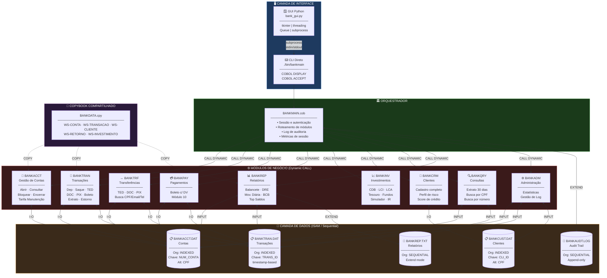
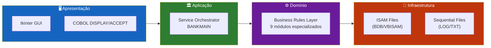
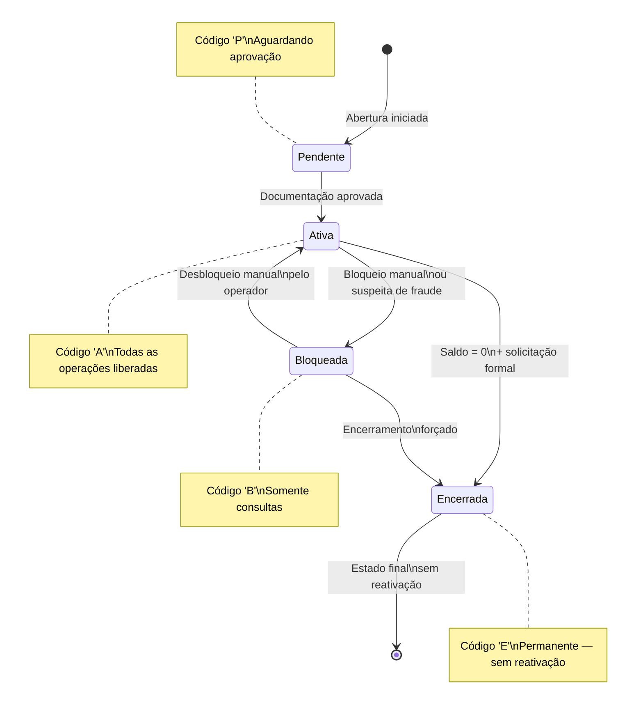
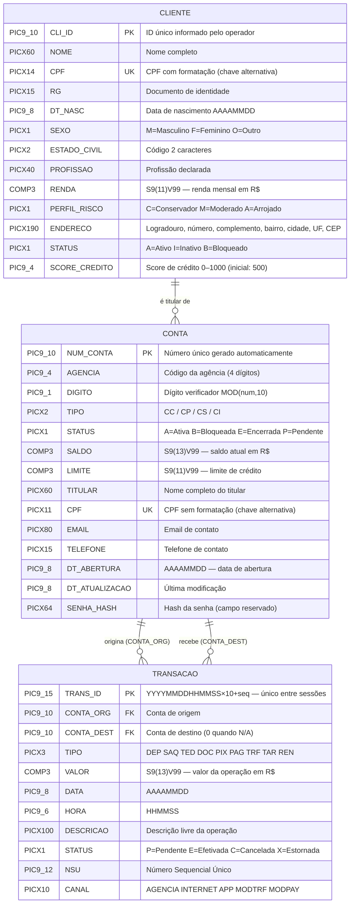
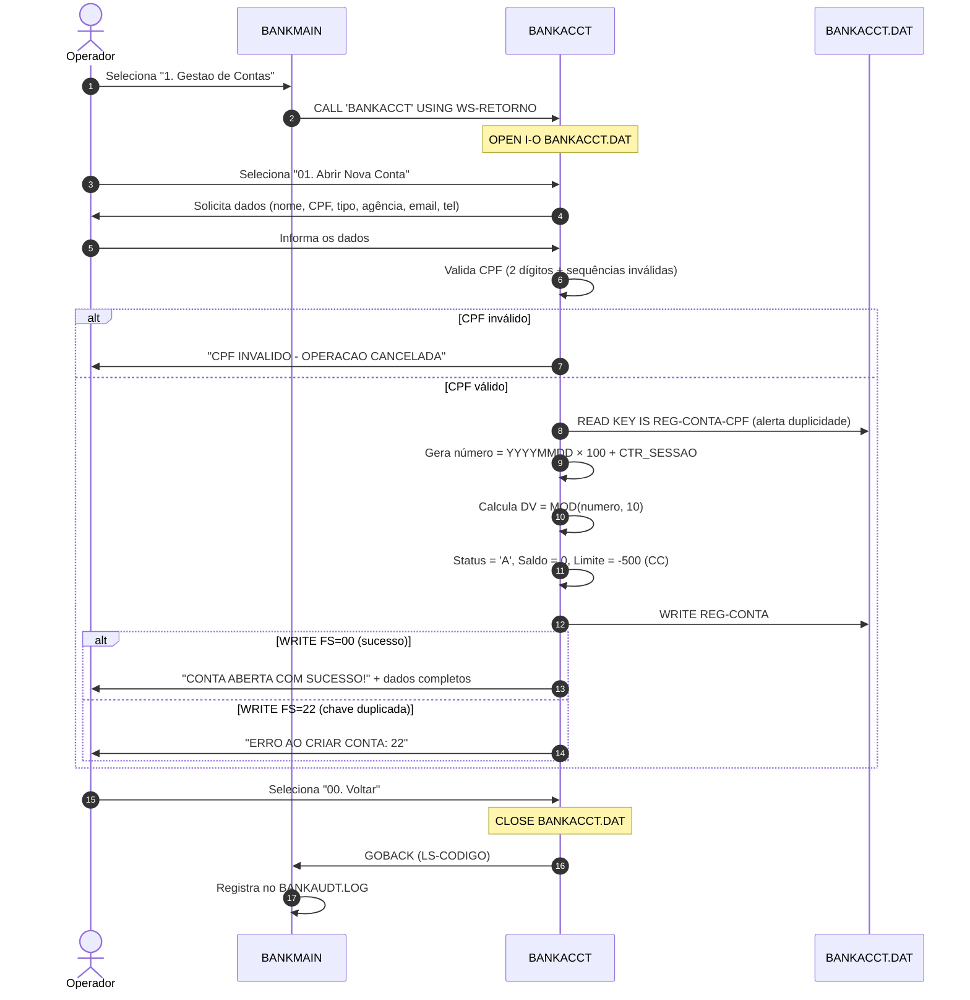
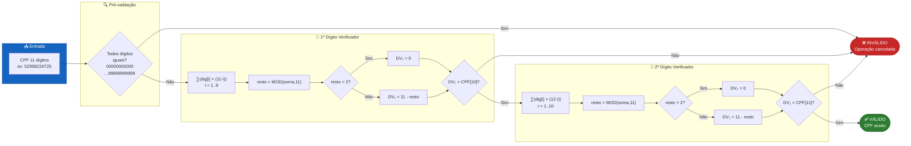
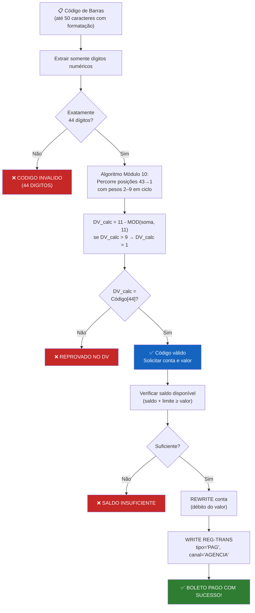
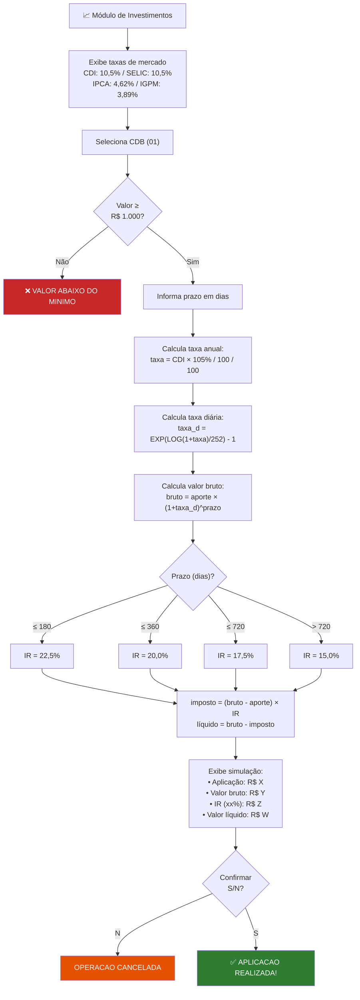
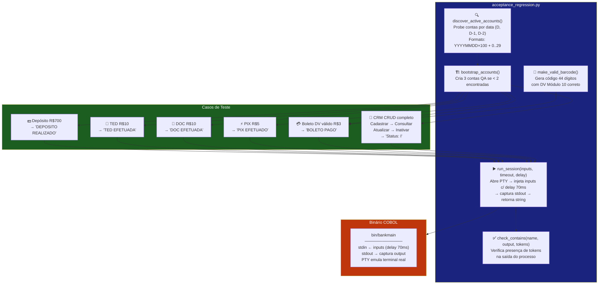

<div align="center">

**🌐 Selecione o Idioma / Choose Language / Elija el Idioma**

[](README.md)&nbsp;&nbsp;&nbsp;[](README_PT.md)&nbsp;&nbsp;&nbsp;[](README_ES.md)

</div>

---

<div align="center">

<!-- ═══════════════════════════════════════════════════════════════════════════ -->
<!--                              HEADER BANNER                                -->
<!-- ═══════════════════════════════════════════════════════════════════════════ -->

```
██████╗  █████╗ ███╗   ██╗ ██████╗ ██████╗      ██████╗ ██████╗ ██████╗  ██████╗ ██╗
██╔══██╗██╔══██╗████╗  ██║██╔════╝██╔═══██╗    ██╔════╝██╔═══██╗██╔══██╗██╔═══██╗██║
██████╔╝███████║██╔██╗ ██║██║     ██║   ██║    ██║     ██║   ██║██████╔╝██║   ██║██║
██╔══██╗██╔══██║██║╚██╗██║██║     ██║   ██║    ██║     ██║   ██║██╔══██╗██║   ██║██║
██████╔╝██║  ██║██║ ╚████║╚██████╗╚██████╔╝    ╚██████╗╚██████╔╝██████╔╝╚██████╔╝███████╗
╚═════╝ ╚═╝  ╚═╝╚═╝  ╚═══╝ ╚═════╝ ╚═════╝      ╚═════╝ ╚═════╝ ╚═════╝  ╚═════╝ ╚══════╝
                         Sistema Bancário Enterprise em GnuCOBOL
```

---

[](https://gnucobol.sourceforge.io/)
[](https://python.org)
[](https://docs.python.org/3/library/tkinter.html)
[](https://ubuntu.com/)
[]()
[]()
[]()

<br/>

> **Um sistema bancário completo, robusto e de nível enterprise**
> desenvolvido em COBOL legado moderno com interface gráfica Python e suíte de testes automatizados.

<br/>


</div>

---

## 📑 Sumário

<table>
<tr>
<td valign="top" width="50%">

**🏗️ Sistema**
- [Visão Geral](#-visão-geral)
- [Arquitetura do Sistema](#-arquitetura-do-sistema)
- [Stack Tecnológico](#-stack-tecnológico)
- [Padrões de Projeto](#-padrões-de-projeto-aplicados)
- [Estrutura do Projeto](#-estrutura-do-projeto)

**📦 Módulos**
- [BANKMAIN — Orquestrador](#-bankmain--orquestrador-principal)
- [BANKACCT — Contas](#-bankacct--gestão-de-contas)
- [BANKTRAN — Transações](#-banktran--processamento-de-transações)
- [BANKTRF — Transferências](#-banktrf--módulo-de-transferências)
- [BANKPAY — Pagamentos](#-bankpay--módulo-de-pagamentos)
- [BANKINV — Investimentos](#-bankinv--módulo-de-investimentos)
- [BANKCRM — Clientes](#-bankcrm--gestão-de-clientes)
- [BANKQRY — Consultas](#-bankqry--consultas-e-extratos)
- [BANKREP — Relatórios](#-bankrep--relatórios)
- [BANKADM — Administração](#-bankadm--administração)

</td>
<td valign="top" width="50%">

**💼 Negócio**
- [Regras de Negócio](#-regras-de-negócio)
- [Requisitos Funcionais](#-requisitos-funcionais)
- [Requisitos Não-Funcionais](#-requisitos-não-funcionais)

**📐 Design**
- [Modelo de Dados](#-modelo-de-dados)
- [Fluxos do Sistema](#-fluxos-do-sistema)
- [Ciclo de Vida da Conta](#ciclo-de-vida-da-conta)
- [Fluxo de Transações](#fluxo-transações-tedpix)
- [Validação de CPF](#fluxo-de-validação-de-cpf)

**🔐 Segurança e Ops**
- [Segurança](#-segurança)
- [Instalação e Execução](#-instalação-e-execução)
- [Testes Automatizados](#-testes-automatizados)
- [Métricas e Monitoramento](#-métricas-e-monitoramento)
- [Limitações Conhecidas](#-limitações-conhecidas)

</td>
</tr>
</table>

---

## 🌟 Visão Geral

O **Banco COBOL S/A** é um sistema bancário completo e funcional implementado em **GnuCOBOL** (COBOL de código aberto moderno), demonstrando que linguagens legadas podem oferecer robustez, precisão financeira e arquitetura limpa comparáveis a sistemas modernos.

O sistema processa **depósitos, saques, transferências TED/DOC/PIX, pagamentos de boleto, investimentos e relatórios regulatórios**, tudo com persistência via arquivos **ISAM indexados** — o mesmo modelo usado em mainframes IBM por décadas.

### 🎯 Objetivos do Sistema

| Objetivo | Descrição |
|----------|-----------|
| 🏦 **Core Banking** | Ciclo completo de vida de contas correntes, poupança, salário e investimento |
| 💸 **Transações** | Processamento de débitos e créditos com trilha de auditoria completa |
| 📊 **Relatórios** | Balancetes, movimentação diária, relatórios regulatórios BCB |
| 🔐 **Segurança** | Validação CPF algoritmo real, bloqueio de contas, controle de status |
| 📈 **Investimentos** | CDB, LCI, LCA, Tesouro Direto e Fundos com cálculo real de IR |
| 🖥️ **GUI** | Interface gráfica moderna Python/tkinter com fluxos guiados |
| 🧪 **Qualidade** | Testes de regressão de aceitação E2E automatizados com pseudo-terminal |

---

## 🏗️ Arquitetura do Sistema

### Diagrama de Módulos



### Camadas da Arquitetura



---

## 🛠️ Stack Tecnológico

<table>
<thead>
<tr>
<th>Camada</th>
<th>Tecnologia</th>
<th>Versão</th>
<th>Propósito</th>
</tr>
</thead>
<tbody>
<tr>
<td>🔧 <strong>Runtime</strong></td>
<td>GnuCOBOL</td>
<td>3.x</td>
<td>Compilação e execução dos módulos COBOL como shared objects</td>
</tr>
<tr>
<td>🖥️ <strong>GUI</strong></td>
<td>Python 3 + tkinter</td>
<td>3.8+</td>
<td>Interface gráfica nativa multiplataforma com fluxos guiados</td>
</tr>
<tr>
<td>💾 <strong>Storage</strong></td>
<td>ISAM / BDB / VBISAM</td>
<td>—</td>
<td>Arquivos indexados para acesso sequencial e randômico por chave</td>
</tr>
<tr>
<td>🔗 <strong>IPC</strong></td>
<td>subprocess + pty</td>
<td>—</td>
<td>Comunicação GUI↔COBOL via stdin/stdout e pseudo-terminal para testes</td>
</tr>
<tr>
<td>🏗️ <strong>Build</strong></td>
<td>GNU Make</td>
<td>—</td>
<td>Compilação incremental dos módulos .so e executável principal</td>
</tr>
<tr>
<td>🧪 <strong>Testing</strong></td>
<td>Python + pty</td>
<td>—</td>
<td>Testes E2E via pseudo-terminal — sem mocks, binário real</td>
</tr>
<tr>
<td>⚙️ <strong>Flags</strong></td>
<td>COB_CFLAGS</td>
<td>—</td>
<td><code>-D_FORTIFY_SOURCE=3 -ggdb3 -finline-functions -fsigned-char</code></td>
</tr>
<tr>
<td>🐧 <strong>Platform</strong></td>
<td>Linux / WSL2</td>
<td>Ubuntu 20+</td>
<td>Ambiente de compilação e execução; GUI suporta Windows via WSL</td>
</tr>
</tbody>
</table>

---

## 🎨 Padrões de Projeto Aplicados

| Padrão | Módulo | Implementação |
|--------|--------|---------------|
| 🏛️ **Service Orchestrator** | BANKMAIN | Roteia CALL dinâmico para módulos via EVALUATE sobre opção do menu |
| 🗄️ **Repository Pattern** | BANKACCT | Encapsula toda I/O de contas em paragraphs com nomes semânticos |
| ⚡ **Command Pattern** | BANKTRAN | Cada tipo de transação é um comando independente com validação própria |
| 📦 **Unit of Work** | BANKTRAN/BANKTRF | Agrupa débito + crédito + audit record como unidade lógica de operação |
| 🎯 **Strategy Pattern** | BANKINV | Cada produto financeiro tem sua estratégia de cálculo de rentabilidade |
| 📋 **Report Generator** | BANKREP | Separa coleta de dados, processamento e formatação de relatórios |
| 🔌 **Shared Kernel** | BANKDATA.cpy | Copybook com estruturas de dados compartilhadas sem duplicação |
| 🏭 **Facade** | BANKMAIN | Interface unificada para todos os subsistemas bancários |

---

## 📁 Estrutura do Projeto

```
bank_system/
│
├── 📋 COBOL Sources (Módulos de Negócio)
│   ├── BANKMAIN.cob          # Orquestrador principal (entry point)
│   ├── BANKACCT.cob          # Gestão de contas bancárias
│   ├── BANKTRAN.cob          # Processamento de transações
│   ├── BANKTRF.cob           # Transferências avançadas (TED/DOC/PIX multi-chave)
│   ├── BANKPAY.cob           # Pagamentos e boletos com validação Módulo 10
│   ├── BANKINV.cob           # Investimentos e simulações financeiras
│   ├── BANKCRM.cob           # Gestão de clientes (CRM)
│   ├── BANKQRY.cob           # Consultas e extratos (read-only)
│   ├── BANKREP.cob           # Relatórios gerenciais e regulatórios
│   └── BANKADM.cob           # Módulo administrativo
│
├── 📎 COBOL Copybooks
│   └── BANKDATA.cpy          # Estruturas de dados compartilhadas
│
├── 💾 Data Files (ISAM/Sequential)
│   ├── BANKACCT.DAT          # Arquivo de contas (indexed)
│   ├── BANKTRAN.DAT          # Arquivo de transações (indexed)
│   ├── BANKCUST.DAT          # Arquivo de clientes (indexed)
│   ├── BANKAUDT.LOG          # Trilha de auditoria (sequential append)
│   └── BANKREP.TXT           # Relatórios gerados (sequential extend)
│
├── 🐍 Python Frontend
│   ├── bank_gui.py               # Interface gráfica tkinter
│   ├── acceptance_regression.py  # Testes E2E automatizados via pty
│   └── finance_regression.py     # Testes de regressão financeira
│
├── 🔨 Build
│   └── Makefile              # Compilação GnuCOBOL com flags de hardening
│
└── 📦 Binaries (gerados pelo make)
    └── bin/
        ├── bankmain          # Executável principal
        ├── BANKACCT.so       # Dynamic module
        ├── BANKTRAN.so
        ├── BANKTRF.so
        ├── BANKPAY.so
        ├── BANKINV.so
        ├── BANKCRM.so
        ├── BANKQRY.so
        ├── BANKREP.so
        └── BANKADM.so
```

---

## 📦 Módulos do Sistema

### 🏛️ BANKMAIN — Orquestrador Principal

**Papel:** Ponto de entrada da aplicação. Gerencia sessão, controla o arquivo de log e roteia chamadas CALL dinâmicas para os módulos especializados.

**Responsabilidades:**
- Inicialização de sessão com ID baseado em timestamp
- Abertura e controle do arquivo de auditoria (`BANKAUDT.LOG` em modo EXTEND)
- Menu principal com 9 opções de navegação
- Registro de cada operação no log de auditoria com data, hora, opção e código de retorno
- Contadores de sessão: operações realizadas e erros encontrados
- Exibição de sumário de sessão no encerramento

```
╔══════════════════════════════════════╗
║    SISTEMA BANCARIO COBOL v2.0.0     ║
║    Sessao: [ID timestamp]            ║
╠══════════════════════════════════════╣
║  1. Gestao de Contas                 ║
║  2. Transacoes                       ║
║  3. Consultas e Extratos             ║
║  4. Transferencias                   ║
║  5. Pagamentos                       ║
║  6. Investimentos                    ║
║  7. Gestao de Clientes               ║
║  8. Relatorios                       ║
║  9. Administracao                    ║
║  0. Sair                             ║
╚══════════════════════════════════════╝
```

---

### 🏦 BANKACCT — Gestão de Contas

**Papel:** Repository Pattern completo para o ciclo de vida de contas bancárias.

| Operação | Código | Descrição |
|----------|--------|-----------|
| Abrir Nova Conta | `01` | Coleta dados, valida CPF (algoritmo completo com 2 dígitos), gera número único, grava registro |
| Consultar Conta | `02` | Busca por número via chave primária, exibe dados completos com saldo formatado |
| Atualizar Dados | `03` | Atualiza email/telefone com timestamp de atualização automático |
| Bloquear/Desbloquear | `04` | Toggle de status A↔B — REWRITE somente quando há mudança efetiva |
| Encerrar Conta | `05` | Encerra conta se saldo = zero; marca status `'E'` permanentemente |
| Listar Contas | `06` | Full scan com total de contas e saldo global (usa contador próprio) |
| Buscar por CPF | `07` | Acesso via chave alternativa indexada |
| Aplicar Tarifas | `08` | Tarifa de manutenção para CC ativas — verifica limite antes de debitar |
| Relatório de Contas | `09` | Delega ao módulo BANKREP |
| Voltar | `00` | Fecha arquivo e retorna ao BANKMAIN |

**Geração de número de conta:** `DATA_ATUAL (YYYYMMDD) × 100 + CTR_SESSAO`
**Dígito verificador:** `MOD(numero_conta, 10)`

---

### 💸 BANKTRAN — Processamento de Transações

**Papel:** Command Pattern + Unit of Work. Módulo central de movimentação financeira com trilha de auditoria completa e IDs únicos por sessão.

| Operação | Código | Validações | Audit |
|----------|--------|-----------|-------|
| Depósito | `01` | Valor > 0, conta ativa | ✅ Tipo `DEP` |
| Saque | `02` | Saldo + limite suficiente, limite diário R$ 5.000, valor > 0 | ✅ Tipo `SAQ` |
| TED | `03` | Saldo+limite ≥ valor+taxa, destino ativo, confirmação | ✅ Tipo `TED` |
| DOC | `04` | Mesmas do TED com taxa própria R$ 5,80 | ✅ Tipo `DOC` |
| PIX | `05` | Origem ativa, saldo disponível, limite noturno, destino ativo, taxa zero | ✅ Tipo `PIX` |
| Pagamento Boleto | `06` | Saldo + limite suficiente, valor > 0 | ✅ Tipo `PAG` |
| Consultar Saldo | `07` | Conta ativa | — |
| Extrato 30 dias | `08` | Filtro real por data via `INTEGER-OF-DATE / DATE-OF-INTEGER` | — |
| Estornar Transação | `09` | Somente status `'E'`, chave correta `REG-TRANS-ID`, reversão por tipo | ✅ Status `'X'` |

**ID de Transação:** `YYYYMMDDHHMMSS × 10 + incremento_sessao` — elimina colisão entre sessões.

---

### ↔️ BANKTRF — Módulo de Transferências

**Papel:** Implementação alternativa e mais completa de transferências com suporte a busca PIX por múltiplas chaves.

| Tipo | Taxa | Busca de Destino |
|------|------|-----------------|
| TED | R$ 14,90 | Por número de conta |
| DOC | R$ 5,80 | Por número de conta |
| PIX | R$ 0,00 | Full-scan por CPF (`'C'`), Email (`'E'`) ou Telefone (`'T'`) |

**PIX com múltiplas chaves:** o módulo percorre todos os registros do arquivo de contas comparando o campo informado — mais completo que o PIX de BANKTRAN (que usa somente chave alternativa CPF via índice).

---

### 💳 BANKPAY — Módulo de Pagamentos

**Papel:** Pagamento de boletos bancários com validação rigorosa do dígito verificador por Módulo 10.

**Algoritmo de Validação (Módulo 10):**
1. Extrai exatamente 44 dígitos numéricos do código de barras
2. Percorre posições 43→1 com pesos 2–9 em ciclo crescente
3. Calcula: `DV = 11 - MOD(soma, 11)` — se resultado > 9, DV = 1
4. Compara DV calculado com dígito na posição 44
5. Rejeita o boleto antes de qualquer operação financeira se DV inválido

**Sequência de operação:**
```
Conta → Código de barras → Validar DV → Valor
→ Verificar saldo → Debitar → WRITE audit PAG → Confirmar
```

---

### 📈 BANKINV — Módulo de Investimentos

**Papel:** Strategy Pattern para produtos financeiros com simulador e cálculo real de rentabilidade e IR.

#### Produtos Disponíveis

| Produto | Taxa | Mínimo | IR | Liquidez |
|---------|------|--------|-----|---------|
| 🏆 **CDB** | 105% CDI | R$ 1.000 | Regressivo | No vencimento |
| 🏠 **LCI** | 95% CDI | R$ 5.000 | **Isento** | 90 dias |
| 🌾 **LCA** | 93% CDI | — | **Isento** | 90 dias |
| 🇧🇷 **Tesouro Selic** | 100% SELIC | R$ 30 | Regressivo | D+1 |
| 🇧🇷 **Tesouro IPCA+** | IPCA + spread | R$ 30 | Regressivo | No vencimento |
| 🇧🇷 **Tesouro Prefixado** | 11,87% a.a. | R$ 30 | Regressivo | No vencimento |
| 📊 **Fundo RF DI** | Varia | — | Regressivo | D+1 |
| 📊 **Fundo Multimercado** | Varia | — | Regressivo | D+1 a D+30 |
| 📊 **Fundo Ações** | Varia | — | 15% fixo | D+3 |

#### Tabela de IR Regressivo

| Prazo | Alíquota IR |
|-------|-------------|
| ≤ 180 dias | 🔴 22,5% |
| 181 – 360 dias | 🟠 20,0% |
| 361 – 720 dias | 🟡 17,5% |
| > 720 dias | 🟢 15,0% |

#### Fórmula de Cálculo CDB — Padrão ANBIMA (252 dias úteis)

```
taxa_anual  = CDI × percentual_CDI / 100 / 100
taxa_diaria = EXP(LOG(1 + taxa_anual) / 252)  - 1
valor_bruto = aporte × (1 + taxa_diaria) ^ prazo_dias
rendimento  = valor_bruto - aporte
imposto     = rendimento × aliquota_IR
valor_liq   = valor_bruto - imposto
```

#### Taxas de Mercado Configuradas

| Índice | Taxa a.a. |
|--------|-----------|
| 📊 CDI | 10,5000% |
| 🏛️ SELIC | 10,5000% |
| 📈 IPCA | 4,6200% |
| 📉 IGPM | 3,8900% |

---

### 👥 BANKCRM — Gestão de Clientes

**Papel:** Cadastro e manutenção do perfil completo de clientes com score de crédito e perfil de risco.

**Dados Cadastrais:**

| Campo | PIC | Descrição |
|-------|-----|-----------|
| ID do Cliente | `9(10)` | Chave primária — informada pelo operador |
| Nome | `X(60)` | Nome completo |
| CPF | `X(14)` | Chave alternativa com formatação |
| RG | `X(15)` | Documento de identidade |
| Data de Nascimento | `9(8)` | Formato AAAAMMDD |
| Sexo | `X(1)` | `M` / `F` / `O` |
| Estado Civil | `X(2)` | Código de 2 caracteres |
| Profissão | `X(40)` | — |
| Renda | `S9(11)V99 COMP-3` | Renda mensal em R$ |
| Perfil de Risco | `X(1)` | `C` / `M` / `A` |
| Endereço | Grupo `X(190)` | Logradouro, número, complemento, bairro, cidade, UF, CEP |
| Status | `X(1)` | `A`=Ativo `I`=Inativo `B`=Bloqueado |
| Score de Crédito | `9(4)` | 0–1000 pontos (inicial: 500) |

**Perfis de Risco:**

| Código | Perfil | Característica |
|--------|--------|---------------|
| 🟢 `C` | Conservador | Preferência por renda fixa, baixa volatilidade |
| 🟡 `M` | Moderado | Mix entre renda fixa e variável |
| 🔴 `A` | Arrojado | Aceita alta volatilidade, busca retorno máximo |

---

### 🔍 BANKQRY — Consultas e Extratos

**Papel:** Interface read-only (`OPEN INPUT`) para consultas sem risco de modificação de dados.

| Operação | Código | Chave de Busca | Filtro |
|----------|--------|----------------|--------|
| Consultar por número | `01` | Chave primária (PIC 9(10)) | — |
| Consultar por CPF | `02` | Chave alternativa indexada (PIC X(11)) | — |
| Extrato rápido 30 dias | `03` | Número da conta (full-scan transações) | `DATA >= (HOJE - 30)` |

**Filtro temporal:** `INTEGER-OF-DATE(HOJE) - 30 → DATE-OF-INTEGER(resultado)` — respeita meses com 28/29/30/31 dias corretamente.

---

### 📊 BANKREP — Relatórios

**Papel:** Report Generator Pattern. Gera relatórios persistidos em `BANKREP.TXT` com `OPEN EXTEND` — sem destruir conteúdo anterior.

| Relatório | Código | Conteúdo |
|-----------|--------|---------|
| Balancete Geral | `01` | Todas as contas com saldos; totais CC/CP; ativas/bloqueadas |
| Resumo por Tipo | `02` | Contagem de contas por categoria |
| Movimentação Diária | `03` | Total DEP/SAQ/TRF do dia atual com filtro por `DATA_TRANS = HOJE` |
| Saldos Negativos | `04` | Contas com `saldo < 0` (overdraft) |
| Top 10 Saldos | `05` | Estrutura para algoritmo de ordenação |
| Inadimplência | `06` | Contas com limite utilizado > 80% |
| DRE Simplificado | `07` | Receitas de tarifas e juros vs despesas operacionais |
| Relatório BCB | `08` | Formato SCR — Sistema de Informações de Crédito do Banco Central |

---

### ⚙️ BANKADM — Administração

**Papel:** Operações administrativas e de manutenção do sistema.

| Operação | Código | Descrição |
|----------|--------|-----------|
| Estatísticas Gerais | `01` | Contagem total de registros em CONTAS, TRANS e CLIENTES via full-scan |
| Limpar Log | `02` | Trunca `BANKAUDT.LOG` (OPEN OUTPUT → fecha) |

> [!WARNING]
> A operação **Limpar Log** apaga permanentemente a trilha de auditoria. Em produção real, o log deve ser imutável e arquivado externamente.

---

## 💼 Regras de Negócio

### 🏦 Contas Bancárias

#### Tipos de Conta

| Código | Nome | Limite de Crédito | Tarifa Manutenção |
|--------|------|-------------------|-------------------|
| `CC` | Conta Corrente | R$ 500,00 (negativo) | R$ 12,90/mês |
| `CP` | Conta Poupança | Sem limite | Isenta |
| `CS` | Conta Salário | Sem limite | Isenta |
| `CI` | Conta Investimento | Sem limite | Isenta |

#### Ciclo de Vida da Conta



#### Regras de Negócio — Contas

- ✅ CPF validado pelo **algoritmo completo** (dois dígitos verificadores + rejeição de 10 sequências inválidas)
- ✅ Alerta emitido quando CPF já possui conta cadastrada (múltiplas contas permitidas por CPF)
- ✅ Número de conta gerado como `YYYYMMDD × 100 + sequencial_sessão`
- ✅ Dígito verificador calculado como `MOD(numero_conta, 10)`
- ✅ Tarifa de manutenção somente debitada quando `(saldo - tarifa) ≥ limite` — não viola o limite contratual
- ✅ Encerramento bloqueado quando `saldo ≠ 0` (positivo ou negativo)
- ✅ Bloqueio/Desbloqueio: REWRITE executado apenas quando o status efetivamente muda

---

### 💸 Transações e Limites

#### Limites Operacionais

| Operação | Limite | Condição |
|----------|--------|---------|
| 💵 Saque diário | R$ 5.000,00 | Por conta, por dia |
| 🔄 Transferência diária | R$ 10.000,00 | TED/DOC |
| ⚡ PIX diário | R$ 20.000,00 | Horário comercial |
| 🌙 PIX noturno | R$ 1.000,00 | 22h00 – 06h00 |

#### Taxas por Operação

| Operação | Taxa | Observação |
|----------|------|------------|
| Depósito | Gratuito | — |
| Saque | Gratuito | Limite diário aplicável |
| TED | R$ 14,90 | Verificada junto com o saldo disponível |
| DOC | R$ 5,80 | Verificada junto com o saldo disponível |
| PIX | **R$ 0,00** | Taxa zero garantida em qualquer horário |
| Boleto | Gratuito | Validação Módulo 10 obrigatória |
| Tarifa CC | R$ 12,90/mês | Somente conta corrente ativa |

#### Cálculo de Saldo Disponível

```
saldo_disponivel = saldo_atual + abs(limite_conta)

Exemplo — conta corrente com limite R$ 500:
  Saldo  R$ 100,00  →  disponível  R$ 600,00
  Saldo  R$   0,00  →  disponível  R$ 500,00
  Saldo  R$ -200,00 →  disponível  R$ 300,00
  Saldo  R$ -500,00 →  disponível  R$   0,00  ← limite esgotado
```

#### Status de Transação

| Código | Significado |
|--------|-------------|
| `P` | Pendente — aguardando processamento |
| `E` | Efetivada — processada com sucesso |
| `C` | Cancelada — cancelada antes da execução |
| `X` | Estornada — revertida após efetivação |

---

### 📊 Validação de CPF

```mermaid
flowchart TD
    A["📥 CPF Informado (11 dígitos)"] --> B{Sequência\ninválida?\n000...9\n111...9...}
    B -->|"Sim"| FAIL["❌ CPF INVÁLIDO"]
    B -->|"Não"| C["Calcular 1º DV\n∑(dígito[i] × (11-i)) para i = 1..9"]
    C --> D["resto = MOD(soma, 11)"]
    D --> E{resto < 2?}
    E -->|"Sim"| F["DV₁ = 0"]
    E -->|"Não"| G["DV₁ = 11 - resto"]
    F --> H{DV₁ = CPF[10]?}
    G --> H
    H -->|"Não"| FAIL
    H -->|"Sim"| I["Calcular 2º DV\n∑(dígito[i] × (12-i)) para i = 1..10"]
    I --> J["resto = MOD(soma, 11)"]
    J --> K{resto < 2?}
    K -->|"Sim"| L["DV₂ = 0"]
    K -->|"Não"| M["DV₂ = 11 - resto"]
    L --> N{DV₂ = CPF[11]?}
    M --> N
    N -->|"Não"| FAIL
    N -->|"Sim"| OK["✅ CPF VÁLIDO"]

    style FAIL fill:#c62828,color:#fff
    style OK fill:#2e7d32,color:#fff
    style A fill:#1565c0,color:#fff
```

---

## ✅ Requisitos Funcionais

<details>
<summary><strong>🏦 RF01–RF10 — Gestão de Contas</strong></summary>

| ID | Requisito |
|----|-----------|
| RF01 | O sistema deve permitir abertura de conta com coleta de: nome, CPF, tipo, agência, email e telefone |
| RF02 | O sistema deve validar o CPF pelo algoritmo oficial (dois dígitos verificadores) antes de criar a conta |
| RF03 | O sistema deve rejeitar CPFs com todos os dígitos iguais (000...0 a 999...9) |
| RF04 | O sistema deve gerar número de conta único por sessão com base em data e sequencial |
| RF05 | O sistema deve calcular dígito verificador da conta automaticamente |
| RF06 | O sistema deve exibir confirmação de abertura somente quando o WRITE for bem-sucedido (FS=00) |
| RF07 | O sistema deve suportar quatro tipos de conta: CC, CP, CS e CI |
| RF08 | O sistema deve permitir bloqueio e desbloqueio de conta (status A↔B) realizando REWRITE apenas quando há mudança efetiva |
| RF09 | O sistema deve impedir encerramento de conta com saldo diferente de zero |
| RF10 | O sistema deve aplicar tarifa de manutenção somente quando o saldo não ultrapassar o limite após o débito |

</details>

<details>
<summary><strong>💸 RF11–RF28 — Transações</strong></summary>

| ID | Requisito |
|----|-----------|
| RF11 | O sistema deve aceitar depósitos em qualquer conta ativa, valor positivo obrigatório |
| RF12 | O sistema deve validar saldo disponível (saldo + limite) antes de qualquer débito |
| RF13 | O sistema deve aplicar limite diário de R$ 5.000 para saques |
| RF14 | O sistema deve cobrar taxa de R$ 14,90 para TED e deduzir do saldo do remetente |
| RF15 | O sistema deve cobrar taxa de R$ 5,80 para DOC e deduzir do saldo do remetente |
| RF16 | O sistema deve executar PIX sem taxa (R$ 0,00) em qualquer horário |
| RF17 | O sistema deve limitar PIX a R$ 1.000 entre 22h00 e 06h00 |
| RF18 | O sistema deve solicitar conta de origem antes de qualquer operação PIX |
| RF19 | O sistema deve verificar se a conta de destino está ativa antes de transferências e PIX |
| RF20 | O sistema deve registrar todas as transações bem-sucedidas no arquivo BANKTRAN.DAT com tipo correto |
| RF21 | O sistema deve gerar IDs de transação baseados em timestamp (YYYYMMDDHHMMSS×10) para evitar colisão entre sessões |
| RF22 | O sistema deve exibir alerta quando o WRITE do registro de auditoria falhar, sem reverter a operação |
| RF23 | O sistema deve exibir extrato com filtro real dos últimos 30 dias usando cálculo por inteiro de data |
| RF24 | O sistema deve permitir estorno somente de transações com status 'E' (Efetivada) |
| RF25 | O sistema deve usar `REG-TRANS-ID` (chave do arquivo) no READ do estorno, não uma variável de working-storage |
| RF26 | O sistema deve usar `REG-CONTA-NUM` (chave do arquivo) no READ de reversão de estorno |
| RF27 | O sistema deve validar código de barras pelo algoritmo Módulo 10 antes de pagar boleto |
| RF28 | O sistema deve registrar pagamento de boleto com tipo 'PAG' no arquivo de transações |

</details>

<details>
<summary><strong>📈 RF29–RF36 — Investimentos</strong></summary>

| ID | Requisito |
|----|-----------|
| RF29 | O sistema deve calcular rentabilidade diária de CDB usando `EXP(LOG(1+r)/252)` — base 252 dias úteis ANBIMA |
| RF30 | O sistema deve aplicar IR regressivo: 22,5% (≤180d), 20% (≤360d), 17,5% (≤720d), 15% (>720d) |
| RF31 | O sistema deve informar que LCI e LCA são isentos de IR |
| RF32 | O sistema deve impor valor mínimo de R$ 1.000 para CDB e R$ 5.000 para LCI |
| RF33 | O sistema deve exibir valor bruto, IR e valor líquido antes de confirmar a aplicação |
| RF34 | O sistema deve oferecer simulador de investimento com os mesmos cálculos do CDB |
| RF35 | O sistema deve exibir as taxas de mercado atuais (CDI, SELIC, IPCA, IGPM) no menu de investimentos |
| RF36 | O sistema deve oferecer pelo menos 5 tipos de produtos: CDB, LCI, LCA, Tesouro, Fundos |

</details>

<details>
<summary><strong>👥 RF37–RF41 — Clientes (CRM)</strong></summary>

| ID | Requisito |
|----|-----------|
| RF37 | O sistema deve cadastrar cliente com dados pessoais, financeiros e de endereço completos |
| RF38 | O sistema deve suportar três perfis de risco: Conservador (C), Moderado (M) e Arrojado (A) |
| RF39 | O sistema deve atribuir score de crédito inicial de 500 pontos a novos clientes |
| RF40 | O sistema deve suportar os status de cliente: Ativo (A), Inativo (I) e Bloqueado (B) |
| RF41 | O sistema deve permitir busca de cliente por ID (chave primária) e por CPF (chave alternativa) |

</details>

<details>
<summary><strong>📊 RF42–RF48 — Relatórios e Administração</strong></summary>

| ID | Requisito |
|----|-----------|
| RF42 | O sistema deve gerar balancete com totais por tipo de conta (CC, CP) e status |
| RF43 | O sistema deve persistir relatórios em BANKREP.TXT sem apagar conteúdo anterior (OPEN EXTEND com fallback) |
| RF44 | O sistema deve calcular movimentação diária filtrando por data atual |
| RF45 | O sistema deve listar contas com saldo negativo (overdraft) |
| RF46 | O sistema deve registrar cada operação do menu principal no log de auditoria com timestamp |
| RF47 | O sistema deve exibir sumário de sessão ao encerrar: total de operações e erros |
| RF48 | O sistema deve exibir estatísticas gerais (contagem de contas, transações e clientes) no módulo de administração |

</details>

---

## ⚡ Requisitos Não-Funcionais

| Categoria | ID | Requisito |
|-----------|----|-----------|
| 🎯 **Precisão** | RNF01 | Todos os cálculos financeiros usam `COMP-3` (packed decimal BCD) — sem ponto flutuante binário |
| 🎯 **Precisão** | RNF02 | Fórmulas de investimento seguem padrão ANBIMA — base 252 dias úteis por ano |
| 🔐 **Segurança** | RNF03 | CPF validado pelo algoritmo completo (2 dígitos) antes de qualquer abertura de conta |
| 🔐 **Segurança** | RNF04 | Contas bloqueadas ou encerradas não podem realizar transações |
| 🔐 **Segurança** | RNF05 | IDs de transação únicos entre sessões via timestamp `YYYYMMDDHHMMSS × 10` |
| 🔐 **Segurança** | RNF06 | Limite PIX noturno (22h–06h) de R$ 1.000 verificado antes da execução |
| 📋 **Auditoria** | RNF07 | Toda transação financeira bem-sucedida gera registro em BANKTRAN.DAT |
| 📋 **Auditoria** | RNF08 | Falha no WRITE de auditoria deve exibir aviso mas não bloquear a operação |
| 📋 **Auditoria** | RNF09 | Log de sessão em BANKAUDT.LOG aberto em modo EXTEND (append-only por sessão) |
| 🔧 **Modularidade** | RNF10 | Módulos compilados como shared objects (`.so`) carregados via `CALL` dinâmico |
| 🔧 **Modularidade** | RNF11 | Estruturas de dados compartilhadas exclusivamente via copybook `BANKDATA.cpy` |
| ⚡ **Desempenho** | RNF12 | Acesso a contas por número e CPF usa índices ISAM — sem full-scan |
| ⚡ **Desempenho** | RNF13 | Extratos e relatórios usam full-scan com filtro por data aplicado durante a leitura |
| 🖥️ **Interface** | RNF14 | GUI sincroniza stdout do processo COBOL via fila thread-safe (`queue.Queue`) |
| 🖥️ **Interface** | RNF15 | GUI envia sequências de input com delay configurável (padrão 80ms entre inputs) |
| 🧪 **Testabilidade** | RNF16 | Sistema testável via pseudo-terminal (pty) sem qualquer interação humana |
| 🌍 **Localização** | RNF17 | `DECIMAL-POINT IS COMMA` ativo em todos os módulos (padrão pt-BR) |
| 🏗️ **Compilação** | RNF18 | Flags de hardening: `-D_FORTIFY_SOURCE=3 -fsigned-char -ggdb3 -pipe` |
| 🔄 **Compatibilidade** | RNF19 | Código em formato fixo COBOL (colunas 1–72), compatível com GnuCOBOL 3.x |

---

## 🗄️ Modelo de Dados

### Diagrama Entidade-Relacionamento



### Especificação dos Arquivos ISAM

<details>
<summary><strong>📋 BANKACCT.DAT — Arquivo de Contas</strong></summary>

| Propriedade | Valor |
|-------------|-------|
| Organização | `INDEXED` |
| Modo de Acesso | `DYNAMIC` |
| Chave Primária | `REG-CONTA-NUM` — PIC 9(10) |
| Chave Alternativa | `REG-CONTA-CPF` — PIC X(11) — `WITH DUPLICATES` |
| Tamanho do registro | ~279 bytes |
| Arquivo de índice | `BANKACCT.DAT.1` (gerado automaticamente pelo GnuCOBOL) |
| Módulos com acesso `I-O` | BANKACCT, BANKTRAN, BANKTRF, BANKPAY |
| Módulos com acesso `INPUT` | BANKQRY, BANKREP, BANKADM |

</details>

<details>
<summary><strong>📋 BANKTRAN.DAT — Arquivo de Transações</strong></summary>

| Propriedade | Valor |
|-------------|-------|
| Organização | `INDEXED` |
| Modo de Acesso | `DYNAMIC` |
| Chave Primária | `REG-TRANS-ID` — PIC 9(15) |
| Formato do ID | `YYYYMMDDHHMMSS × 10 + incremento_sessão` (0–9) |
| Tamanho do registro | ~169 bytes |
| Módulos com acesso `I-O` | BANKTRAN, BANKTRF, BANKPAY |
| Módulos com acesso `INPUT` | BANKQRY, BANKREP, BANKADM |

</details>

<details>
<summary><strong>📋 BANKCUST.DAT — Arquivo de Clientes</strong></summary>

| Propriedade | Valor |
|-------------|-------|
| Organização | `INDEXED` |
| Modo de Acesso | `DYNAMIC` |
| Chave Primária | `REG-CLI-ID` — PIC 9(10) |
| Chave Alternativa | `REG-CLI-CPF` — PIC X(14) — única |
| Tamanho do registro | ~407 bytes |
| Score inicial | 500 pontos |
| Módulos com acesso `I-O` | BANKCRM |
| Módulos com acesso `INPUT` | BANKADM |

</details>

---

## 🔄 Fluxos do Sistema

### Ciclo de Vida da Conta



### Fluxo Transações TED/PIX

```mermaid
sequenceDiagram
    autonumber
    actor Cliente
    participant BANKTRAN
    participant ARQCONTAS as BANKACCT.DAT
    participant ARQTRANS as BANKTRAN.DAT

    Note over BANKTRAN: WS-PROXIMO-ID = YYYYMMDDHHMMSS × 10

    Cliente->>BANKTRAN: Seleciona TED (03) ou PIX (05)

    rect rgb(20, 60, 20)
        Note over BANKTRAN,ARQCONTAS: VALIDAÇÃO CONTA ORIGEM
        BANKTRAN->>Cliente: Solicita número da conta origem
        Cliente->>BANKTRAN: Informa conta origem
        BANKTRAN->>ARQCONTAS: READ KEY IS REG-CONTA-NUM
        alt Não encontrada / Inativa
            BANKTRAN->>Cliente: Mensagem de erro
        end
    end

    rect rgb(60, 20, 20)
        Note over BANKTRAN,ARQCONTAS: VALIDAÇÃO CONTA DESTINO
        BANKTRAN->>Cliente: Solicita conta destino (número ou CPF para PIX)
        Cliente->>BANKTRAN: Informa destino
        BANKTRAN->>ARQCONTAS: READ KEY IS REG-CONTA-NUM ou REG-CONTA-CPF
        alt Não encontrada / Inativa
            BANKTRAN->>Cliente: Mensagem de erro
        end
    end

    rect rgb(20, 20, 60)
        Note over BANKTRAN: VALIDAÇÕES FINANCEIRAS
        BANKTRAN->>Cliente: Solicita valor
        Cliente->>BANKTRAN: Informa valor
        BANKTRAN->>BANKTRAN: disponivel = saldo_orig + limite_orig
        BANKTRAN->>BANKTRAN: total = valor + taxa_corrente (PIX: taxa=0)
        alt Saldo insuficiente
            BANKTRAN->>Cliente: "SALDO INSUFICIENTE"
        else PIX entre 22h-06h > R$1.000
            BANKTRAN->>Cliente: "LIMITE PIX NOTURNO"
        end
    end

    rect rgb(60, 40, 0)
        Note over BANKTRAN,ARQTRANS: EXECUÇÃO
        BANKTRAN->>Cliente: "Confirmar? (S/N)" — apenas TED/DOC
        BANKTRAN->>ARQCONTAS: REWRITE origem (saldo - valor - taxa)
        alt Falha no débito
            BANKTRAN->>Cliente: "ERRO AO DEBITAR CONTA ORIGEM"
        else Débito OK
            BANKTRAN->>ARQCONTAS: REWRITE destino (saldo + valor)
            alt Falha no crédito
                BANKTRAN->>Cliente: "ERRO AO CREDITAR CONTA DESTINO"
            else Crédito OK
                BANKTRAN->>BANKTRAN: ADD 1 TO WS-PROXIMO-ID
                BANKTRAN->>ARQTRANS: WRITE REG-TRANS (tipo=TED/DOC/PIX correto)
                BANKTRAN->>Cliente: "TED/DOC/PIX REALIZADO COM SUCESSO!"
            end
        end
    end
```



### Fluxo de Validação de CPF



### Fluxo de Pagamento de Boleto (Módulo 10)



### Fluxo de Investimento CDB



---

## 🔐 Segurança

### Controles Implementados

| Controle | Onde | Mecanismo |
|----------|------|-----------|
| 🔏 **Validação de Identidade** | BANKACCT | CPF com algoritmo completo (2 DV) + rejeição de sequências inválidas |
| 🔒 **Controle de Status** | BANKTRAN, BANKTRF, BANKPAY | `STATUS = 'A'` verificado antes de qualquer débito/crédito |
| 🛡️ **Validação de Saldo** | BANKTRAN, BANKTRF, BANKPAY | `disponível = saldo + limite` verificado antes de cada operação |
| ⏰ **Limite PIX Noturno** | BANKTRAN | R$ 1.000 entre 22h00–06h00 via `CURRENT-DATE(9:4)` |
| 🔑 **Validação de Boleto** | BANKPAY | Módulo 10 obrigatório — rejeita boletos inválidos antes do débito |
| 📋 **Trilha de Auditoria** | BANKMAIN | Cada operação do menu registrada em `BANKAUDT.LOG` com timestamp |
| 🆔 **IDs Únicos de Transação** | BANKTRAN, BANKTRF | `YYYYMMDDHHMMSS × 10 + seq` — sem colisão entre sessões |
| 🔄 **REWRITE Condicional** | BANKACCT | Bloqueio/Desbloqueio somente grava quando status efetivamente muda |
| 🏗️ **Hardening de Compilação** | Makefile | `-D_FORTIFY_SOURCE=3 -fsigned-char -ggdb3 -pipe -Wno-pointer-sign` |
| 📊 **Contagem de Erros** | BANKMAIN | `WS-CTR-ERROS` incrementado a cada falha detectada na sessão |

### Limitações de Segurança Conhecidas

> [!CAUTION]
> As seguintes limitações existem no sistema atual. **Não use em produção sem endereçá-las.**

| # | Limitação | Impacto | Recomendação |
|---|-----------|---------|--------------|
| 🔴 1 | **Sem autenticação** — `SENHA-HASH (X(64))` existe no schema mas nunca é preenchido ou verificado | Qualquer operador acessa qualquer conta | Integrar módulo C de hashing (bcrypt/Argon2) via `CALL` |
| 🔴 2 | **Transferências não atômicas** — débito e crédito são dois REWRITEs independentes | Risco de perda de fundos se o processo morrer entre os dois escritas | Implementar journaling antes-depois ou adaptar 2-Phase Commit |
| 🟡 3 | **Session ID previsível** — gerado com `RANDOM(DATA_ATUAL)` — mesma semente no mesmo dia | Sessões do mesmo dia têm IDs idênticos | Usar `/dev/urandom` via módulo utilitário em C |
| 🟡 4 | **Log de auditoria deletável** — `3000-LIMPAR-LOG` em BANKADM trunca `BANKAUDT.LOG` | Um operador pode apagar evidências de fraude | Remover a operação do menu ou tornar o log append-only com permissões restritivas |
| 🟠 5 | **Email/telefone em campos de endereço no CRM** — mapeamento semântico incorreto | Dados em posições não intuitivas, dificulta manutenção | Adicionar campos `EMAIL (X(80))` e `TELEFONE (X(15))` ao registro de cliente |

---

## 🚀 Instalação e Execução

### Pré-requisitos

```bash
# Ubuntu / Debian / WSL2
sudo apt update
sudo apt install -y gnucobol libcob-dev python3 python3-tk make

# Verificar instalação
cobc --version     # GnuCOBOL 3.x
python3 --version  # Python 3.8+
```

### Compilação

```bash
# Compilar todos os módulos
make all

# Saída esperada:
#   bin/BANKACCT.so, BANKTRAN.so ... (módulos dinâmicos)
#   bin/bankmain                     (executável principal)

# Limpar tudo (ATENÇÃO: apaga .DAT, .LOG e .TXT)
make clean
```

### Execução

<table>
<tr>
<td width="50%">

**🖥️ Interface Gráfica**
```bash
make run-gui

# Ou diretamente:
python3 bank_gui.py
```

A GUI detecta automaticamente se está rodando em WSL e usa `cmd.exe /C py -3` quando necessário.

</td>
<td width="50%">

**⌨️ CLI Direto**
```bash
make run

# Ou:
COB_LIBRARY_PATH=bin ./bin/bankmain
```

Execução interativa diretamente no terminal com menus COBOL nativos.

</td>
</tr>
</table>

### Targets do Makefile

| Target | Descrição |
|--------|-----------|
| `make all` | Compila todos os módulos (`.so` + executável) |
| `make run` | Compila + executa em modo CLI interativo |
| `make run-gui` | Compila + executa a GUI Python/tkinter |
| `make acceptance` | Compila + executa testes de regressão E2E |
| `make acceptance-fast` | Executa testes sem recompilar |
| `make acceptance-finance` | Executa testes de regressão financeira |
| `make clean` | Remove `bin/`, `*.DAT`, `*.DAT.*`, `*.LOG`, `*.TXT` |
| `make install` | Copia `bankmain` para `/usr/local/bin` |

### Flags de Compilação

```makefile
COB_CFLAGS_SAFE = -finline-functions -ggdb3 -pipe -Wdate-time \
                  -Wno-unused -fsigned-char -Wno-pointer-sign \
                  -D_FORTIFY_SOURCE=3
```

---

## 🧪 Testes Automatizados

O sistema possui uma suíte completa de testes de aceitação que executa o binário COBOL real através de um **pseudo-terminal (PTY)** — sem mocks, sem simulações, com comportamento idêntico ao uso manual.

### Arquitetura de Testes



### Executando os Testes

```bash
# Requer Linux / WSL2 (pty não disponível no Windows nativo)
make acceptance

# Saída esperada:
# [INFO] Active accounts discovered: 3
# [INFO] Account 2026060400 cpf=52998224725 email=qa1@example.com phone=11990000001
# [PASS] Deposito
# [PASS] TED
# [PASS] DOC
# [PASS] PIX
# [PASS] Pagamento Boleto
# [PASS] CRM CRUD
#
# Result: 6/6 checks passed
```

### Contas QA (Bootstrap Automático)

Quando menos de 2 contas ativas são encontradas nos últimos 3 dias, a suíte cria automaticamente:

| Conta | CPF | Agência | Email |
|-------|-----|---------|-------|
| AUTO QA 1 | 12345678909 | 1234 | qa1@example.com |
| AUTO QA 2 | 11144477735 | 1234 | qa2@example.com |
| AUTO QA 3 | 52998224725 | 1234 | qa3@example.com |

---

## 📊 Métricas e Monitoramento

### Métricas de Sessão (BANKMAIN)

| Campo | Tipo | Descrição |
|-------|------|-----------|
| `WS-CTR-OPERACOES` | PIC 9(10) | Total de operações realizadas na sessão |
| `WS-CTR-ERROS` | PIC 9(6) | Total de erros encontrados na sessão |
| `WS-CTR-SESSOES` | PIC 9(6) | Contador acumulado de sessões |
| `WS-MET-TEMPO-RESP` | COMP-3 | Tempo médio de resposta (extensível) |
| `WS-MET-THROUGHPUT` | COMP-3 | Throughput de operações (extensível) |
| `WS-MET-DISPONIB` | COMP-3 | Disponibilidade percentual (extensível) |

### Formato do Log de Auditoria

```
YYYYMMDD HHMMSS OP:[opcao] COD:[codigo_retorno]

20260604 143022 OP:1   COD:0000
20260604 143045 OP:2   COD:0000
20260604 143103 OP:2   COD:0001
20260604 143112 OP:0   COD:0000
```

### Códigos de Retorno Padronizados

| Código | Significado |
|--------|-------------|
| `0000` | Sucesso |
| `0001` | Saldo insuficiente |
| `0002` | Conta/CPF não encontrado |
| `0003` | Limite excedido / valor inválido |
| `0004` | Conta bloqueada ou encerrada |
| `0005` | Erro de autenticação |
| `9999` | Erro de sistema (I/O) |

---

## ⚠️ Limitações Conhecidas

> [!IMPORTANT]
> Este sistema foi desenvolvido para fins educacionais e demonstração de arquitetura COBOL.

| Categoria | Limitação | Contexto |
|-----------|-----------|---------|
| 🔄 **Atomicidade** | Transferências usam dois REWRITEs separados — sem transação distribuída | ISAM não oferece suporte nativo a 2PC |
| 💾 **Investimentos** | Módulo BANKINV é um simulador — aplicações e resgates não persistem em arquivo | Requer arquivo de portfólio `BANKINV.DAT` |
| 📊 **DRE** | Valores do DRE simplificado são fixos (não calculados dos dados reais) | Integração com dados de receita necessária |
| 👤 **Autenticação** | Campo `SENHA-HASH (X(64))` existe mas nunca é preenchido ou verificado | Requer módulo C para hash seguro |
| 📱 **Concorrência** | Sistema monousuário — sem controle de concorrência entre processos | Lock básico do ISAM apenas |
| 🔑 **Chaves PIX** | BANKTRAN suporta somente chave CPF; BANKTRF suporta CPF, Email e Telefone | Chave aleatória (UUID) não implementada em nenhum módulo |
| 🗄️ **BCB** | Relatório BCB exibe cabeçalho mas sem dados no formato SCR real | Estrutura de saída a implementar conforme manual BACEN |
| 📧 **BANKCRM** | Email e telefone armazenados nos campos de endereço (logradouro/número) | Limitação do schema atual — mudança quebraria arquivo `.DAT` existente |

---

<div align="center">

---

### 🏦 Banco COBOL S/A

*Desenvolvido com rigor técnico, precisão financeira e respeito ao legado*

[](https://gnucobol.sourceforge.io/)
[](https://python.org)
[](https://en.wikipedia.org/wiki/ISAM)
[]()
[]()

<br/>

```
"The reports of COBOL's death have been greatly exaggerated."
— Toda empresa Fortune 500 que ainda processa trilhões de dólares em COBOL.
```

</div>
